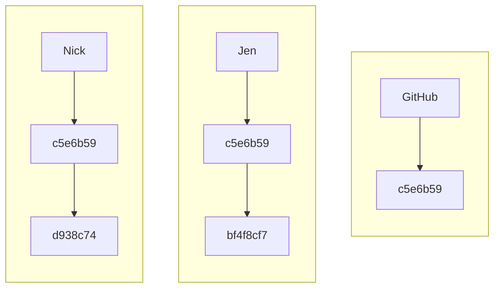
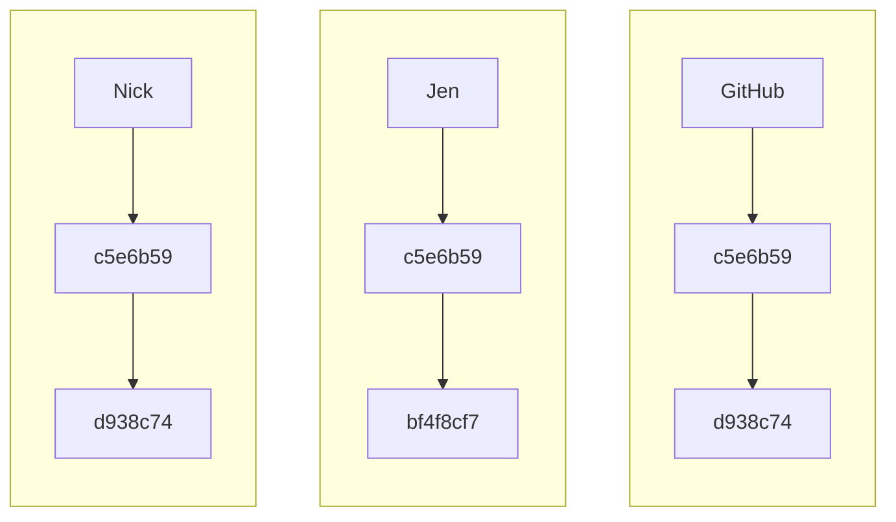
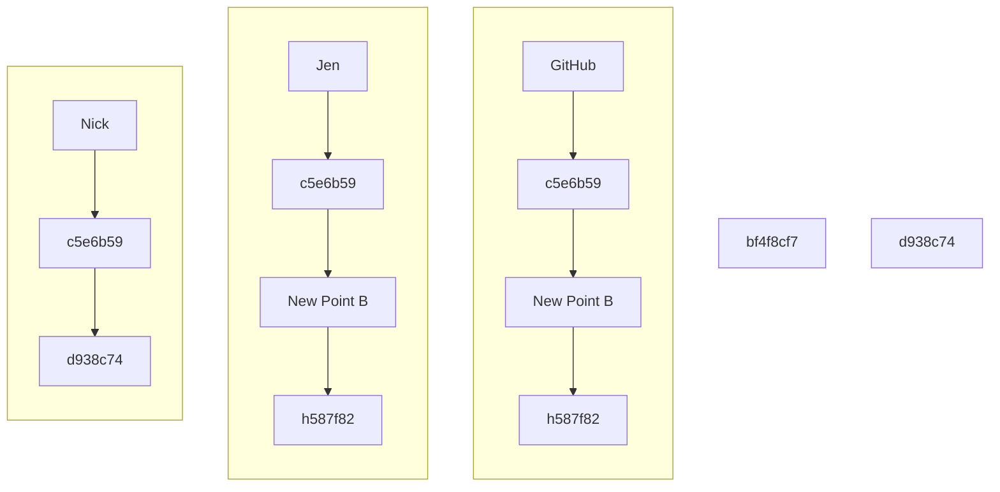

# Merges in git

The need to merge in git results from: a) creating a new branch where changes are made that need to be integrated into the main branch, `main`; and b) people taking different paths in the same branch.

Here, we'll demo working through merging using the latter. However, resolution for the former is the same.

## Path Divergence

Path divergence results from two (or more) people starting from a common origin, here, we'll say a `pull` from `main` at the same commit point. We'll call this `point a`, git would have a commit hash for this, something like `c5e6b59`.

Each of the two people then makes some local edits to the files, stages these and commits them. Locally, these users have moved to a new point, `point b`, but there `point b`s are different, as they've made different modifications. For each user, git establishes a new commit hash, say `bf4f8cf7` for Jen and `d938c74` for Nick.

At this stage we have the repository at three different points on `main`. GitHub is at `c5e6b59`, while Jen and Nick have respectively progressed to `bf4f8cf7` and `d938c74`.

Diagrammatically, this looks like



If Nick pushes before Jen, Nick and GitHub will be on the same path, but not Jen.



When Jen attempts to push to GitHub, git will let her know that she's on a different path and she has to resolve these differences before she can push.

Resolving the differences starts with Jen being forced to do a `pull`, figure out how to merge the two paths, and create a new starting point for herself and GitHub, which will all be then one commit ahead of Nick, i.e. Nick will still be at `point b` while Jen and GitHub will be at `point c`.



# Merge Conflicts

There are several possible ways in which merge issues and merge conflicts may arise when trying to `pull` from or `push` to GitHub. We'll start with the issue where you have not modified the same file as someone else has, but you have both made changes to different files. This should not create a conflict, but will need to be addressed by you telling Git how to handle this situation.

## Issue 1: Simple Path Divergence

Assuming you are working on branch `main`, when you modify a file, stage it, and commit it locally, you have a tracked change that moves you from point a to point b (the path) on the branch. This path is identified by a commit "code". So say you start from a fresh `pull` from GitHub at point a, with commit code `c5e6b59` -- both you and GitHub are sitting at `c5e6b59`. Then, you make your edits, stage, and commit these. This moves you to point b, say `bf4f8cf7`.

Now, someone else working on the project in branch `main` with a fresh `pull` will be starting at the same point a as you on their local machine, `c5e6b59`. When they edit a file, stage, and commit those changes, they will move to point b, but a different point b to you! All the "codes" are auto generated. So their point b will be earmarked as, say `d938c74`.

You're both on the same branch, `main`, you both started at the same point, `c5e6b59`, but you've taken different paths. Becuase you both made fresh `pulls` from GitHub, GitHub is sitting at point a, `c5e6b59`.

If your friend or colleague pushes their point b, `d938c74` to GitHub before you, GitHub will move from `c5e6b59` to `d938c74`.

When you try to push to GitHub, Git will say, "hold on, you're trying to move from `c5e6b59` to `bf4f8cf7`, but I have no record of this path, I only know the path from `c5e6b59` to `d938c74`, how am I supposed to handle the differences between these two paths?"

The way to handle this is to find a way to merge these two paths.

Let's see how this plays out. I've edited a file locally, staged it, and committed it. I go to push it, and I get the following:

```
vdunbar rdm-jumpstart $ git push

To github.com:Alliance-RDM-GDR/rdm-jumpstart.git
 ! [rejected]        main -> main (fetch first)
error: failed to push some refs to 'github.com:Alliance-RDM-GDR/rdm-jumpstart.git'

hint: Updates were rejected because the remote contains work that you do not
hint: have locally. This is usually caused by another repository pushing to
hint: the same ref. If you want to integrate the remote changes, use
hint: 'git pull' before pushing again.
hint: See the 'Note about fast-forwards' in 'git push --help' for details.
```
Git is telling me that I'm on a different path from what's on GitHub. And it wants me to reconcile this locally, first pulling before pushing. Let's do that.

```
vdunbar rdm-jumpstart $ git pull
remote: Enumerating objects: 5, done.
remote: Counting objects: 100% (5/5), done.
remote: Compressing objects: 100% (3/3), done.
remote: Total 3 (delta 2), reused 0 (delta 0), pack-reused 0 (from 0)
Unpacking objects: 100% (3/3), 946 bytes | 189.00 KiB/s, done.
From github.com:Alliance-RDM-GDR/rdm-jumpstart
   a7c6b29..80987a2  main       -> origin/main
hint: You have divergent branches and need to specify how to reconcile them.
hint: You can do so by running one of the following commands sometime before
hint: your next pull:
hint:
hint:   git config pull.rebase false  # merge
hint:   git config pull.rebase true   # rebase
hint:   git config pull.ff only       # fast-forward only
hint:
hint: You can replace "git config" with "git config --global" to set a default
hint: preference for all repositories. You can also pass --rebase, --no-rebase,
hint: or --ff-only on the command line to override the configured default per
hint: invocation.
fatal: Need to specify how to reconcile divergent branches.
```

This is what you'll see the first time this happens. Here, Git is telling me that I need to identify how to merge these two paths. For this project, we'll use `git config pull.rebase true`. Here we go:

```
vdunbar rdm-jumpstart $ git config pull.rebase true
```

Let's try the pull again.

```
vdunbar rdm-jumpstart $ git pull
remote: Enumerating objects: 5, done.
remote: Counting objects: 100% (5/5), done.
remote: Compressing objects: 100% (2/2), done.
remote: Total 3 (delta 1), reused 0 (delta 0), pack-reused 0 (from 0)
Unpacking objects: 100% (3/3), 950 bytes | 118.00 KiB/s, done.
From github.com:Alliance-RDM-GDR/rdm-jumpstart
   bc88f56..07bbb3f  main       -> origin/main
Successfully rebased and updated refs/heads/main.
```

Success! We're now all on the same path and can continue working.

## Issue 2: Path Divergence and Modifcations to the Same File

This story has a similar starting point to that above. You have modified, staged, and committed a file. So has your friend or colleague, but this time, you've made edits to the same file! You both started at point a, you are now at different point bs. This will result in a merge conflict, one that Git won't automatically deal with.

You go to push, and the initial message reads the same:

```
vdunbar rdm-jumpstart $ git push
To github.com:Alliance-RDM-GDR/rdm-jumpstart.git
 ! [rejected]        main -> main (fetch first)
error: failed to push some refs to 'github.com:Alliance-RDM-GDR/rdm-jumpstart.git'
hint: Updates were rejected because the remote contains work that you do not
hint: have locally. This is usually caused by another repository pushing to
hint: the same ref. If you want to integrate the remote changes, use
hint: 'git pull' before pushing again.
hint: See the 'Note about fast-forwards' in 'git push --help' for details.
```

If you haven't already, you know from above that first we need to specify how to merge divergent paths. If you haven't yet, run

```
vdunbar rdm-jumpstart $ git config pull.rebase true
```

The try to pull

```
vdunbar rdm-jumpstart $ git pull
remote: Enumerating objects: 5, done.
remote: Counting objects: 100% (5/5), done.
remote: Compressing objects: 100% (2/2), done.
remote: Total 3 (delta 1), reused 0 (delta 0), pack-reused 0 (from 0)
Unpacking objects: 100% (3/3), 956 bytes | 119.00 KiB/s, done.
From github.com:Alliance-RDM-GDR/rdm-jumpstart
   07bbb3f..d7e9f52  main       -> origin/main
Auto-merging issue-generator_2.md
CONFLICT (content): Merge conflict in issue-generator_2.md
error: could not apply 1c04a8e... issue 2
hint: Resolve all conflicts manually, mark them as resolved with
hint: "git add/rm <conflicted_files>", then run "git rebase --continue".
hint: You can instead skip this commit: run "git rebase --skip".
hint: To abort and get back to the state before "git rebase", run "git rebase --abort".
hint: Disable this message with "git config set advice.mergeConflict false"
Could not apply 1c04a8e... # issue 2
```

Unlike the first time, where the modifications didn't create a conflict, Git is saying it can't resolve the issue and you need to step in -- you need to decide what is kept and what is not in the file modified by you and your colleague.

We know the issue is the file `issue-generator_2.md`. And Git has markup to indicate where the issue is. This mark up uses a series of `<<<<<>>>>>` to demarcate the begining and end of the issue, with `======` representing the break between what is in the file in GitHub and what is in the file locally on your machine. Your job is to delete the markup and keep only the text that should belong!

This will look something like:

```
Some text here.

<<<<<<< HEAD
Edited remotely. Again.
=======
Edited remotely.
And locally.
>>>>>>> 1c04a8e (issue 2)
```

And you need to edit it to something like:

```
Some text here.

Edited remotely.
And locally.
```

Save the file, you have completed the hint:

```
hint: Resolve all conflicts manually, mark them as resolved with
```

Next we address the hint

```
hint: "git add/rm <conflicted_files>", then run "git rebase --continue".
```

```
vdunbar rdm-jumpstart $ git add *
vdunbar rdm-jumpstart $ git commit -m 'resolve issue in issue 2'
[detached HEAD 5a52f39] resolve issue in issue 2
 1 file changed, 2 insertions(+), 1 deletion(-)
vdunbar rdm-jumpstart $ git rebase --continue
Successfully rebased and updated refs/heads/main.
vdunbar rdm-jumpstart $ git push
Enumerating objects: 9, done.
Counting objects: 100% (9/9), done.
Delta compression using up to 8 threads
Compressing objects: 100% (5/5), done.
Writing objects: 100% (6/6), 619 bytes | 619.00 KiB/s, done.
Total 6 (delta 3), reused 0 (delta 0), pack-reused 0 (from 0)
remote: Resolving deltas: 100% (3/3), completed with 2 local objects.
To github.com:Alliance-RDM-GDR/rdm-jumpstart.git
   d7e9f52..5a52f39  main -> main
```

Success!

## Issue 3: You go to Pull, but you have unstaged edits.

Whoops! You were working in a file, saved your changes and walked away for a bit. You came back, and did a pull and get this...

```
vdunbar rdm-jumpstart $ git pull
error: cannot pull with rebase: You have unstaged changes.
error: Please commit or stash them.
```

You're given two options.

**Option 1**

If you're ready to stage and commit, do this and then follow along with **Issue 1** or **Issue 2** whichever manifests.

**Option 2**

*stash* your edits and return to them later. When you do this, Git keeps a record of the modifications you made to the file, but reverts it to a stage that predates these changes. In essence, you're no longer on a divergent path.

Let's do this:

```
vdunbar rdm-jumpstart $ git stash push -m 'my edits to issue 2'
Saved working directory and index state On main: my edits to issue 2
```

`git pull` will now work as expected.

To see what you have stashed, run

```
vdunbar rdm-jumpstart $ git stash list
stash@{0}: On main: my edits to issue 2
```

And to retrieve your edited copy for further work, run `git stash pop`. If the last pull you did did no result in merge conflict, you'll get something like:

```
vdunbar rdm-jumpstart $ git stash pop
On branch main
Your branch is up to date with 'origin/main'.

Changes not staged for commit:
  (use "git add <file>..." to update what will be committed)
  (use "git restore <file>..." to discard changes in working directory)
	modified:   _getting_started/06_Merge-Conflicts.md
	modified:   issue-generator_2.md

no changes added to commit (use "git add" and/or "git commit -a")
Dropped refs/stash@{0} (df4aa46f369d7a4aa610c335a1cbae7b4dd9af05)
```

And you're good to go. However, if there is a conflict, you'll get something like:

```
vdunbar rdm-jumpstart $ git stash pop
Auto-merging issue-generator_2.md
CONFLICT (content): Merge conflict in issue-generator_2.md
On branch main
Your branch is up to date with 'origin/main'.

Changes to be committed:
  (use "git restore --staged <file>..." to unstage)
	modified:   _getting_started/06_Merge-Conflicts.md

Unmerged paths:
  (use "git restore --staged <file>..." to unstage)
  (use "git add <file>..." to mark resolution)
	both modified:   issue-generator_2.md

The stash entry is kept in case you need it again.
```

And you'll need to go back to **Issue 2** to address this.