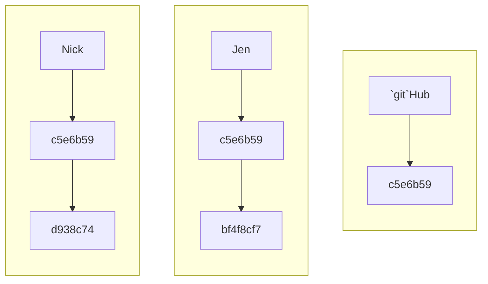
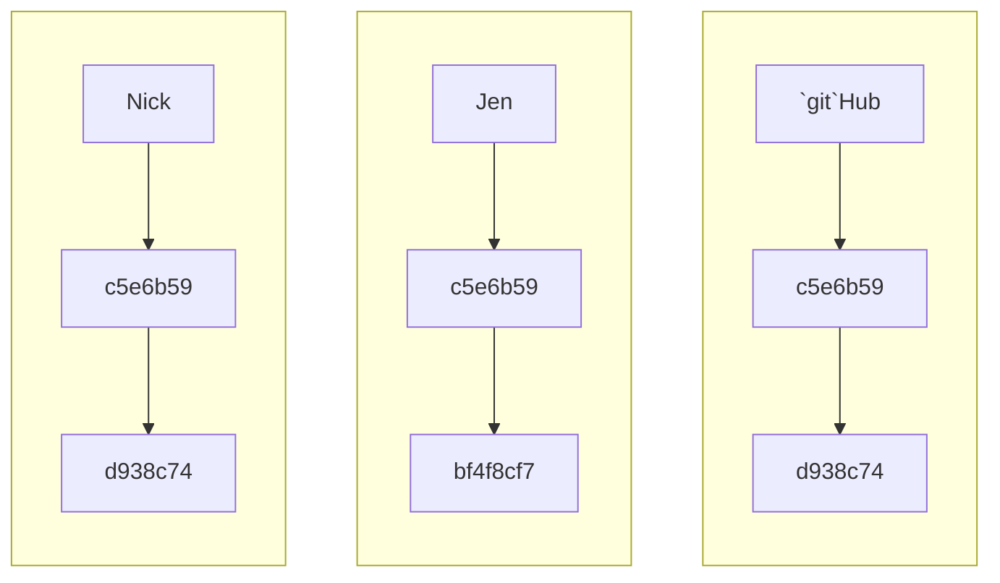
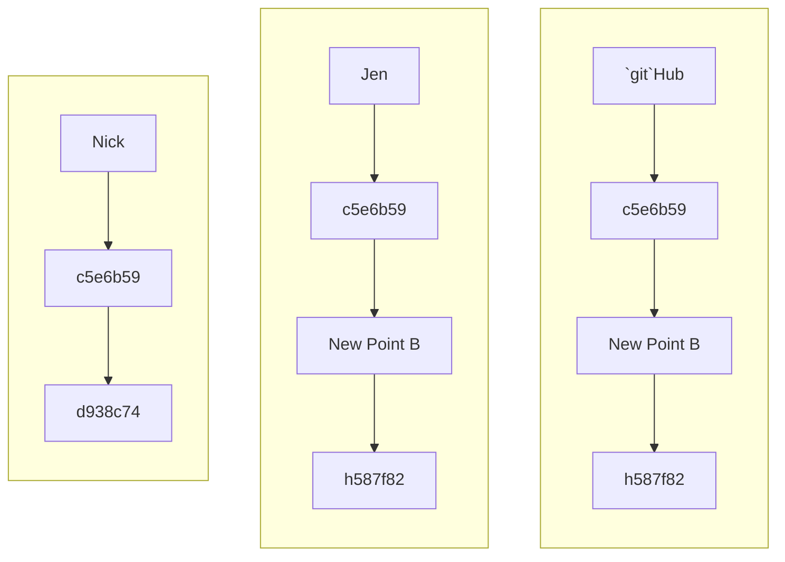

# Merges in `git`

The need to merge in `git` results from: a) creating a new branch where changes are made that need to be integrated into the main branch, `main`; and b) people taking different paths in the same branch.

Here, we'll demo working through merging using the latter. However, resolution for the former is the same.

## Path Divergence

Path divergence results from two (or more) people starting from a common origin, here, we'll say a `pull` from `main` at the same commit point. We'll call this `point a`, `git` would have a commit hash for this, something like `c5e6b59`.

Each of the two people then makes some local edits to the files, stages these and commits them. Locally, these users have moved to a new point, `point b`, but there `point b`s are different, as they've made different modifications. For each user, `git` establishes a new commit hash, say `bf4f8cf7` for Jen and `d938c74` for Nick.

At this stage we have the repository at three different points on `main`. `git`Hub is at `c5e6b59`, while Jen and Nick have respectively progressed to `bf4f8cf7` and `d938c74`.

Diagrammatically, this looks like

**Diagram A**



If Nick pushes before Jen, Nick and `git`Hub will be on the same path, but not Jen.

**Diagram B**



When Jen attempts to push to `git`Hub, `git` will let her know that she's on a different path and she has to resolve these differences before she can push.

Resolving the differences starts with Jen being forced to do a `pull`, figure out how to merge the two paths, and create a new starting point for herself and `git`Hub, which will all be then one commit ahead of Nick, i.e. Nick will still be at `point b` while Jen and `git`Hub will be at `point c`.

**Diagram C**



Going forward, if Nick wants to avoid a merge issue, he'll want to make sure he does a `pull` before modifying any files.

## Merge with No Conflict

If Nick and Jen are at **Diagram A**, but they have not modified the same file, i.e. Nick is working in Block 1 and Jen in Block 2, `git` is able to handle the merge, since there's nothing to suggest that their file modifications have any conflict.

What does this look like in practice?

Let's assume Nick has pushed, so we're at **Diagram B**. When Jen attempts to `push` she'll get a response like this:

```bash
vdunbar rdm-jumpstart $ `git` push

To `git`hub.com:Alliance-RDM-GDR/rdm-jumpstart.`git`
 ! [rejected]        main -> main (fetch first)
error: failed to push some refs to '`git`hub.com:Alliance-RDM-GDR/rdm-jumpstart.`git`'

hint: Updates were rejected because the remote contains work that you do not
hint: have locally. This is usually caused by another repository pushing to
hint: the same ref. If you want to integrate the remote changes, use
hint: '`git` pull' before pushing again.
hint: See the 'Note about fast-forwards' in '`git` push --help' for details.
```

`git` wants Jen to `pull` before she can `push`.

So, let's do that.

```bash
vdunbar rdm-jumpstart $ `git` pull
remote: Enumerating objects: 5, done.
remote: Counting objects: 100% (5/5), done.
remote: Compressing objects: 100% (3/3), done.
remote: Total 3 (delta 2), reused 0 (delta 0), pack-reused 0 (from 0)
Unpacking objects: 100% (3/3), 946 bytes | 189.00 KiB/s, done.
From `git`hub.com:Alliance-RDM-GDR/rdm-jumpstart
   a7c6b29..80987a2  main       -> origin/main
hint: You have divergent branches and need to specify how to reconcile them.
hint: You can do so by running one of the following commands sometime before
hint: your next pull:
hint:
hint:   `git` config pull.rebase false  # merge
hint:   `git` config pull.rebase true   # rebase
hint:   `git` config pull.ff only       # fast-forward only
hint:
hint: You can replace "`git` config" with "`git` config --global" to set a default
hint: preference for all repositories. You can also pass --rebase, --no-rebase,
hint: or --ff-only on the command line to override the configured default per
hint: invocation.
fatal: Need to specify how to reconcile divergent branches.
```

This is what you'll see the first time this happens. `git` has three options or methods for managing merges.  For this project, we'll use ``git` config pull.rebase true`. We only need to set this once, i.e. the first time we encounter a merge.

```bash
vdunbar rdm-jumpstart $ `git` config pull.rebase true
```

Now that the merge option is set, let's try the pull again.

```bash
vdunbar rdm-jumpstart $ `git` pull
remote: Enumerating objects: 5, done.
remote: Counting objects: 100% (5/5), done.
remote: Compressing objects: 100% (2/2), done.
remote: Total 3 (delta 1), reused 0 (delta 0), pack-reused 0 (from 0)
Unpacking objects: 100% (3/3), 950 bytes | 118.00 KiB/s, done.
From `git`hub.com:Alliance-RDM-GDR/rdm-jumpstart
   bc88f56..07bbb3f  main       -> origin/main
Successfully rebased and updated refs/heads/main.
```

Success! Because Nick and Jen did not modify the same file(s), `git` handles the merge flawlessly. We're now at **Diagram C**.

## Merge with Conflict

Now let's assume that we're at **Diagram A**, but this time, Nick and Jen have both modified the same file. Again, we'll assume Nick has pushed first, and we are sitting at **Diagram B**.

The journey for Jen begins in a simlar way with `git` telling her to `pull` before she can `push`.

```bash
vdunbar rdm-jumpstart $ `git` push
To `git`hub.com:Alliance-RDM-GDR/rdm-jumpstart.`git`
 ! [rejected]        main -> main (fetch first)
error: failed to push some refs to '`git`hub.com:Alliance-RDM-GDR/rdm-jumpstart.`git`'
hint: Updates were rejected because the remote contains work that you do not
hint: have locally. This is usually caused by another repository pushing to
hint: the same ref. If you want to integrate the remote changes, use
hint: '`git` pull' before pushing again.
hint: See the 'Note about fast-forwards' in '`git` push --help' for details.
```

If this is the first time you're encoungering a merge, run the following before continuing.

```bash
vdunbar rdm-jumpstart $ `git` config pull.rebase true
```

And then we try to `pull`

```bash
vdunbar rdm-jumpstart $ `git` pull
remote: Enumerating objects: 5, done.
remote: Counting objects: 100% (5/5), done.
remote: Compressing objects: 100% (2/2), done.
remote: Total 3 (delta 1), reused 0 (delta 0), pack-reused 0 (from 0)
Unpacking objects: 100% (3/3), 956 bytes | 119.00 KiB/s, done.
From `git`hub.com:Alliance-RDM-GDR/rdm-jumpstart
   07bbb3f..d7e9f52  main       -> origin/main
Auto-merging issue-generator_2.md
CONFLICT (content): Merge conflict in issue-generator_2.md
error: could not apply 1c04a8e... issue 2
hint: Resolve all conflicts manually, mark them as resolved with
hint: "`git` add/rm <conflicted_files>", then run "`git` rebase --continue".
hint: You can instead skip this commit: run "`git` rebase --skip".
hint: To abort and get back to the state before "`git` rebase", run "`git` rebase --abort".
hint: Disable this message with "`git` config set advice.mergeConflict false"
Could not apply 1c04a8e... # issue 2
```

Unlike the first time, since the same file was changed by two users, `git` is unable, or unwilling, to automatically handle the merge. Instead, it wants Jen to decide what modifications should be kept and which discarded.

We know the issue is the file `issue-generator_2.md` -- ths is listed after `CONFLICT (content)`. Jen will need to open `issue-generator_2.md` to resolve the condlict.

`git` has markup to indicate where the issue is. This mark up uses a series of `<<<<<>>>>>` to demarcate the begining and end of the issue, with `======` representing the break between what is in the file in `git`Hub and what is in the file locally on your machine. There could multiple points in the file that have conflicting edits. Jen's job is to delete the markup and keep only the text that should belong.

This will look something like:

```markdown
Some text here.

<<<<<<< HEAD
Edited remotely. Again.
=======
Edited remotely.
And locally.
>>>>>>> 1c04a8e (issue 2)
```

And you need to edit it to something like:

```markdown
Some text here.

Edited remotely.
And locally.
```

Once this is done, Jen will need to save the file. This addresses the first hint given by the `git`.

```bash
hint: Resolve all conflicts manually...
```

Next we address the remainder of the hint with the next hint

```bash
hint: Resolve all conflicts manually, mark them as resolved with
hint: "`git` add/rm <conflicted_files>", then run "`git` rebase --continue".
```

We'll add all modified files for this example.

```bash
vdunbar rdm-jumpstart $ `git` add *
```

Jen will then commit

```bash
vdunbar rdm-jumpstart $ `git` commit -m 'resolve issue in issue 2'
[detached HEAD 5a52f39] resolve issue in issue 2
 1 file changed, 2 insertions(+), 1 deletion(-)

```

And finally, Jen will complete the `rebase`, i.e. the merge.

```bash
vdunbar rdm-jumpstart $ `git` rebase --continue
Successfully rebased and updated refs/heads/main.
vdunbar rdm-jumpstart $ `git` push
Enumerating objects: 9, done.
Counting objects: 100% (9/9), done.
Delta compression using up to 8 threads
Compressing objects: 100% (5/5), done.
Writing objects: 100% (6/6), 619 bytes | 619.00 KiB/s, done.
Total 6 (delta 3), reused 0 (delta 0), pack-reused 0 (from 0)
remote: Resolving deltas: 100% (3/3), completed with 2 local objects.
To `git`hub.com:Alliance-RDM-GDR/rdm-jumpstart.`git`
   d7e9f52..5a52f39  main -> main
```

Success! We are now at **Diagram C**.

## Another Situation

It may happen that you have edited a file or files locally, but have not staged and committed these, for some reason. It happens. Let's assume Jen has done this. Jen is following best practice and doing a `pull` from `main` to make sure she's up to date for working on an edit she plans to `stage`, `commit`, and `push`.

Unfortunately, this will result in the following error:

```bash
vdunbar rdm-jumpstart $ `git` pull
error: cannot pull with rebase: You have unstaged changes.
error: Please commit or stash them.
```

You have two ways of resolving this isse.

### Option 1

If you're ready to `stage` and `commit`, do this. Then `push`. If you encounter a merge conflict, address it as above.

## Option 2

`stash` your edits and return to them later.

When you do this, `git` keeps a record of the modifications you made to the file, but reverts the file in your working directory to where it was at before you edited it, i.e. like you did a fresh `pull` and you and `git`Hub are on the same path.

Let's do this:

```bash
vdunbar rdm-jumpstart $ `git` stash push -m 'my edits to issue 2'
Saved working directory and index state On main: my edits to issue 2
```

``git` pull` will now work as expected.

To see what you have stashed, run

```bash
vdunbar rdm-jumpstart $ `git` stash list
stash@{0}: On main: my edits to issue 2
```

And to retrieve your edited copy for further work, run ``git` stash pop`. If the last pull you did did not result in a merge conflict, you'll get something like:

```bash
vdunbar rdm-jumpstart $ `git` stash pop
On branch main
Your branch is up to date with 'origin/main'.

Changes not staged for commit:
  (use "`git` add <file>..." to update what will be committed)
  (use "`git` restore <file>..." to discard changes in working directory)
	modified:   _getting_started/06_Merge-Conflicts.md
	modified:   issue-generator_2.md

no changes added to commit (use "`git` add" and/or "`git` commit -a")
Dropped refs/stash@{0} (df4aa46f369d7a4aa610c335a1cbae7b4dd9af05)
```

And you're good to go.

However, if there is a conflict, you'll get something like:

```bash
vdunbar rdm-jumpstart $ `git` stash pop
Auto-merging issue-generator_2.md
CONFLICT (content): Merge conflict in issue-generator_2.md
On branch main
Your branch is up to date with 'origin/main'.

Changes to be committed:
  (use "`git` restore --staged <file>..." to unstage)
	modified:   _getting_started/06_Merge-Conflicts.md

Unmerged paths:
  (use "`git` restore --staged <file>..." to unstage)
  (use "`git` add <file>..." to mark resolution)
	both modified:   issue-generator_2.md

The stash entry is kept in case you need it again.
```

And you'll need to review the merge conflict section of this document to address this.