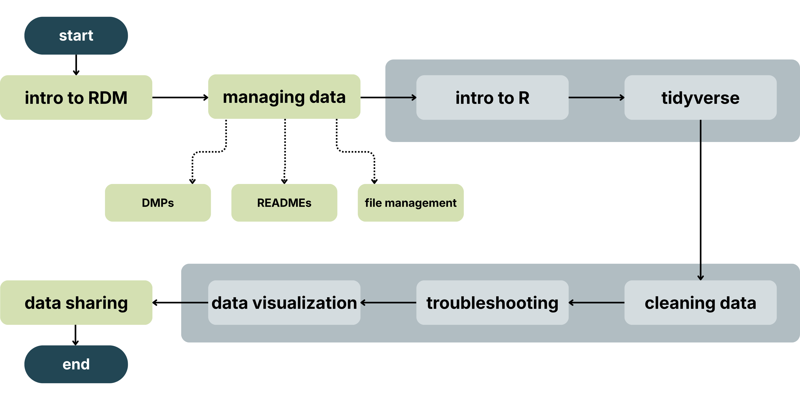

```{r}
```

Site last rendered `r Sys.Date()`.

## Welcome

Welcome to RDM Jumpstart, 2025! Before going any further, [please read our code of conduct...](codeOfConduct.html)

## Program Overview

By the end of the program, participants will be able to:

* Explain how Research Data Management (RDM) principles support research transparency and reproducibility
* Apply RDM practices to real-world examples and consider how they can be applied to your own work.
* Implement reproducible research workflows using R and RStudio.
* Develop transferable strategies for independently learning and adopting new digital tools for research and applying RDM practices to different types of data.

The program will start with the basics of RDM and how to manage your data, and then will continue with how to use the R language to clean and visualize data. We will close the course by discussing data sharing principles. This will all be done by using a mock survey example dataset.



## Navigating the Website

The series is broken up into 6 days. On the menu bar at the top of the webpage, you will see a drop-down menu for each of the 6 days and their content. Each day begins with an Overview that covers any technical pre-requisites, a textual description of the block, learning objectives, and an overview for each individual lesson. Each lesson’s content is listed on their respective pages. The lesson content will guide the live instruction, and is also meant to function as asynchronous materials for those wanting to revisit the content after attending live delivery, or if people want to guide themselves through the content on their own.

The lessons are built in such a way that they are meant to be taken in sequential order, with each block functioning as a pre-requisite for subsequent blocks.

## Contact

Please refer to the email communications you’ve received to get in touch with us.

