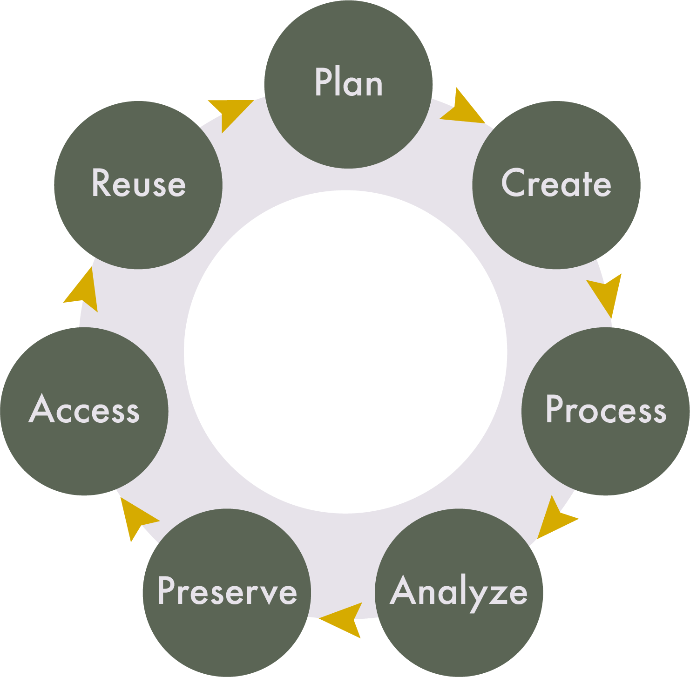

## Learning Objectives

By the end of this lesson, you will be able to:

- Define research data, research data management, and the FAIR, CARE, and OCAP principles.
- List the different stages of the research data management lifecycle.
- Articulate how RDM principles support research transparency, accessibility and reproducibility.
- Identify where to find RDM support.
- Define sensitive data.
- Discuss risk assessment and harm in data management at both the individual participant and global level of privacy and data security. 
- Connect RDM concepts and practices to previous research and/or data management experiences.

## Introduction

Before we start, let’s take a few minutes to get to know the other students in this course. 

::: {.callout-note}
## Breakout Room

In breakout rooms of five, introduce yourself, using the following information as a guide:

- Your name and pronouns.
- Your university and the program you are in.
- Your general research area / questions and what type of data you use.
- What interested you about this course.

You will have 15 minutes in the breakout room.
:::

## Lecture - Introduction to Research Data Management and Working with Sensitive Data
### Lecture

* [Download the PowerPoint](files/day1-L1_Intro-to-RDM.pptx)

<embed src="files/day1-L1_Intro-to-RDM.pdf" type="application/pdf" width="100%" height="600px" />

### What is Research Data?

Before we start talking about research data management (RDM), we first need to define research data. Every research project seeks to investigate a research question. The materials that support the answering of a research question are considered data. This can include:

- spreadsheet data  
- audio recordings  
- video recordings  
- textual transcripts  
- images / photographs  
- corpora of text  
- computer code  
- marginalia (writing in the margins of books)  
- geographic information, such as coordinates

This is not an exhaustive list.

::: {.callout-tip}
## Question

What data are you currently working with, or aiming to work with?
:::

### What is Research Data Management (RDM)?

RDM involves the practices and activities over the research lifecycle that pertain to the management of research data, including planning, collecting, analyzing, documenting, storing, sharing, and preserving. Ultimately, RDM is research, and it is just as important as presenting at conferences and publishing papers. But, instead of framing your journal article as the star of the show, RDM puts the data front and centre. 

### The Research Data Lifecycle

Data can outlast a project, and even the researcher who collected it. For this reason, the analogy of a lifecycle is often used to describe the management of research data. 

The stages in this lifecycle can be broadly defined. They include:

- **Plan:** Creating documentation at the beginning of a project, often in the form of a data management plan (DMP), will help you consider and outline how data will be managed throughout the project’s lifecycle.
- **Create:** This is the stage where people believe research ‘begins.’ It is the creation, collection, collation, or other fun verbs that describe how you will obtain or generate the data for a project.
- **Process:** The raw materials or data that you gather are not usually in a state that makes it ready to understand. In order to ask meaningful questions of your data, you may need to clean, restructure, or anonymize what you’ve collected.
- **Analyze:** This is the stage where people believe research ‘happens.’ The research question becomes answerable from the results of the analyzed data. 
- **Preserve:** What happens to research data after analysis and publication? It is not unusual for data to languish on an old hard drive, never to be used again. A key component of RDM is the consideration of how data will be preserved after the project’s completion.
- **Access:** Some journal publishers and grant funders require research data to be accessible once a paper is published. There are platforms, called data repositories, where data can be deposited for the short or long-term. If data is preserved in a repository that allows other people to find it, the visibility of your work can increase, along with your citations.
- **Reuse:** Closely related to access, if others can find and access your data, it has the potential to be reused for additional projects, including your own, maximizing the long-term value of your research.

Even though “create” and “analyze” are what most people think of as research, the other stages are just as important in ensuring the quality of the research project. This lifecycle represents an ideal, but the realities of research are much harder to define and categorize. It is a model designed to help you understand the ways in which you interact with data, and to guide you through these stages before starting your research project. With that in mind, there is no perfectly circular flow to these stages, as there are many interconnections and repetitions of each stage within a research project.

Throughout this course, we are going to take you through the research lifecycle using a mock research project. For the purposes of instruction, the project data may be a bit cleaner than what exists in reality, but the goal is to prepare you to plan and engage with your own research data in ways that promote the transparency and reproducibility of your work.

### Why Should You Care?

#### Academic Integrity

::: {.callout-tip}
## Question

What does academic integrity mean to you?
:::

In undergraduate programs, it is very common for academic integrity to be situated within the context of plagiarism (cite your sources!). But as you move through graduate research, there is a shift from ‘you as consumer’ of information to ‘you as producer’ of information. From this perspective, academic integrity encompasses the integrity of your research data, as your data forms the basis of the claims you will make in your research papers. 

Consider the following articles:

* [Stanford president resigns after fallout from falsified data in his research](https://www.npr.org/2023/07/19/1188828810/stanford-university-president-resigns)
* [Research Fraud: Is Everything We Think We Know About Alzheimer’s Disease Wrong?](https://scitechdaily.com/research-fraud-is-everything-we-think-we-know-about-alzheimers-disease-wrong/)  
* [University investigation found prominent spider biologist fabricated, falsified data](https://www.science.org/content/article/university-investigation-found-prominent-spider-biologist-fabricated-falsified-data)

In each of these stories, purposeful academic fraud occurred because the data was undocumented and inaccessible. While these examples represent extreme cases, what happens more commonly is that poor data management practices result in accidental misrepresentations of data. This can happen for a number of reasons, including:

* Using code that you do not fully understand.
* Working in a collaborative environment in which versions of data and data manipulations are not properly tracked or communicated.
* Applying statistical models that are not appropriate for your data.
* Subsetting portions of data to generate significant results, when results of the complete dataset may not be significant. 

::: {.callout-tip}
## Question

Can you think of other reasons that data might be misrepresented (either purposefully or accidentally)?
:::

Learning to apply best practices in research data management is the focus of this course. Our goal is to teach you how you can avoid accidental misrepresentation by focusing on the integrity of your data, and how to incorporate each stage of the research data lifecycle into your overall program of research.

#### Data Policies

**Publisher policies**

It is becoming more common for publishers to require that research data be shared upon publication to support the transparency, reproducibility, and validation of the research findings. Some examples include:

* Springer Nature: [Research Data Policy](https://www.springernature.com/gp/authors/research-data-policy)   
* Wiley: [Data Sharing Policies](https://authorservices.wiley.com/author-resources/Journal-Authors/open-access/data-sharing-citation/data-sharing-policy.html)   
* PLOSOne: [Data Availability](https://journals.plos.org/plosone/s/data-availability)

**Funder Policies**

As research funding often comes from government organizations, which are supported by taxpayer dollars, funding agencies (such as SSHRC, NSERC, and CIHR) are starting to require proof of RDM practices. In some cases, this includes creating data management plans and making research data openly accessible. In Canada, the [Tri-Agency RDM Policy](https://science.gc.ca/site/science/en/interagency-research-funding/policies-and-guidelines/research-data-management/tri-agency-research-data-management-policy), has outlined the following requirements:

* Institutional Strategies:  
  * By March 1, 2023, research institutions subject to this requirement were required to post their RDM strategies online and share the link with the agencies so this information can be shared publicly on a [dedicated science.gc.ca webpage](http://science.gc.ca).  
* Data management plans:  
  * In spring 2022, the agencies identified the initial set of funding opportunities subject to the DMP requirement. The agencies are continuing to introduce the DMP requirement into funding opportunities as they finalize a timeline and approach for broader implementation of the requirement.  
* Data deposit:  
  * After reviewing the institutional strategies and in line with the readiness of the Canadian research community, the agencies will phase in the data deposit requirement, with deposit requirements expected to be rolled out for awarded projects beginning in 2026\.

In addition to the Tri-Agencies, other international funders require RDM:

* Horizon Europe: **[Research Data Management Guide](https://www.openaire.eu/guides/)**   
* National Institutes of Health (NIH): [**Data Management and Sharing Policy**](https://grants.nih.gov/policy-and-compliance/policy-topics/sharing-policies/dms/writing-dms-plan)  
* National Science Foundation (NSF): [**Public Access Initiative**](https://www.nsf.gov/public-access) 

#### Philosophical Rationale
**FAIR Principles**

The [FAIR Principles (Findable, Accessible, Interoperable, Reusable)](https://www.go-fair.org/fair-principles/) support research visibility and citation, long-term preservation, and the responsible stewardship of data.

**Findable**   
The first step in (re)using data is to find them. Metadata (information about the data) and data should be easy to find for both humans and computers.

**Accessible**  
Once the user finds the required data, they need to know how they can be accessed, possibly including authentication and authorisation.

**Interoperable**  
The data usually need to be integrated with other data. In addition, the data need to interoperate with applications or workflows for analysis, storage, and processing.

**Reusable**  
The ultimate goal of FAIR is to optimise the reuse of data. To achieve this, metadata and data should be well-described so that they can be replicated and/or combined in different settings.

FAIR does not mean that all data must be open or public.​ Rather, FAIR supports the structured discoverability and usability of data and other research outputs.

**CARE Principles**

**“**The [CARE Principles (Collective benefit, Authority to control, Responsibility, Ethics)](https://static1.squarespace.com/static/5d3799de845604000199cd24/t/6397b363b502ff481fce6baf/1670886246948/CARE%2BPrinciples_One%2BPagers%2BFINAL_Oct_17_2019.pdf) are a set of principles that are meant to work in tandem with the FAIR principles, with a focus on Indigenous self-determination in research and data practices.

**Collective Benefit:** Data ecosystems shall be designed and function in ways that enable Indigenous Peoples to derive benefit from the data.

**Authority to Control:** Indigenous Peoples’ rights and interests in Indigenous data must be recognised and their authority to control such data be empowered. Indigenous data governance enables Indigenous Peoples and governing bodies to determine how Indigenous Peoples, as well as Indigenous lands, territories, resources, knowledges and geographical indicators, are represented and identified within data.

**Responsibility:** Those working with Indigenous data have a responsibility to share how those data are used to support Indigenous Peoples’ self-determination and collective benefit. Accountability requires meaningful and openly available evidence of these efforts and the benefits accruing to Indigenous Peoples.

**Ethics:** Indigenous Peoples’ rights and wellbeing should be the primary concern at all stages of the data lifecycle and across the data ecosystem.**”**

**OCAP Principles**

**“**The [First Nations Principles of OCAP (Ownership, Control, Access, Possession)](https://fnigc.ca/ocap-training/) assert that First Nations have control over data collection processes, and that they own and control how this information can be used.

**Ownership:** refers to the relationship of First Nations to their cultural knowledge, data, and information. This principle states that a community or group owns information collectively in the same way that an individual owns his or her personal information.

**Control:** affirms that First Nations, their communities, and representative bodies are within their rights to seek control over all aspects of research and information management processes that impact them. First Nations control of research can include all stages of a particular research project-from start to finish. The principle extends to the control of resources and review processes, the planning process, management of the information and so on.

**Access:** refers to the fact that First Nations must have access to information and data about themselves and their communities regardless of where it is held. The principle of access also refers to the right of First Nations’ communities and organizations to manage and make decisions regarding access to their collective information. This may be achieved, in practice, through standardized, formal protocols.

**Possession:** while ownership identifies the relationship between a people and their information in principle, possession or stewardship is more concrete: it refers to the physical control of data. Possession is the mechanism by which ownership can be asserted and protected.**”**

### Sensitive Data

::: {.callout-tip}
## Question

What types of materials would you be hesitant to post publicly?  
:::

The [Sensitive Data Toolkit for Researchers](https://zenodo.org/records/4088946#.Y1KyV3bMI2w) defines **sensitive data** as “information that must be safeguarded against unwarranted access or disclosure”. Examples include: 

* personal information  
* personal health information  
* educational records  
* customer records  
* financial information  
* criminal information  
* geographic information (e.g., detailed locations of endangered species)  
* confidential personnel information  
* information that is deemed to be confidential  
* Proprietary information   
* Information that is protected by data sharing agreements or other contracts

Data may be considered sensitive for ethical, legal, and contextual reasons. While institutional ethics boards will review research projects with the lens of protecting participants, you have a responsibility beyond ethics approval to ensure that your data is managed with care. A risk assessment is a process for identifying, evaluating, and mitigating risks associated with collecting, storing, using, sharing, and preserving research data. The [Sensitive Data Toolkit for Researchers](https://zenodo.org/records/4088954) provides a framework for assessing and protecting participant risk, but it is good practice to ask yourself the following questions:

* Can someone be identified?  
* Could harm result from sharing?  
* What consent was given?  
* Are there legal restrictions?  
* Are there community expectations?

Ethically managing sensitive data is beyond the scope of this course, and we advise you to consult with your institutional supports to determine adequate strategies for addressing sensitive data in your research.

### Data Storage

::: {.callout-tip}
## Questions

Where do your research materials live right now?  
Have you ever accidentally lost or overwritten your work?  
If your personal computer crashed or was stolen, would you still have access to your work?   
:::

Where your data is stored is a key part of data management. It is always recommended that your research materials are stored **in at least two places**, and that one of those places is remote cloud storage beyond your personal machine. This is known as a back-up. 

In addition to storing data for your active work, there are platforms that support the long-term storage and preservation of your data and research materials **after the project’s completion**. We will talk more about these preservation platforms later in the course, but this chart provides a summary of the basic storage types.

| Storage | Supports active research work | laptop, shared drive, cloud storage |
| :---- | :---- | :---- |
| **Repository** | Publishes and shares research outputs | Borealis, Zenodo |
| **Archive** | Ensures long-term preservation | institutional archives, digital preservation systems |

::: {.callout-tip}
## Questions

* What active storage platforms does your institution offer?  
  * Does the platform provide backups?  
* Who at your institution could you contact for RDM support?  
:::

## Activity \- Breakout Room Discussion

Now that you have learned about some of the fundamental aspects of RDM, take some time to reflect on your previous research and/or data management experiences in the light of RDM concepts. 

::: {.callout-note}
## Breakout Room

In breakout rooms of five students, discuss one or more of the following questions:

* What (if any) research data management practices do you or your research group currently implement?  
* What stage(s) of the research data management lifecycle would be the most challenging to implement for your own work?  
* How can implementing research data management practices improve transparency, accountability, reproducibility and/or academic integrity in your research?  
* What data policies have you heard about before and/or had to implement? If applicable, how was your experience with them?  
* Are you familiar with RDM support at your own institution? Have you used their services before? How was your experience with it?

You will have ten minutes in the breakout rooms. You won’t need to report back about your discussion to the larger group.
:::

