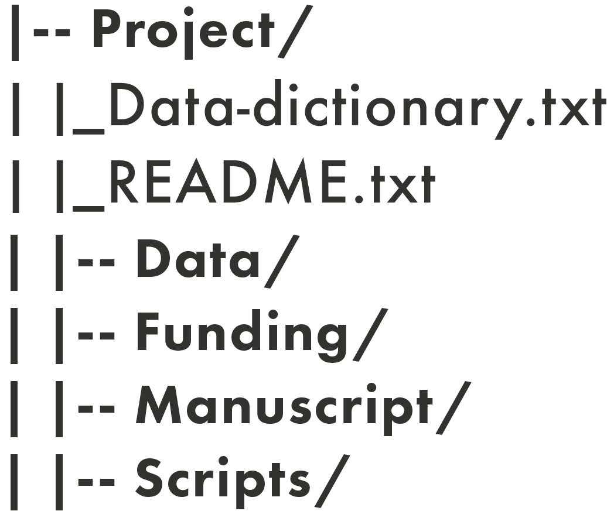
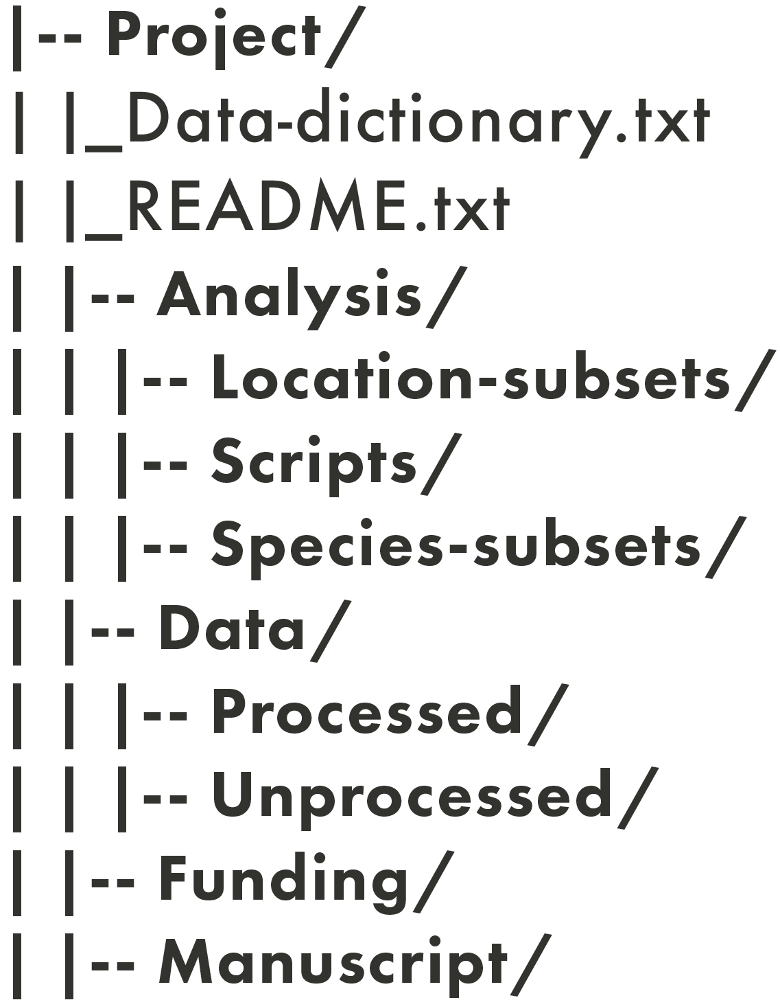

## Learning Objectives

By the end of this lesson, you will be able to:

- Explain best practices for project file naming and directory structure.  
- Describe how version control can be applied through file naming conventions.  
- Develop file naming convention and directory structure for a mock list of project files.  
- Apply pre-determined file naming convention and directory structure for an example project.

## Lecture \- Introduction to File Management

### Lecture

* [Download the PowerPoint](files/day2_L2_File-Management.pptx)

<embed src="files/day2_L2_File-Management.pdf" type="application/pdf" width="100%" height="600px" />

### Best Practices in File Naming

Have you ever looked at the files in your computer and wondered what some of them are? Or maybe, you’ve been granted access to a project folder, but when you looked at the filenames none of them made sense?

File naming is a foundational aspect of managing the assets in your research projects. There are four main best practices when naming files. filenames should be:

* human-readable  
* machine-readable  
* consistent  
* predictable

#### Human-Readable

When determining if a filename is human-readable, consider the following questions:

* Can you look at a filename and, without additional information, know what the file is for? Could you look at your own files a year from now, and begin work without delay?  
* Are others able to look at your files and know what they are?  
* Are you or others able to easily find files that are needed for a project?

Human-readable filenames are short and complete, and they should include at least 3-5 concise conceptual elements. These can include:

* date of data creation/collection  
* short description   
* activity   
* location where data was collected  
* editor/creator  
* versioning information (see more on this below)  
* any other relevant information

It is good practice to record your naming conventions, and to define all acronyms, abbreviations, codes, and other notations in your project README file. 

#### Machine-Readable

When determining if a filename is machine-readable, consider the following questions:

1. How will a computer sort your filenames? By date, by number, or by first letter?  
2. If files need to move from one place to another, will they remain interpretable in the same way? Can the files be opened by different operating systems or computers?

A big part of organizing files has to do with how machines order characters such as letters and numbers. Machine-readability across operating systems and applications can be quite complicated, but here are some general guidelines to follow for interoperable ordering:

* Ordering begins with the first character of a filename, and works its way from left to right.  
* Numbers are ordered ahead of alphabetical characters.  
* Dashes \- are ordered ahead of underscores \_, and both are ordered ahead of numbers.  
* Putting a dash or an underscore at the beginning of a filename can be a way to force it to appear first in a list.  
* While some systems will position capital letters ahead of lowercase, it’s not recommended to use letter casing as a way to order names.

Machine-readable filenames often have the following characteristics:

* They only contain letters in the English alphabet, numbers 0-9, dashes \-, and underscores \_.  
* They do not use spaces or special characters such as: \! @ \# $ % ^ & \* ( ) \+ \= { } \[ \] |.  
* Naming elements are separated with underscores and/or dashes.  
* They use the date format YYYYMMDD or YYYY-MM-DD. These are the formats recommended by the [International Standards Organization](https://www.iso.org/iso-8601-date-and-time-format.html).

::: {.callout-note}
## Excercise

How would the following filenames be ordered?

data-analyzed\_20260504.csv  
01\_data-analytic\_20260504.csv  
\-README.txt  
data-analyzed\_20260504.docx

:::

::: {.callout-tip collapse=true}
## Answer

\-README.txt  
01\_data-analytic\_20260504.csv  
data-analyzed\_20260504.csv  
data-analyzed\_20260504.docx

:::

#### Consistency, Likeness, and Importance

The most important thing in any file naming convention is consistency. Within a given project, name your files using the same convention, every time, all the time.

When choosing a file naming convention, consider which elements are the most important for your project, and how similarities (or likeness) and differences will play into how the names are sorted. This can help you to choose which element in the name should come first, which should come second, etc. For example, if it’s important to know when a given batch of data was collected, you may choose to put the date first in filenames. If it’s important to distinguish locations where data was collected, then the location should come before other information, such as the date.

#### Examples of Readable File Naming and Appropriate Documentation

Here is an example of a human- and machine-readable filename: **lldr\_mpp\_20240723.csv**. Though, just because it can be read, doesn’t mean that you or others can understand what it represents.

In this instance, your documentation would need to explain the following:

* The naming convention: project\_location\_collection-date.file-type.  
* Acronyms: lldr means ‘leaf litter decomposition rate’; mpp means ‘Monk Provincial Park’.  
* Date formatting: dates are given in YYYMMDD format.

This filename has characteristics that work for both machines (underscores, date formatting) and humans (when combined with the documentation).

### Managing Directories

Directories, also called ‘folders’, are units that hold files or other directories. They’re a way to keep your files organized and easy to find. Developing a directory structure **before** you begin a project can help with managing all the files that you will be collecting and/or generating during the course of a research project. 

Directory structures typically consist of the following:

1. A root directory (the top-level directory) \- e.g., project\_name  
2. Sub-directories (also known as sub-folders)  
3. Relevant files

Directories are denoted by a slash ‘/’ at the end of their name in these diagrams.

Before you begin a research project, it’s useful to create a plan of your required directories. It can be helpful to think about the natural and distinct groups of data and files that you’ll be working with. To start the process, you can think about things such as: 

* **Directory names**:   
  * In general, it’s best to keep directory names short and reflective of the kinds of objects they contain. Like machine-readable filenames, directory names shouldn’t include spaces or special characters. In the example above, the directory names are all single words (Project/, Data/, Funding/, etc.), and you can guess what kinds of objects will be in each one based on the name (e.g., Data/ will contain data files, Funding/ will contain documents and information related to financial matters, etc.). Naming conventions could be based on things like the following:  
    * Steps in a research project: e.g., Collection/, Analysis/, Writing/, Presentations/  
    * Names of collaborators on a research project  
    * For a research group, you may have different root directories for each project  
        
* **Directory contents:**   
  * This is what you’ll put in each directory. Keeping similar objects in the same directory can make it easier to navigate, e.g., having all the data-related files in a directory called Data/ rather than scattered across multiple directories. However, if multiple people need to work on data in different ways, it may make sense for them to have their own directories. Always consider what will work best for your project.  
      
* **Access permissions:**   
  * You will need to decide whether everyone on a project has access to all directories, or whether some directories will be restricted to certain project members, and if so, how that will be managed.

### Hierarchy Depth

There are two distinct ways you can structure your directories:

1. A “shallow” directory structure has minimal nesting of sub-directories.  
2. A “deep” directory structure contains many (potentially very many) sub-directories.

The directory structure shown above is a shallow structure. It has four sub-directories   
(Data/, Funding/, Manuscript/ and Scripts/) and no sub-sub-directories. Below is an example of  a deep(er) directory structure:

In this example, there are nested sub-directories in addition to four main sub-directories: three nested sub-directories in Analysis/ (Location-subsets/, Scripts/, and Species-subsets/) and two nested sub-directories in Data/ (Processed/ and Unprocessed/).

Choosing which type of structure you want will depend on the following:

* How many files the project has.  
* The types of files the project has.  
* The size/nature of your research team.  
* Personal preference.

## File Naming and Version Control

Version control is the systematic tracking of the various versions and growth of your files. File naming is one tool that you can use for version control; it’s a type of manual version control, versus an automatic versioning system or version control done through scripting. Manual version control through file naming lends itself well to administrative documents and manuscripts, but in the right context can be appropriate for data as well.

Some examples of manual version control are the following:

* Version number: manuscript\_v01.docx, manuscript\_v02.docx, …  
* Editor initials: manuscript\_v01\_NR.docx, manuscript\_v01\_NR\_JA.docx  
* Stage/process of data: data\_raw.csv, data\_clean.csv

## Activity \- Creating a File Management System

Your supervisor has given you another task \- she needs help organizing the Social Cognition and Wellbeing Lab’s files\! With so many students and research assistants in the research group, things have gotten messy and confusing. She’s asked you to organize the files with the structure below, under the project name “social\_media\_wellbeing”:

You’ve been given this list of files and their descriptions:

* file1.csv \- raw student survey data collected on March 20, 2026  
* file2.csv \- raw student survey data collected on April 9, 2026  
* file3.csv \- raw faculty survey data collected on April 9, 2026  
* file4.docx \- raw transcript from student focus group collected on March 29, 2026  
* file5.mov \- video recording from student focus group collected on March 29, 2026  
* file6.csv \- cleaned faculty survey data from April 9, 2026  
* file7.R \- R script for making figures with survey data  
* file8.docx \- project data management plan  
* file9.txt \- project README file  
* file10.docx \- methodology used during a previous iteration of the project, used before April 30, 2026  
* file11.docx \- revised project methodology, to-be-implemented starting May 1, 2026  
* file12.xlsx \- research assistant schedule  
* file13.pdf \- human ethics approval  
* file14.docx \- a draft manuscript for a lab paper

::: {.callout-note}
## Breakout Room

For this activity, you will work in breakout groups to create a directory structure and file naming conventions for the files above. Each breakout group will have a link to a google doc with the list of files above, which you can move around and rename to try to come up with an organized system. In your groups:

* Look through the files and figure out what they are. Move them around the document to classify them based on type/function: are they data files, coding scripts, project documentation, administrative files, or something else?  
* Pick a folder structure \- how would you organize these files?  
* Pick a naming convention \- how do you want to name the project files?  
* Think about how you would document the folder structure/hierarchy and naming convention you picked.  
  * How would you ensure that naming convention is followed throughout the course of the project?  
  * How would things be different or similar for projects involving a single person versus many people?

 
  **Remember:** there is no “right” way to organize and name files. Your file hierarchy and naming structure will depend on the project, the files, your research group’s standards, your personal preferences, etc\!

You will have 30 min in the break out rooms. After your group discussion, we will reconvene with the larger group to share what was discovered. **Please choose someone in your group to share your group's final decision.**
:::

