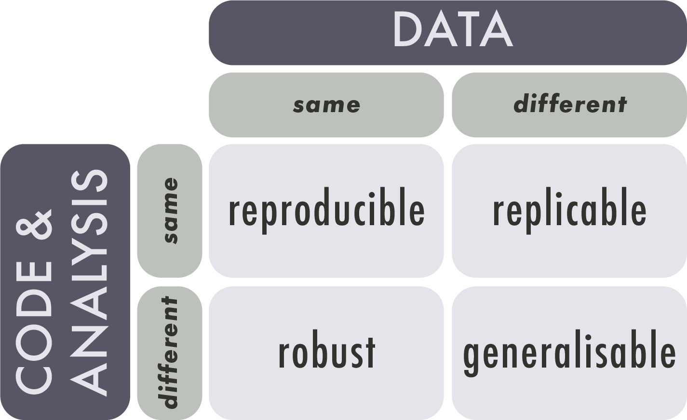

## Learning Objectives

By the end of this lesson, you will be able to:

 - Identify issues with reproducibility in research, and best practices to make research reproducible.  
 - Discuss pros and cons of using Excel for spreadsheet data.  
 - Explain the difference between Excel files (.xlsx) and plain-test .csv files, and their role in reproducibility.  
 - Define scripting and the concept of literate programming.  
 - Connect the data science workflow and the use of R and RStudio with the research data lifecycle.
 
## Lecture \- Reproducibility in Research

### Lecture

* [Download the PowerPoint](files/day2_L3_Reproducibility.pptx)

<embed src="files/day2_L3_Reproducibility.pdf" type="application/pdf" width="100%" height="600px" />

### What is Reproducibility?

As we have learned, research data management supports the responsible conduct of research. Reproducibility is an important aspect of that responsibility. Reproducible research practices lead to research outputs that are verifiable, extendable, and trustworthy.

Research is reproducible when the same data \+ the same methods \= the same results. Reproducibility is related to replicability, though replicability occurs when **new data** \+ the same methods \= results that point in the same direction.

[Source](https://ar5iv.labs.arxiv.org/html/2003.12206)

Reproducibility in research can take different forms, including empirical/methodological, statistical, and computational. This section is focused on computational reproducibility. 

For a project to be computationally reproducible, information about all assets used to test hypotheses and generate results must be available. These include (but are not limited to) the following:

- input data  
- source code  
- software  
- computing environment and/or hardware

### The Reproducibility Crisis

‘Crisis’ is a strong word, but it is easy to find examples of fabricated research results. Poorly documented research, whether accidental or purposeful, can create measurable harms to individuals and communities.

Most researchers are not formally trained as programmers, but they increasingly need to deal with issues such as the growing size and scope of datasets, the availability of data analysis methods and algorithms, and the proliferation of new research tools and software.

For these reasons, the barriers to fully reproducible research must be identified and addressed. These barriers include technical challenges, external dependencies, and human factors.

**Technical challenges:**   
Variations in available computing environments and differing computational complexity across projects / disciplines create hindrances to reproducibility. Technical challenges are not insurmountable, but they highlight the importance of detailed documentation. 

**External dependencies:**   
Infrastructure such as external APIs and algorithms are often outside of the control of the research team. Many external services are not open-source, which creates a ‘black box’ of uncertainty when it comes to data processing methods and code documentation. 

**‘Operator error’ and reluctance to share:**   
Human factors, such as inexperience with coding or a reluctance to share data, pose significant barriers to reproducible research. Documenting code takes time and skill, and some researchers are unwilling to share due to a fear of criticism or concern about their findings being ‘scooped’ or taken by others. 

#### Nuances of Reproducibility

**Reproducibility is a spectrum**. The more assets and information provided, the easier it is to reproduce the study.

- High / full reproducibility: studies that provide the code, data, and full computational environment necessary to reproduce the results.  
- Medium / partial reproducibility: studies that provide the code and data, but not the computational environment in which the code can be run.  
- Low / shallow reproducibility: studies that provide algorithms and results. 

**Sharing ≠ reproducible**. Simply sharing data and code does not make a project reproducible; rather, reproducibility requires detailed project documentation. Could another researcher, without ever speaking to you, open, understand, run, or reuse your data and code?

**Not all data are computationally reproducible**. Research methods are discipline-specific, and what works in one domain may not be possible in another. Qualitative, humanities, or arts-based research are not exempt from good documentation practices just because they are less computationally reproducible than other projects. 

### Best Practices

Good research data management is not about perfection. Small incremental changes can have a powerful impact on the reusability and reproducibility of a research project. Perfection is unattainable, but good and consistent data management practices are always within reach. Best practices in reproducible research include being proactive with data management planning, providing robust (rather than just sufficient) documentation, and paying careful attention to the computational environment and hardware.

**Be proactive**. Planning for reproducibility should happen at the start of a project, not the end. Make use of resources such as data management plan templates and reproducibility checklists. This will not only help with the project’s reusability, it will make the current research easier to implement and understand.  
**Document, document document**. There can never be too much documentation. If the concept of writing about the project details seems daunting, think of it as a communication with your future self. If you put the project away for six months, how would you describe to yourself what you were working on? Practices such as literate programming and version control can help to streamline and automate documentation. 

**Use discrete computational environments**. Technologies such as software containers and virtual machines create predictable and controlled environments for computational research. As with all practices in RDM, using discrete computational environments is not only helpful for future research, but for the implementation of the current research project.

**Be** **FAIR**. Sharing your data, code, and documentation in a recognized repository helps with reproducibility by making your research *findable*. Ensuring all documentation and data are in open, rather than proprietary, file formats allows your research to be *accessible* and *interoperable*. And, providing robust documentation supports research *reusability*.

### Working with Microsoft Excel

#### What it Does Well

Microsoft Excel is widely known and used, and it often elicits strong reactions from people who either strongly like or dislike it. But Excel is popular for a reason. It is easy to use; it can quickly calculate things like sum, mean, and basic statistics; there are many options in the graphical user interface for automation and formatting; it can create colourful graphs and charts; and there is a lot of help available for writing formulas and using advanced features. 

The popularity of Excel can lead users to believe that it is the only option for wrangling data, but there are other options depending on the use-case. Programs like OpenRefine, SPSS, Sass, and Stata, and coding languages such as R and Python all have robust functions and features for tasks like data cleaning and advanced statistical analysis and graphing. 

#### What it Doesn’t Do Well

Excel is an easy-to-use program for novice users, but it is full of hidden features and idiosyncrasies. The biggest issue with any technology is ‘operator error’, and this is especially prevalent in Excel, where settings and preferences are hidden away in menus. Since Excel is a proprietary program, users can’t easily inspect or search for errors in their configuration settings.  

Dates in Excel need to be formatted correctly in multiple ways. The characters must appear in a predictable pattern, and the cell format needs to be set correctly. 

Long strings of numbers will always be truncated, and, depending on the settings, numbers with more than 16 characters may be rounded to zero. 

Excel does not handle big, or even medium datasets very well. Files become very hard to load or work with if they have over 800,000 rows of data.

Since Excel is a graphical user interface, it provides multiple ways in which to achieve the same task. For example, formulas can be ‘hard-coded’ (referring to specific cells), or they can be relational (referring to named cells) depending on configuration and user knowledge. When formulas are hard-coded, if a change is made to the data or configuration, the formula may break, or worse, display incorrect information.

And finally, one of the biggest issues with Excel is the lack of versioning support. The program makes direct changes to the source data whenever a file is saved. If the data are overwritten in the absence of a backup copy, a research project can be compromised, delayed, or worse.

### What’s in a Spreadsheet

An Excel spreadsheet saves as an `.xlsx`  file, which is a proprietary Microsoft format. While it’s natural to think of an Excel file as a single file, it is actually a zipped archive containing multiple files, including:

- source data  
- formatting and style sheets  
- charts and graphs  
- pivot tables  
- external links  
- Metadata

Excel can load and save non-proprietary file formats such as `.csv`, `.tsv`, `.txt`, and `.xml`. Comma separated values, or`.csv` files, structure data in a tabular format, which differentiates between columns using commas, with rows represented by every new line in the file. This is exactly how a spreadsheet is formatted, only without the extra configuration and style data attached. `.csv` files are text files; they are Human-Readable, they can be opened by text editors and other programs, and they can be interpreted by coding languages such as R or Python. 

### Converting Excel Files to Other Formats

Excel files such as `.xslx` can be converted to plain text formats, but there are important factors to be aware of. Aside from the textual and formatting issues that can occur when `.xlsx` is saved as `.csv`, it is important to know that `.csv` files only save one Excel worksheet at a time, rather than the multiple worksheets saved by an `.xlsx` file. Complex formulas or tables that rely on data from multiple worksheets cannot be saved into `.csv`, so it is important to understand the data sources and structure before files are converted. The table below shows some of the most common formatting issues that can occur during a file conversion.

|   |   |   |   |  
|---|---|---|---|  
|**Original value/format**|**What can happen**|**Example of change**|**Why it happens**|  
|01234|Leading zero lost|1234|Treated as a whole number|  
|Résumé|Characters corrupted|Rsum / Résumé|Encoding issues|  
|31/12/2024|Date misread or changed|12/31/2024|Different regional settings for dates|  
|=SUM(A1:A10)|Formula lost|55 (only value)|Plain text only keeps values|  
|==Hello==|Formatting lost|Hello|Plain text doesn’t store formatting|  
|123456789012345|Rounded or scientific notation|1.23E+19 or rounded value|Precision limits|

#### Example: Genetic Data

In a survey looking at over 11,000 papers with Excel gene lists published between 2014 and 2020, more than 30% contained at least one gene name error caused by Excel's autoformatting. This was due to gene names being converted to standard dates, internal data numbers (5 digits), and floating point numbers. 

[Source](https://journals.plos.org/ploscompbiol/article?id=10.1371/journal.pcbi.1008984)

### Scripting

#### What is Scripting?

Lines of code, or ‘scripts', are instructions that a coding language can perform. They are useful for automating common or repeated operations, such as renaming variables or column names, especially for projects that use medium to large sets of data. Scripts can be used for many purposes, but in this section, the focus is on scripting for datasets.  
Scripts improve reproducibility because they are predictable. They perform the same operations, in the same order, every time.  

#### Literate Programming

Code is a language that computers can understand, but it is not always easily read by humans. Literate programming is a method of providing a human-language, or narrative, explanation of how a script works in combination with the script itself, so that it can be accurately interpreted and reused. The researcher who first wrote about literate programming, [Donald E. Knuth](https://cs.stanford.edu/~knuth/lp.html), suggested that researchers “treat a program as a piece of literature, addressed to human beings rather than to a computer.” 

This is a helpful approach for all aspects of research data management. Documentation **is** academic writing, and requires just as much care as a journal article or conference presentation. 

“An article about computational science in a scientific publication is not the scholarship itself, it is merely advertising of the scholarship.” [Buckheit and Donoho](https://web.stanford.edu/dept/statistics/cgi-bin/donoho/wp-content/uploads/2018/08/wavelab.pdf) (1995) paraphrasing Jon Claerbout.

#### When Not to Script

Coding, like any language, takes time and regular practice to learn. As a beginner, creating scripted solutions to simple research tasks may take much longer than using an easily accessible tool such as Excel. Good scripts take time, and they are not always necessary. Focus on the biggest, most repetitive tasks first. This will not only improve reproducibility, but it will save valuable time that can be used for tasks that are easily automated.  

#### When to Script

Scripting can overcome the common issues with Excel that were described earlier. For example:

- In scripting there are no ‘manual’ changes; everything from the data to the configuration can be tracked and checked.  
- Scripts are saved as individual documents and provide a clear and ordered list of everything that was done.  
- A single script can be used for multiple files, and individual lines of code can be taken from one script and altered slightly to perform the same task on different datasets.  
- There is no graphical user interface to inadvertently obscure settings or hide data.   
- Scripting can load and work on a copy of the source data, so original data isn't overwritten or corrupted. 

Scripting, especially when it is literate and well-documented, is a powerful way to increase the reusability of your data, both for yourself and others. 

### Coding in R
R is an open-source programming language designed for data manipulation, statistical analysis, and visualization in research. It can be used on any operating system, it has comprehensive documentation, and it has an active user-support and training community. It is popular in academic settings because researchers from many disciplines can use it on data types that range from bioinformatics to demography.

Because R is open-source, it is easily reproducible, as there are no hidden algorithms or proprietary file formats. Many R users are willing to share their code openly, which means that novice users don’t need to have perfect fluency in order to get started.

### RStudio

R is a programming language and RStudio is an Integrated Development Environment (IDE). While this is not quite the same as a program like Excel, it does make R a lot more user friendly, especially when it comes to identifying inconsistencies or errors, which is known as debugging.

To make the difference between R and RStudio clearer, consider this analogy:   
You are writing a document in Microsoft Word. In this case, the plain human language that you are typing would be R, and Microsoft Word, which is the software that allows you to view, format, add visuals, and save your work, is RStudio. 

### Choosing Between R and Python

As described in this [article from IBM](https://www.ibm.com/think/topics/python-vs-r), choosing between R and Python (another popular open-source coding language) depends on the needs and goals of the data analysis and the research team. R is well known for its capacity for statistical analysis and data visualizations. Python is known as being easier to learn than R, but both languages are suitable for novice users. Because R is so widely used in data science, it will be the focus of the instruction for this content.   
