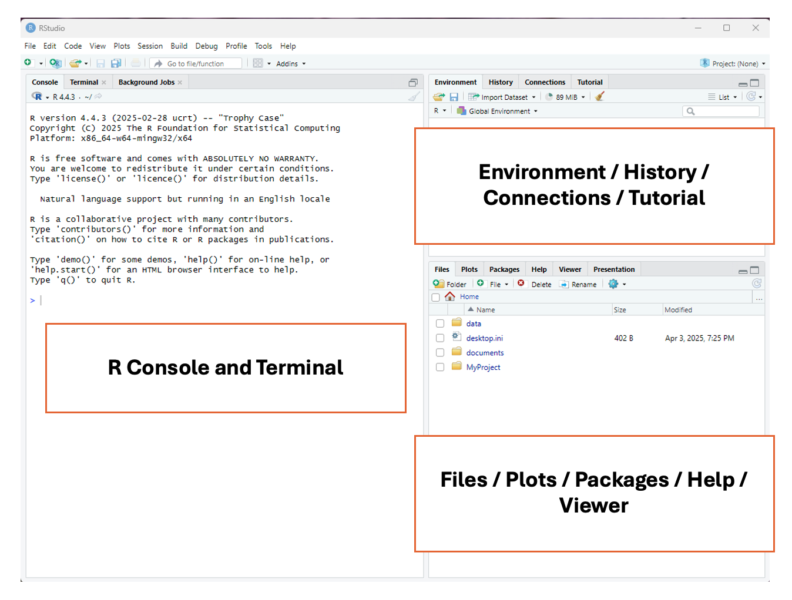
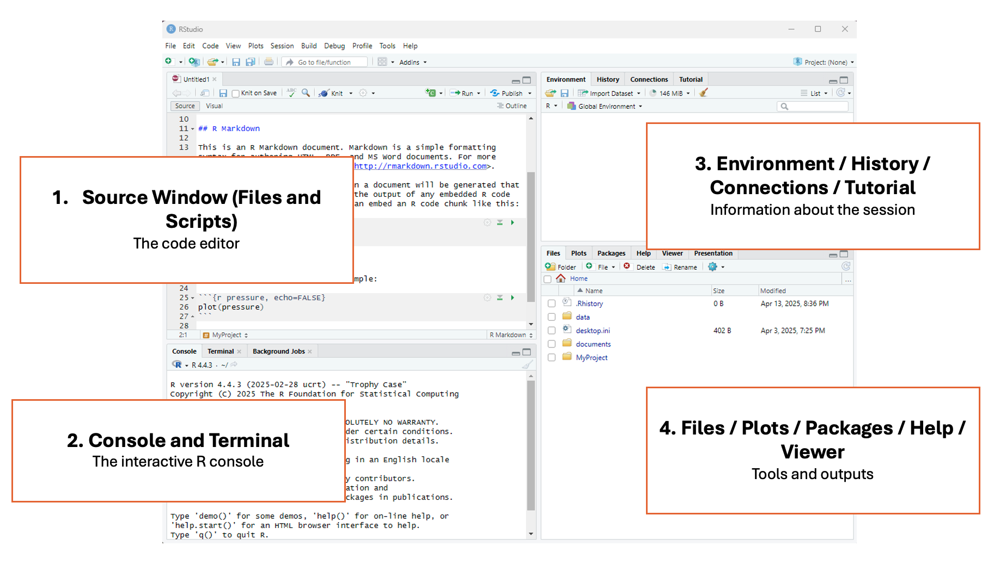
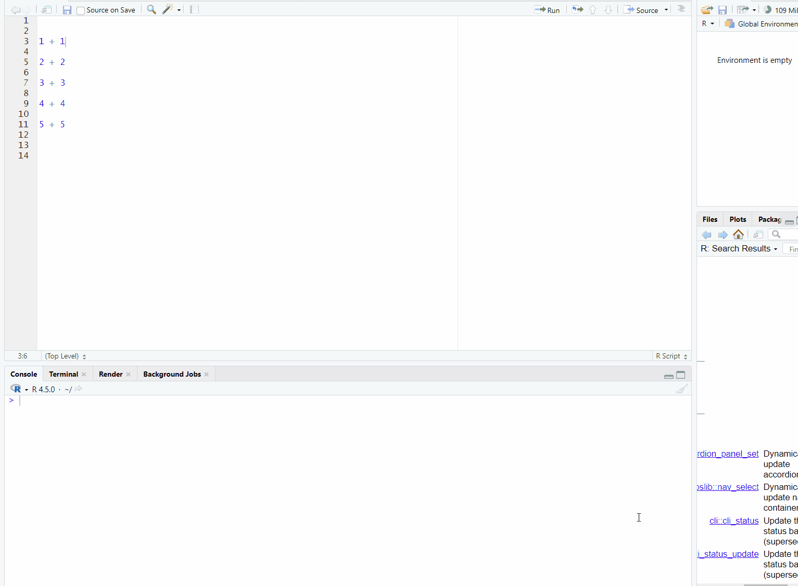

## Learning Objectives

By the end of this lesson, you will be able to:

 - Navigate R Studio and understand its different windows.  
 - Apply the syntax of an R to conduct basic actions.  
 - Perform basic functions in R (e.g., naming objects, basic mathematical calculations).  
 - Create reproducible code by applying concepts of literate programming.

## Tutorial \- Introduction to R

In this lesson, you will work through the tutorial below to learn how to navigate R Studio and perform basic commands in R. Follow the instructions below to implement the commands in R. If you run into issues or have questions, do not hesitate to ask\!

## Introduction to R

RStudio is a program that helps you write and run R code. The RStudio interface makes it easier to work with data, make graphs, and generate statistics.

To complete this exercise, you must download R and RStudio; follow the instructions on this page, [R and RStudio setup](../extras/setup.html).

## RStudio Interface

When you launch RStudio for the first time, you will notice three main panels or quadrants on the interface:

Then, once you open a document, the interface will show four main panels. Don’t worry if you don’t understand everything that each of the panels can do yet\! The following information contains a lot of coding-related terms that you will learn as this course progresses. 

### 1 \- Top left panel

#### **Files and scripts (source window or code editor)**

This is your code editor, where you write, save, and run R scripts (.R), RMarkdown documents (.Rmd), or other file types.

### 2 \- Bottom left panel

#### **R console and terminal**

This is the interactive R console, where code is executed immediately. You can:

* Type and run commands interactively (great for testing small bits of code).  
* View outputs, error messages, and warnings in real time.  
* Switch to the Terminal tab for system-level commands.

### 3 \- Top right panel

#### **Objects, history, environment, tutorial and connections**

This area lets you track what’s happening in your R session.

It has different tabs for different actions:

* **Environment:** See all objects (like data frames, functions, variables) currently in memory.  
* **History:** View all commands you’ve previously run.  
* **Connections:** Manage database connections.  
* **Tutorial:** View built-in interactive tutorials.

### 4 \- Bottom right panel

#### **Tree of folders, plots, packages, help, viewer**

This panel contains various tools and outputs:

* **Files:** Navigate your folder structure and open scripts.  
* **Plots:** View visualizations generated by your code.  
* **Packages:** Install, load, or update R packages.  
* **Help:** Search R documentation.  
* **Viewer:** View HTML content, like R Markdown outputs or Shiny apps.

## Easing Into R

### R as a Calculator

A good starting place for learning R is using one of its most basic functions, the calculator. Let’s look at how this works by typing the following examples directly into the Console (left panel). You will see a `>` symbol at the midpoint of the window. Put your cursor there to type, pressing enter when you’re ready to see the result.

#### **Adding Numbers**

You can add numbers using the plus sign `+`:

`2 + 2`

#### **Subtracting Numbers**

You can subtract numbers using a hyphen `-`:

`10 - 4`

#### **Dividing Numbers**

You can divide numbers using a slash `/`:

`20/4`

#### **Multiplying Numbers**

You can multiply numbers using the star / asterisk `*`:

`10 * 10`

**A quick note on the R console**

The R console can be used as a place to type very small calculations or actions. However, a big drawback of using the console is that you can’t save the calculations, and there is no way to add comments to the code. If you were to close RStudio without saving a file, you would lose everything you’ve done here. 

Try it: close the RStudio program and then reopen it. Are your calculations still in the console?

This is why R script files are used, as they can keep track of everything that has been done with sufficient documentation for others (and yourself\!) to interpret.

### Types of Files in R

There are two main types of files in R studio that can be used to edit code: R script files `.R` and RMarkdown files `.Rmd`.

The R script file (`.R`) is a plain text file where you can write sequences of R code and comments. It is used to write and run code line-by-line, such as for data cleaning, analysis, or function building. It’s good for experimenting, scripting, and running code interactively. It’s also good for sharing code with other researchers.

The RMarkdown file (`.Rmd`) has a mix of R code and written explanations using a type of formatting called Markdown. It can be used to create dynamic, reproducible reports that can be transformed into HTML, PDF, or Word documents. It’s great for homework, research reports, dashboards, or combining narrative with code. 

Both R script files and RMarkdown files can enable the practice of literate coding. For the purposes of this program we’ll be using R scripts, but if you’re interested in learning more about RMarkdown, check out:

* [RMarkdown lesson from RStudio](https://rmarkdown.rstudio.com/lesson-8.html)  
* [RMarkdown definitive guide](https://bookdown.org/yihui/rmarkdown/)

Reopen RStudio and create a script file. To create this file, select File \> New File \> R Script

### Working in an R Script File

Let’s move to the R script file we just created, located in the top left panel. First, try to re-run some simple mathematical calculations, but this time in the script:

`2 + 2`  
`10 - 4`  
`20/4`  
`10 * 10`

Did it work?

Unless you have previous experience with R, you will notice that R won’t simply run commands in a script when you press the `enter/return` button. This is because the R script allows you to freely type, edit, and adjust your code before it deploys it. This is another advantage to using RStudio over using the console.

#### **Running Code in an R Script**

There are a few different ways that you can run code in your R script:

1. **Point-and-click**: In the top right of the RStudio screen, you will see a button that says `Run`. If you click on it, RStudio will run the line/chunk of code where your cursor is located. If your cursor is above a line of code, it will run the line below it, but if your cursor is below the code, it won’t run anything. You can also highlight multiple lines of code and press `Run`, and they will be run consecutively

2. **Keyboard commands**: There are two main ways that you can use keyboard commands to code in R scripts:  
* `Ctrl + Enter` (Windows) / `Command + RETURN` (Mac) \- will run a single line/chunk of code that your cursor is on  
* `Ctrl + Shift + Enter` (Window) / `Command + Shift + Return` (Mac) \- will run all the code in your R script, beginning at the top.

Use both methods with the calculations above, and then check the results in the console window, now shown in the bottom left panel below the script window. 

### Basic Syntax of R

In this section, we will start to use some of the coding-specific language that is commonly used in R. You don’t need to understand it all right away, but code, like any language, has grammar that provides structure and rules. Understanding the syntax of R will help you understand what R can do. Much like learning a spoken or signed language, we’re going to start off by learning about individual words and parts of speech before we jump into sentences (with paragraphs being the advanced next step).

The most important components of an R script are **objects** and **functions**. **Objects** store information and **functions** are used to manipulate the data.

#### **Objects & Assignment Operators**

An **object** is anything you create and name in R. It can be a number, a dataset, a function, or even a plot. Objects take on content from everything to the right of the assignment operator.

An **assignment operator** is how you store a value in R. It’s like saying: “Let this name hold this value.” It assigns content from the objects/functions/arguments on its right to the object on its left.

::: {.callout-caution}
## Note

In the examples below, you will also see a hashtag `#` symbol. This is used to indicate a comment about the code, which is an important aspect of literate programming. Everything after the `#` will be technically ‘ignored’ when the script runs. 

:::

Try the two examples below, with and without the `#` symbol. When you use the `#` symbol, the code executes in the console as written. If you remove the symbol, the code results in an error. It is a good habit to use comments in your code, and we will start to use them more often as this course progresses.

`a <- 5 # x is now an object that holds the value 5`  
`b <- "Anna" # b is now an object that holds the character Anna`

::: {.callout-caution}
## Note

Since “Anna” is a series of characters (as opposed to numbers), it needs to be wrapped in quotations. We’ll learn more about this in another session.

:::

`name <- "Maria" # The "name" object now holds the value "Maria"`

`name <- "Anna" # The "name" object now holds the value "Anna", and no longer has the value "Maria".`

Now, take a look at the top right panel, under the ‘Environments’ tab, to see the values you’ve just assigned. Try switching the `name` object to your own name and see what happens. 

**Why Overwriting is Useful**

* As your analysis becomes more complicated, you often build your results step-by-step.  
* Instead of creating dozens of different object names, you can reuse the same object name to store updated versions of your data or results.  
* This keeps your environment clean and your code easier to read.

Objects can also be assigned several values. This is done by using the `c()` command, which stands for concatenate, and where the strings of values go into the brackets. You can think of this function as “glueing” elements together into one group. It can be used like this:

`numbers <- c(1, 2, 3, 4, 5, 6, 7, 8, 9, 10)`

`sports <- c("Basketball", "Golf", "Soccer", "Tennis")`

Again, you’ll notice that the words, which are strings of letters / characters, are surrounded by quotation marks `""`, while numerals are not. This is because R, and most coding languages, handle character strings uniquely, and require quotations to surround words and phrases. We’ll cover this more in another section, but for now, just know that every time you want to use a character string as a value in R, you must use quotation marks.

::: {.callout-note}
## Test yourself!

1. Create an object called `w`, and assign it a value of `100`.  
2. Create an object called `x`, and assign it a value of `25`.  
3. Create an object called `y`, and assign it the value of `basketball`.  
4. Create an object called `z`, and assign it the value of `baseball`.

If this all worked, you will see in the top-right ‘Environment’ panel the four new values that you have created.

Let’s keep going:

5. Use the additional symbol `+` to add `w` and `x`.  
6. Use the division symbol `/` to divide `w` by `x`.  
7. Re-write objects `w` and `x` to give them new values of your choosing.  
8. Use the additional symbol `+` to add `y` and `z`. Did it work? If not, what do you think might have happened?  
9. Try creating an object that contains multiple values.

:::

::: {.callout-tip collapse=true}
## Answers

1. `w <- 100`  
2. `x <- 25`  
3. `y <- "basketball"`  
4. `z <- "baseball"`  
5. `w + x`  
6. `w/x`  
7. Ex: `w <- 500` or `x <- 9000`  
8. This should show an error like the following: `"Error in y + z : non-numeric argument to binary operator"`. This is because R will only let you add numerical values together, and not character values. This will be covered in more detail in another section.  
9. Example: `movies <- c("Pulp Fiction", "Lord of the Rings: The Fellowship of the Ring", "Highlander")`

:::

#### **Functions & Arguments**

Functions in coding are like verbs in a language; they convey an action to be performed. These actions are often (though not always) performed on an argument. We’re going to learn more about functions in a later section, but here is a basic function to show you how it works.

`numbers <- c(1, 2, 3, 4, 5, 6, 7, 8, 9, 10)`

`mean(numbers)`

Console result \=  `5.5`

In this example, the `mean` function is applied to the `numbers` object (which in this case is the `argument`), and gives the mean for the series of numbers. 

::: {.callout-tip}
## Question

Can you see how R could be used to perform multiple or repeated calculations with the use of a script file, rather than working manually or using an Excel formula?

:::

## Literate Programming

Literate programming is a method of providing a human-language, or narrative, explanation of how a script works in combination with the script itself, so that it can be accurately interpreted and reused. If you look at the script that you’ve currently written, it’s quite messy and difficult to interpret. While this is only a practice script, it is a good idea to start developing documentation practices at the beginning of a project, so as you continue on your scripting journey, these principles become second-nature. There are two primary ways we can start to support literate programming: **commented code** and **object naming**.

### Commented Code

Commented code was described above and is identified by the hashtag `#` symbol. The `#` symbol is a valuable tool used in all coding languages, as it **provides human-language descriptions of what a code chunk is doing.** Comments can be placed anywhere in the code. In the earlier examples, the `#` was found directly following the code. In the examples below, the comment is shown above the code chunk.

`# Create an object called "numbers" that carries the values 1-10`  
`numbers <- c(1, 2, 3, 4, 5, 6, 7, 8, 9, 10)`

`# Calculate the mean of the object "numbers"`  
`mean(numbers)`

Console result \= `5.5`

As you can see in the example above, you can use the `#` to write descriptions of what each chunk of code is doing, so that when others look at your code, or if you look at code that you wrote in the past, you can easily understand what it is doing. This is an integral part of literate coding and reproducibility, and something that is practiced across all coding languages and domains.

#### **Object Naming**

Looking again at the script that you’ve created, there are a lot of objects with single letters as names (`w`, `x`, `y`, `z`). While using letters as object names isn’t a problem when running small tests in practice scripts, it can get very confusing when you start working on bigger projects and have multiple objects to sift through. A much better approach is to give your objects short but meaningful names so that you and others can easily make sense of the objects that you’ve created.

Much like file naming, the following parameters apply:

* Only use letters in the English alphabet, numbers 0-9, dashes \-, and underscores \_  
* Do not use spaces or special characters such as: \~\!@\#$%^&\*()+=…  
* Separate naming elements with dashes \- and underscores \_

::: {.callout-note}
## Clean Up!

Now that we’ve established some best practices in literate programming, go through the script that you have currently created, and utilizing commented code and object naming, try to make it easily interpretable and reusable for others\!

:::

### Save your Work\!

You can save your script by selecting `file > save` or by clicking the disk icon in the top navigation pane.

Name your script `my-first-script.R`.