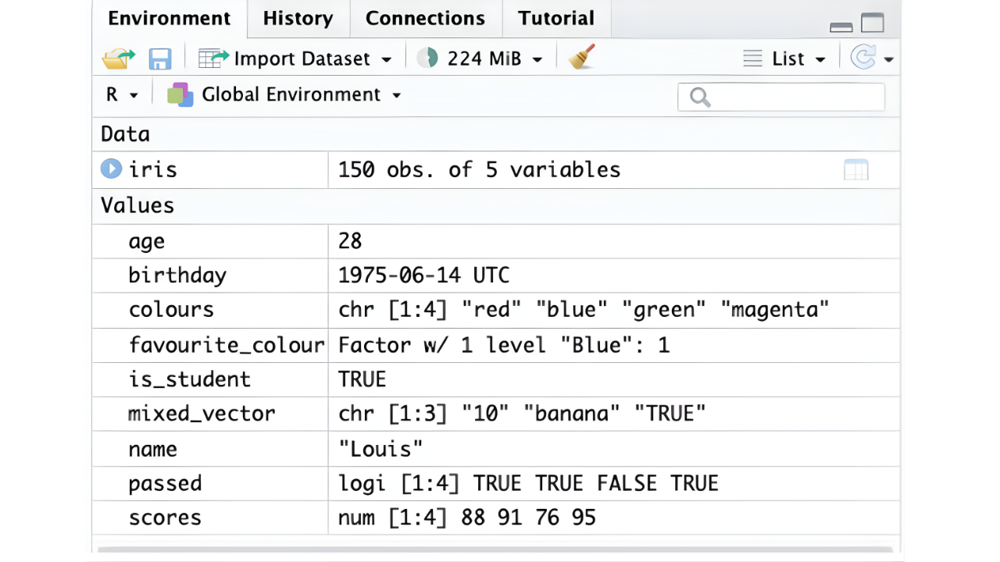

## Learning Objectives

By the end of this lesson, you will be able to:  

 - Describe and check the main data types and structures in R.  
 - Create numeric, character, and logical vectors in R.  
 - Inspect the structure and column names of a dataframe in R.  
 - Select specific columns of a dataframe in R.
 
## Lecture \- Data Types and Structures in R

## Lecture

* [Download the PowerPoint](files/day3_L1_Data-Types-Structures.pptx)

<embed src="files/day3_L1_Data-Types-Structures.pdf" type="application/pdf" width="100%" height="600px" />

### Data Types and Structures

This section will cover how data is organized in R. Understanding how your data is organized, and being able to adjust that organization to match your research needs, is an important part of research data management. For example, you might need your data to be in a certain structure to run statistical analyses, or you may need to transform variables into data types that are more easily understood by R.

There are two main ways that R works with data:

**Data types:** The kind of value that is stored in a cell or group of cells.  
**Data structures:** How values are organized.

Misunderstandings about the way data types and structures work in R can lead to common errors. In this session, we will learn about concepts that are essential to understanding and working with data in R. We will continue to build on these foundational skills as we progress through this course.

### Data Types

Data types represent the kind of data stored in a value. Values can come in many different formats or units. Your data may include numbers with decimals, true or false values, or categories with names. It is important to know what type of data you have, how to identify a data type in R, and how to modify a data type if needed. Various functions in R require using certain data types, which makes this a core skill for managing your data.

#### Main Data Types in R

* **Numeric**: Data values that consist of numbers. These numbers can be integers (whole numbers), or have decimal values.  
* **Character:** Data values that consist of letters or words. Remember, quotation marks are required to represent words as values rather than functions.  
* **Logical:** Data values that are TRUE or FALSE. For example, `5 > 3` will return a TRUE value, while `3 > 5` will return a FALSE value. R can also provide TRUE or FALSE responses if a certain condition is met.  
* **Factor:** Data values that represent categories, and can store either numeric or character data. “Education level” would be a factor variable consisting of character data, with values like “High school diploma”, “Undergraduate degree”, “Masters degree”, etc. Likert scales are very common examples where numeric data has categorical representation, such as the number 1 meaning “Strongly disagree” and the number 5 meaning “Strongly agree”.  
* **Dates and Times:** Data values stored in date or time format. While the specific format depends on the structure of your original data, a format for dates can look like “2026-05-06”, and a format for time can look like “12:45:54”.

#### Let’s Get Started\!

Let’s first start by creating a new R script. Remember, to create a new R script:

Select File \> New File \> R Script

Now that we have our script, let’s begin by creating some new objects in R:

`age <- 28`  
`name <- “Louis”`  
`is_student  <- TRUE`

In these simple examples, the data type is clear, but data type identification is not always this easy. You can use the `class()` function in R to check the data type. Remember, functions are “verbs” in R, providing actions to be performed. The typical syntax of an R function looks like this:

`function(object)`

::: {.callout-caution}
## Note

You will often see functions in R accompanied by a set of parentheses (or brackets). This is because the parentheses `()` tell R to run a function, and you must put any inputs the function needs inside them. Here is a simple guide:

`class` \- the function itself  
`class()` \- run the function  
`class(x)` \- run the function with the information inside the parentheses

If you want R to run a function, you must use `()`.

:::

::: {.callout-note}
## Exercise

With this structure, see if you can use the `class()` function to get the data type of each of these objects.

`class(age)`  
`class(name)`  
`class(is_student)`

:::

In addition to these three data types, there are two other types: factor and date/time. These are more complicated than numeric, character, and logical data types, but they are very common in datasets. Let’s start by creating two new R objects:

`favourite_colour <- “Blue”`  
`birthday <- 1999-04-05`

Now, use the `class()` function on these new objects to see the result.

You’ll see that `favourite_colour` is character, and `birthday` is numeric. This is because, by default, R classifies characters and numbers as character and numerical data, respectively.

In order for R to recognize these objects as factor and date data types, you will need to use two new functions when assigning values to these objects.

`favourite_colour <- as.factor(“Blue”)`  
`birthday <- as.Date(“1999-04-05”)`

::: {.callout-caution}
## Note

Capitalization matters\! The `as.factor` and `as.Date` functions must be written exactly as shown, otherwise they will result in an error. Try changing the first letters to upper or lowercase to see what happens.

:::

In these examples, `as.factor` and `as.Date` are specifically telling R to handle the values as factor for `favourite_colour` and as date for `birthday`. We’ll cover these concepts more throughout the program, so don’t worry if this is still confusing. For now, all you need to know is that there are different data types in R, and that factor and dates can require a bit more work than others.

Another way to inspect objects in R is through the `str()` function, which stands for structure. This function provides a compact summary of the internal structure of an object.

::: {.callout-note}
## Exercise

Give it a try with the 5 objects we’ve created\!

`str(age)`  
`str(name)`  
`str(is_student)`  
`str(favourite_colour)`  
`str(birthday)`

What is R telling you about each object?  
Is there anything that is interesting/confusing?

:::

### Data Structures

We’ve seen the ways that R handles different types of data values, but it is rare for values to exist on their own. They are often part of a larger **data structure,** which is the way R defines how values are stored, grouped, and accessed.

#### Main Data Structures in R

**Vectors**

Vectors are the simplest data structure in R. A vector is **a list of elements of the same data type.** For example, you could have a numeric vector containing the elements (10, 15, 20, 25\) or a character vector containing the elements (“blue”, “red”, “green”). A single variable in a dataset (e.g., a list of ages of all the participants) can be considered a vector.

**Data Frames**

Data frames are the most common data structure used in R. Data frames look like spreadsheets, which are formatted in rows and columns to represent tabular data. Unlike vectors, which have one dimension (a single column of the same data type), data frames are two-dimensional, and have columns and rows that can store different data types in the same data frame (e.g., numeric and character). **Data frames are made up of vectors of the same length**.

**Data frames have constraints:**

* The columns and rows must be named.  
* The lists of vectors in the data frame must have equal lengths (i.e., each column needs an identical number of elements/rows).   
* All elements in a single column must be of the same data type (e.g., you can’t switch between numbers and names in a single column).

In addition to these two main data structures, there are also other data structures in R, which include **lists** and **matrices.** We will not focus on these structures in this course, but you can read more about data structures in the ebook, ['R Programming for Data Scientists'](https://doserlab.com/files/for875/_book/structures).

### Playing with Vectors

Let’s make some multi-value vectors for **numeric, character, and logic** data types.

`scores <- c(88, 91, 76, 95)`  
`colours <- c(“red”, “blue”, “green”, “magenta”)`  
`passed <- c(TRUE, TRUE, FALSE, TRUE)`

::: {.callout-note}
## Exercise

We’ve already looked at `class()` and `str()` to inspect objects, but the `length()` function can also be a helpful tool to explore. Give these functions a try for the three vectors we just created. Are there any surprises?

Let’s play a bit more, and create a vector with mixed data types:

`mixed_vector <- c(10, “banana”, TRUE)`

Now run the `class()` function on this object. Is the output what you expected?

:::

As mentioned, vectors can only contain a single data type. When R gets an object like this, it must decide what data type that vector should be, and will convert values to a common data type by following a set of internal rules.

| If a vector contains: | Everything becomes: |
| :---- | :---- |
| Logical \+ numeric | numeric |
| Numeric \+ character | character |
| Logical \+ character | character  |

Try playing around with these combinations.

This might seem like unnecessary information, but R’s default conversions can be the source of errors and confusion, so it’s good to know it has some pre-programed behaviours.

### Playing with Data Frames

Most of the data that you’ll be working with in R are data frames, which contain rows and columns. In the next session we will learn how to import data from our example dataset, but for this session, we will play around with data that is pre-built into R.

Before we do this, it is worth mentioning that R has a lot of built-in datasets to practice with: [https://stat.ethz.ch/R-manual/R-devel/library/datasets/html/00Index.html](https://stat.ethz.ch/R-manual/R-devel/library/datasets/html/00Index.html)

They cover all kinds of topics and data types, and using them can be a great way to practice skills before you have your own data to analyze. There are a lot of online training materials and exercises that work with these datasets.

For this session, we’ll be looking at the Iris dataset: [https://stat.ethz.ch/R-manual/R-devel/library/datasets/html/iris.html](https://stat.ethz.ch/R-manual/R-devel/library/datasets/html/iris.html)

#### Loading Built-In Datasets

To load one of the built-in datasets in R, the syntax is:

`data(dataset-name)`  
`dataset-name`

Let’s use this pattern to load the iris data:

`data(iris)`  
`iris`

You should now see `iris` in the top right corner in your Environment pane. You will see that the previous objects we created are “values”, while `iris` is “data”. The data objects are tabular structures, and this is R’s way of organizing one-dimensional (values) and two-dimensional (data) objects.

::: {.callout-note}
## Exercise

Using the names, str, and length functions, start exploring the iris dataset.

1) What kind of structure is `iris`?  
2) How many columns does it have?  
3) What are the column names?  
4) Which columns are numeric?  
5) Which column is a factor (categorical)?  
6) What other questions would you like to know about the data?

:::

::: {.callout-tip collapse=true}
## Answers

1) It is a data frame. You can find this by using: `class(iris)` or `str(iris)`  
2) There are 5 columns. You can find this by using: `str(iris)` or `names(iris)`  
3) The column names are “Sepal.Length”, “Sepal.Width”, “Petal.Length”, “Petal.Width”, “Species”. You can find this by using:  `names(iris)` or `str(iris)`  
4) “Sepal.Length”, “Sepal.Width”, “Petal.Length”, “Petal.Width” are numeric. You can find this by using: `str(iris)`  
5) “Species” is a factor. You can find this by using `str(iris)`.  

:::

In these answers, we’ve introduced a new function called `names()`. This function is used to get or set the names of elements in an object. This function is **not** the same as the object called `name` that we created earlier in this lesson. 

In addition to these functions, we can use the `head()` function to show the top few rows of a dataset.

`head(iris)`

If you want to see more rows, you can specify the number with a command after the data object you are viewing:

`head(iris, 15)`

Finally, if you want to look at the dataset in a visual spreadsheet form, you can use the `View()` function (note that the capital ‘V’ is case sensitive\!).This function will open a new window in your RStudio interface. Let’s take a look at the this dataset:

`View(iris)`

#### Isolating Columns From a Data Frame

It is quite common for raw data to contain columns of data types that need to be changed. Changing data types will be covered in another session, however, it’s worth noting that you can quickly isolate columns to check their data types, among other functions. The syntax to isolate a column in a dataframe is:

`dataframe_name$column_name` 

::: {.callout-note}
## Exercise

1. Use the `names()` function on the `iris` dataset to determine the column names.  
2. Isolate any three of the columns in `iris` using the $ operator. What do you see?  
   

As mentioned above, columns in data frames are *usually* vectors, so we can use the `class()` function combined with the above syntax to determine the data type of a column. When you want to call a function on a column name within a dataframe, you must use the entire syntax, otherwise you may run into errors, or worse, incorrect information. 

3. Using the `class()` function, what type of data is `iris$Sepal.Length`?  
4. Using the `class()` function, what type of data is `iris$Species`?

:::

::: {.callout-tip collapse=true}
## Answers

1) `names(iris)`  
2) iris$\[column-names\]. You will see the full range of values for the specified variable in the R console.  
3) Numeric. You can find this by using: `class(iris$Sepal.Length)`  
4) Factor. You can find this by using: `class(iris$Species)` 

:::

## Conclusion

In this session, we learned about how R understands data types (numeric, character, logical, factor, and date), and how these types (also known as data values), are organized into structures like vectors and dataframes. 

The key takeaway is that **when you work with real data, every column has a type, and that type affects what you can do with it**. 

In the next session we’re going to start working with a real dataset and you’ll get an opportunity to move these concepts into practice\!
