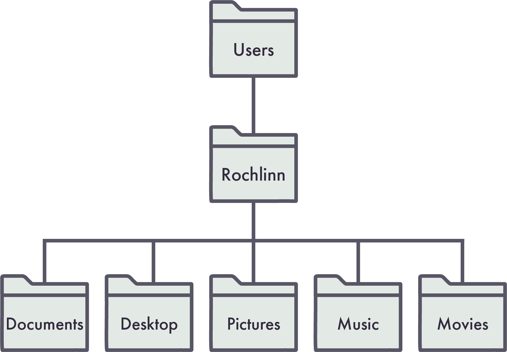
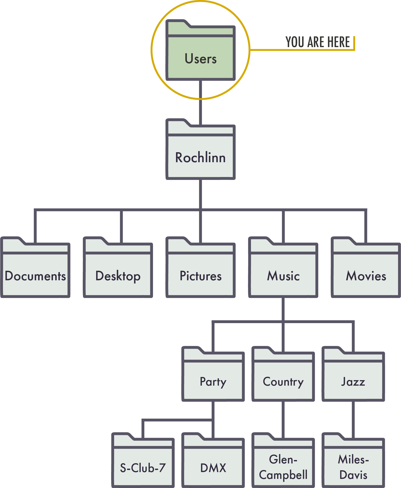
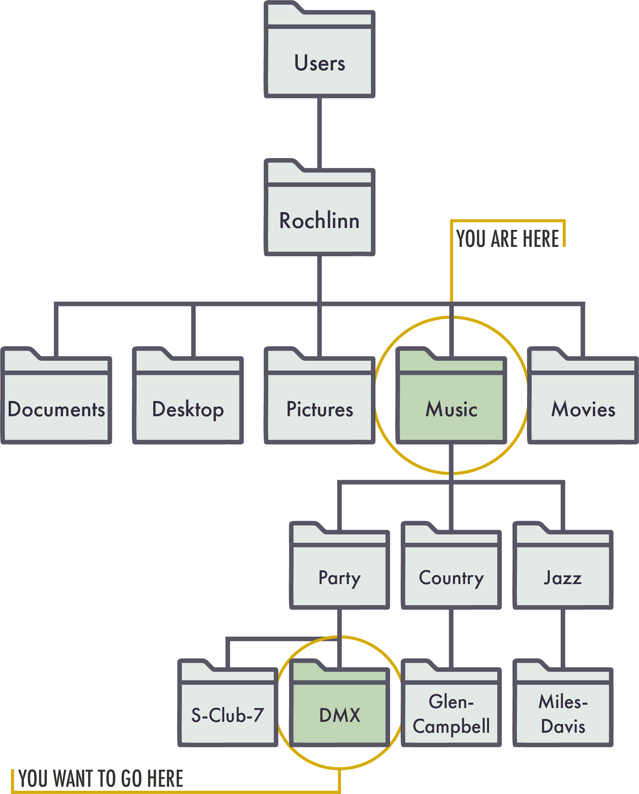

## Learning Objectives

By the end of this lesson, you’ll be able to:

 - Identify how your computer sorts information via file paths.  
 - Define relative and absolute file paths.  
 - Apply concepts of file paths to importing, or “reading” data into R.
 
## Lecture \- Introduction to File Paths

### Lecture

* [Download the PowerPoint](files/day3_L2_File-Paths.pptx)

<embed src="files/day3_L2_File-Paths.pdf" type="application/pdf" width="100%" height="600px" />

### Working with Files, Directories, and Paths

Files are named objects on a computer that store data for use by programs and users.

Directories, or ‘folders’, are units that hold files or other directories. For research data management purposes, directories keep your files organized, which makes them easier to find and work with.

A ‘path’ is a string of characters that specifies a unique location in a directory hierarchy; i.e., it specifies the location of a particular directory or file in a computer's file system structure. In paths, each directory in the path is followed by a slash /. The slash helps differentiate `folders/` from `files`. 

Consider the following diagram. The path for the Desktop directory would be written as `Users/Rochlinn/Desktop/` , while the path for the Music directory would be: `Users/Rochlinn/Music/`. 

::: {.callout-caution}
## Note

**An important note on slashes\!**  
In the early days of computing, all slashes in file and directory paths were forward slashes /. These are still used in operating systems like Mac, Android, and Linux, and in programming languages like R and Python. A typical file path in these systems would be something like `Users/UserName/Desktop/Music/myfavouritesong.mp3` 

In Windows-based systems, the backwards slash \\ is used instead. The same file path in a Windows system would be `Users\UserName\Desktop\Music\myfavouritesong.mp3`

When you move on to the sections discussing R, remember that even if you’re on a Windows system, any file or directory path you indicate in R will need to use the forward slash /.

:::

#### Exercise 1

Consider the following diagram of a directory structure.

::: {.callout-note}
## Questions

1. What would be the path to the Music directory?  
2. What would be the path to the S-Club-7 directory?

:::

::: {.callout-tip collapse=true}
## Answers

a. /Users/Rochlinn/Music   
b. /Users/Rochlinn/Music/Party/S-Club-7

:::

### Absolute and Relative Paths

**Absolute path**: Specifies the full location of a file or folder starting from the root directory.  
**Relative path**: Specifies the location of a file or folder starting from the current location, or ‘working directory’. 

Consider the diagram below:

The absolute path to the DMX folder, i.e., the path from the root directory is:

**`Users/Rochlinn/Music/Party/DMX`** 

From the Music folder, the relative path to the DMX folder is:

**`Party/DMX`**

#### Why This Matters

So far we have learned about objects, functions, and dataframes in R, but we have yet to import our example dataset. One common challenge when first working with external datasets in R is understanding file paths, specifically where a file is stored and which directory R is currently using. You don’t need to be an expert in file paths, but this session has provided the knowledge needed for the next session, where we will import our own data into R.

