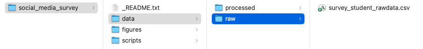

## Learning Objectives

Be the end of this lesson, you’ll be able to:  

 - Create a project directory.  
 - Organize files and folders within the project following a given directory structure and naming convention.

## Activity \- Create a Directory for the Example Project

Your supervisor has given you the directory structure she would like you to use for the student survey data. It looks like this:

::: {.callout-note}
## Breakout Room

For this activity, you will work in breakout groups to replicate this directory structure on your own computers, and organize project files into their corresponding folders. In your groups:

* Replicate this folder structure on your own computers.  
* Organize the project files you have already downloaded and/or created into these folders.  
* When you are ready, share your screen with your group and breakout room facilitator to make sure your file organization is good to go\!

You will have 30 minutes in the breakout rooms. You won’t need to report anything to the larger group.

:::

### File Naming Convention

Because we won’t be using or creating many files, we can keep our file naming rules simple.  We will name the raw and processed data files using the format `asset_group_description.csv`, where ‘group’ refers to faculty/students, while the ‘description’ tells us what’s been done to the data.

For example, a raw faculty survey dataset would be called `survey_faculty_rawdata.csv` and once it’s been cleaned and anonymized, `survey_faculty_anonymized.csv`.

