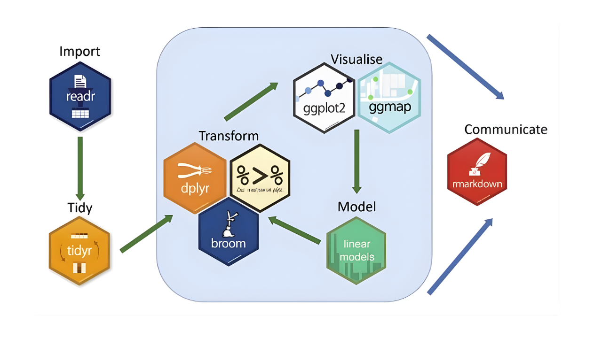
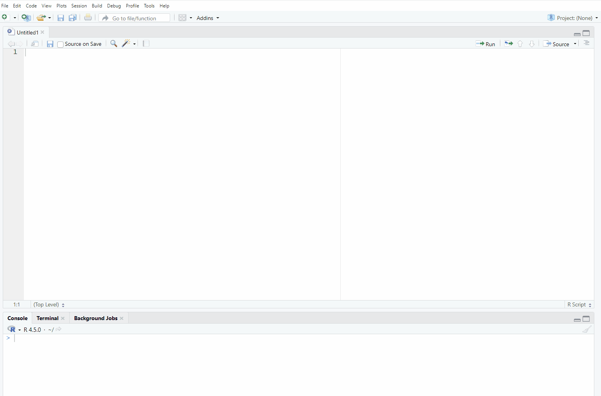
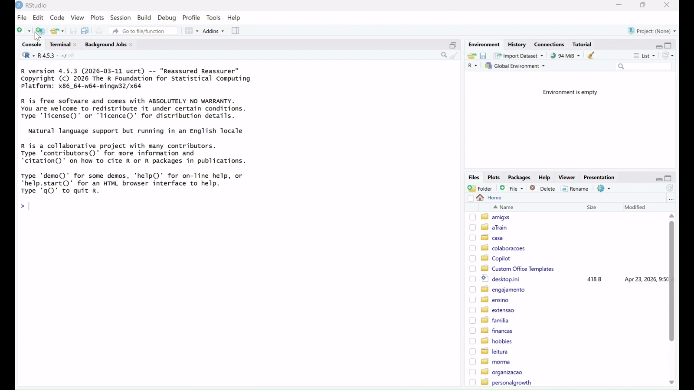

## Learning Objectives

By the end of this lesson, you’ll be able to:  
 - Install and load the `tidyverse` package in R.  
 - Check and modify the working directory in an R session.  
 - Create an R project.  
 - Read tabular data into R using `tidyverse`.  
 - Use both base R and `tidyverse` functions to view a dataset.  
 - Upload project documentation based on new project information.
 
## Lecture \- Packages, Working Directories, and R Projects

### Lecture

* [Download the PowerPoint](files/day3_L4_Tidyverse.pptx)

<embed src="files/day3_L4_Tidyverse.pdf" type="application/pdf" width="100%" height="600px" />

### Packages and Libraries

R includes a number of pre-installed functions and data that you can use upon installation. This is commonly called “base R”. However, for certain tasks, you will need to use additional tools to accomplish work and facilitate workflows. In this session, we will learn about R packages and libraries.

* **Packages**: Packages are collections of functions, datasets, and tools created to extend the capabilities of R. They can be installed to access additional functionality, data analysis tools, visualizations, and sample datasets. There are many R packages available, but here is a link to some of the most common/useful ones: [list of useful R packages](https://support.posit.co/hc/en-us/articles/201057987-Quick-list-of-useful-R-packages)  
* **Libraries**: Once you install a package, it is stored on your computer in a folder (called a library), where R can access its functions and data. You only have to install packages once, and you can use the `library()` function to load packages into your R session.

#### Tidyverse

We will be using a collection of R packages called the `tidyverse`. The `tidyverse` is commonly used for research and data science, as it is designed to facilitate data manipulation, analysis, and visualization. The `tidyverse` packages are designed to work well together. They all use the same syntax and rules, which makes learning how to use them easier. The `tidyverse` website has a lot of documentation and reference material that you can use if you are struggling with how to approach a specific task. 



Let’s take a closer look at the [tidyverse website](https://www.tidyverse.org/packages/).

::: {.callout-note}
## Exercise

Explore the [tidyverse website](https://www.tidyverse.org/packages/) to view the different packages available in the `tidyverse`. Ask questions if you have them\!

:::

### Setting the Working Directory

In the previous session on files and directories, we learned about relative file paths. Remember, relative file paths refer to the location of a file or folder *relative* to your current location in the directory. R uses relative file paths when reading data and using libraries, so it is important for you to understand this concept. You can manually set a working directory in R, or you can use a feature called R Projects. We will review both methods in this session. 

One way to set a working directory is to use the `setwd()` function. This function tells R where to look for files and where to save outputs. But, setting the working directory using this manual method means that the settings are valid for that session only.

You can access the `setwd()` function in two ways:

In the console or your script, use the `setwd()` function manually by inserting your file path in the brackets and running the code:

`setwd("directory-name/secondary-directory/etc...")`

::: {.callout-caution}
## Note

See lesson on [File Paths](Day03_Lesson2.html) for more information on file paths.

:::

OR

Select the `Session` tab in the toolbar, and then select `Set Working Directory`:



But here’s the problem…  
Using `setwd()` can break your code when:

* Someone else tries to run it on their machine.  
* You move your project folder.  
* You’re running your code on a server or in cloud environments like RStudio Cloud.

Since file paths are hardcoded and depend on your machine, this practice is not reproducible.

### R Projects

R Project is a feature in RStudio (and base R) that provides a self-contained working environment. An R Project creates an `.Rproj` file in a named folder, and that folder becomes the root directory of your project. Every time you open the project (via the `.Rproj` file), R automatically sets the working directory to that folder. You can reference files relative to the project root, with no need to hardcode file paths.

This is useful when you’re working on multiple analyses, sharing code with collaborators, or version-controlling with Git. An `.Rproj` file is a configuration file that tells R Studio how to set up and manage the specific working environment you require for your project. **It is a good practice for reproducible research.**

## Tutorial \- Create an R Project and Read Data into R

### Create an R Project

In this tutorial, we will read and inspect the dataset from our example project. First, we need to create an R project inside the project folder that you created in the previous lesson.

 - To create an R Project, select File \> New Project

 - Because you already created the folder to contain the project in the previous session, you should choose “Existing Directory” here. If you had not created the folder, you could choose “New Directory”, and R Studio would also create the folder for you.

 - Click on “Browse” and then navigate to the folder `student_survey` that you just created.

 - Click on “Create Project”.

Now you have created an R Project\! 



To better understand how the R Project works, type this command in the console:

```{r} 
#| eval: false

getwd()

```

This command will show the working directory that R is looking at. To see how R Projects can be very useful, let’s do a test:

 - Close R Studio.  
 - Navigate to the `student_survey` folder on your computer.   
 - You now should have a file called `student_survey.RProj` in your folder. Open it. 

As you can see, the file opens R Studio. 

Enter `getwd()` into the console again.

It should show the same working directory. Every time you open the project (via the `.Rproj` file), R automatically sets the working directory to that folder.

### Create an R script

Now, let’s create a new R script.

Select File \> New File \> R Script


### Install the `tidyverse` Package

To install a package we use the function `install.packages()`.

Packages only need to be installed once. You should always install packages **in the R console**, rather than in a script to avoid reinstalling them each time the script runs. Some packages may take several minutes to install, depending on their size and the speed of your connection. You do not want to do this every time you run a script\!

```{r} 
#| eval: false

install.packages("tidyverse")

```

### Load Libraries

Once a package is installed, you load it using the `library()` function.

It’s best practice to **load packages in your script** so that others can see what packages are required to run the code.

```{r}
#| eval: false

# Install package

library(tidyverse)

```

::: {.callout-caution}
## Note

When installing a package, you need to wrap the package name in quotation marks “”. When loading a library, you don’t need to use quotations.

As mentioned, it is best practice to install packages in the R console, because this only needs to be done once. But since libraries need to be loaded in every working session, it is best practice to keep them in the script so that others can see what libraries need to be loaded to reproduce your work.

:::

### Read Data with Tidyverse

In order to start working with a dataset in R, we first need to import, or “read in”, the data. As mentioned in the session **“Reproducible Research: Moving From Excel to Scripting”**, we will be working with `.csv` files, but R is capable of reading in other file types as well. As you work through this tutorial, type in the chunks of code inside your R script, and send them to the console to see the results.

### Read a .csv File

To import a `.csv` file, we can use the `read_csv()` function and assign it to a new object called `survey_data`. We’re creating this new object so that we can call it in different functions later on.

```{r}
#|eval: false

# Import data
library(tidyverse)
survey_data <- read_csv ("rdm-jumpstart/qmd/Day03/surveydata/raw/survey_student_rawdata.csv")
```


