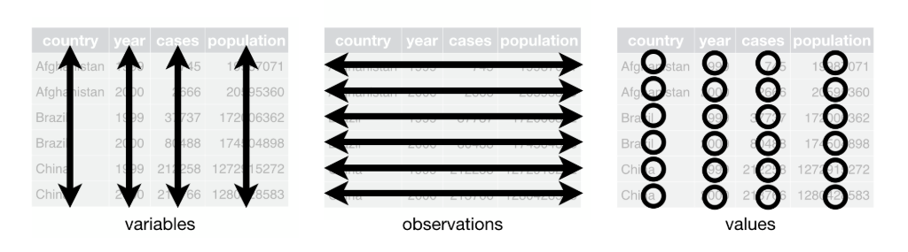

## Learning Objectives

By the end of this lesson, you’ll be able to:  

 - Describe what tidy data is.  
 - Manipulate data into tidy formats.  
 - Reshape data from wide to long format and vice-versa.  
 - Use functions from the tidyverse to clean data of an example dataset.  
 - Write reproducible code by applying concepts of literate programming.
 
## Lecture - Data Cleaning

### Lecture

* [Download the PowerPoint](files/day5_L1_Tidy-data.pptx)

<embed src="files/day5_L1_Tidy-data.pdf" type="application/pdf" width="100%" height="600px" />

### Tidy data

Last session, we learned the `tidyverse` is a useful package for cleaning data. The `tidyverse` is also useful for formatting datasets to make them ‘tidy’. But what is tidy data?

There are 3 things make a dataset tidy:
- each variable has its own column.
- each observation has its own row.
- each value has its own cell.

In practice, tidy data might look like this: in table format, each column represents a unique variable, each row a unique observation and each cell a unique value.


But what are variables, observations and values? From the [Tidy data documentation](https://tidyr.tidyverse.org/articles/tidy-data.html#defining): “A dataset is a collection of values, usually either numbers (if quantitative) or strings (if qualitative). Values are organised in two ways. Every value belongs to a variable and an observation. A variable contains all values that measure the same underlying attribute (like height, temperature, duration) across units. An observation contains all values measured on the same unit (like a person, or a day, or a race) across attributes.”

Let’s work through what this all means with an example.

Say this is your dataset: you have a list of countries, and years where the number of cases of an illness were recorded.

| **country** | **1999** | **2000** |
|---|---|---|
| Afghanistan | 587 | 497 |
| Brazil | 93 | 88 |
| China | 3391 | 2034 |
| ... | ... | ... |

::: {.callout-tip}
## Question

What are the variables and observations in this data? Is this dataset tidy?
:::

Here, the numbers of cases were recorded for each country and year, which then comprise the three variables in this dataset (country, year, cases). Each combination of country and year consists of one observation. Therefore, this dataset is not tidy, because the variable year is spread across multiple columns. 

How can we tidy this data up? Remember that for tidy data, each variable has its own column. Therefore, we would have to take the columns ‘1999’ and ‘2000’ and combine them into a new column, ‘year’ - which looks like this:

| **country** | **year** | **cases** |
|---|---|---|
| Afghanistan | 1999 | 587 |
| Afghanistan | 2000 | 497 |
| Brazil | 1999 | 93 |
| Brazil | 2000 | 88 |
| China | 1999 | 3391 |
| China | 2000 | 2034 |
| ... | ... | ... |

You will notice that each column is its own variable - country, year, cases - and each row is its own observation - one row per combination of country and year. You will also notice that the names of countries appear in multiple rows, as do the years, as they have more than one observation each (each country has observations for multiple years, and each year has observations for multiple countries). 

::: {.callout-tip}
## Question

Let’s try again! Look at the dataset below. Is it in tidy format? If not, what would the tidy version look like?

| **Student**   | **Math test** | **English test** | **Essay** |
|--------|-------|-------|-------|
| Beth  | D	| D 	| C 	|
| Carl   | F 	| C	| C	|
| Erin | B 	| C 	| B 	|
| Joe  | A 	| A 	| B 	|

:::

::: {.callout-tip collapse=true}
## Answer

The dataset is not tidy. Here, the variable “assessment” is spread across multiple columns. The tidy version of this dataset would look like this, with one row per observation, that is, per combination of student and assessment.

| Student | Assessment  	| Grade |
|---------|-----------------|-------|
| Beth	| Math test   	| D 	|
| Beth	| English test	| D 	|
| Beth	| Essay       	| C 	|
| Carl	| Math test   	| F 	|
| Carl	| English test	| C 	|
| Carl	| Essay       	| C 	|
| Erin	| Math test   	| B 	|
| Erin	| English test	| C 	|
| Erin	| Essay       	| B 	|
| Joe 	| Math test   	| A 	|
| Joe 	| English test	| A 	|
| Joe 	| Essay       	| B 	|

::: 

Because this format has more rows than the original version, it is said to be in long format, while the previous version is said to be in wide format. 

Usually, the long format of a dataset is considered to be more tidy. However, each dataset and research question is different, and what is considered a variable might also be different depending on questions. For example, while for most situations “home phone” and “work phone” could be considered two different variables, in a fraud detection context, you might want to use a long version dataset with “phone type” and “phone number”, as having one phone number for multiple people could indicate fraud. Therefore, deciding what is the best tidy format for your project will depend on your dataset and questions. Typically, if you want to describe the relationship between things (e.g., is age related to usage of social media?), these two things are better considered as different variables in your dataset. On the other hand, if you want to compare things between groups (e.g., is usage of social media different between genders?), you want the group to be a variable, with categories of your group to appear in the different rows of the dataset.

Great, but why bother to make your dataset tidy in the first place? There are two reasons you might want to transform your data into a tidy format. First it helps to keep data structure consistent. Second, it makes it easier to use lots of functions in R, especially in the `tidyverse` package, which you will see in future lessons. 

Now that we have gone over what tidy data is and why you might want to make your data tidy - let’s try it in R! 

## Tutorial - Tidying Data

To keep this neat for yourself, and to promote transparent and reproducible research, it is best to clean your data in a single script that works from raw input to a final cleaned output. So, we are going to continue with the same script that we were working with before: survey_student_cleaning.R

### Set Up

Open the survey_student_cleaning.R script by first opening the R Project, then opening the script file. Run the script from beginning (set-up) to end (separate or unite values). We are now in the same place we ended off the previous data cleaning lesson.

```{r}
#| echo: false

# load the package
library(tidyverse)
# load the data
survey_data_unit <- read_csv("data/processed/survey_student_survey-data-unit.csv")
```

### Fix Variable Types

Before we start reshaping our data, we want to make sure all variables are assigned to their correct type in the dataset.

In Day 3 - Lesson 1, we talked about the different data types in R, such as numeric, character, and factor. To explore and analyze data in R, you must make sure that R is reading your data as it should. That is, numeric variables are understood as numeric, and categorical variables are understood as factors. For categorical variables that are ordinal (that is, they have an order), it is particularly important to assign correct levels of the variable. We will go through these cases one by one here.

To start, we can use the `str()` function to see all the data types of our dataset and identify the ones that need correcting. Remember that, in our current script, we stopped at the step where we created the object `survey_data_unit`, so that’s the object we are starting with today.

```{r}
# check data types
str(survey_data_unit)
```

The output lists all variables, followed by either “num” or “int” for numeric variables (“int” is for integer values, while “num” is for continuous values), or “chr” for character variables. You can also see the first few values of each variable.

#### Nominal Variables

Nominal variables are categorical variables without order, for example the gender, province, and field of study variables. Typically, these variables are written with letters, which means that R will read them as characters. To transform them to factor, we can use the `as.factor()` function inside the `mutate()` function. 

To transform it into a factor, we can use the `mutate()` function, but instead of creating a new column name, we will use the same column name. R will overwrite the original variable with the new variable transformed to factor type.

```{r}
# transform gender variable to factor
survey_data_transf <- survey_data_unit |>
  mutate(
    gender = as.factor(gender)
  )

```

You can now check if it worked:

```{r}
# check: 'gender' is a factor?
str(survey_data_transf$gender)
```

It says that it is a “Factor w/ 4 levels”. Levels are what R calls the categories of a factor vector. You can check all levels using the `levels()` function:
 
```{r}
# check the levels of the factor 'gender'
levels(survey_data_transf$gender)
```


::: {.callout-note}
## Your turn!

Now transform the province and the field of study variables to factor. Remember that, in typical `tidyverse` syntax similar to the `rename()` function, you can perform multiple creations of variables with a single `mutate()` function, just by separating the different statements by a comma.

You can check the answer below, but please make sure to try it yourself before you see the answer.

:::

::: {.callout-tip collapse=true}
## Answer

```{r} 
# transform province and field of study variables to factor
survey_data_transf <- survey_data_transf |>
  mutate(
    province = as.factor(province),
    field_study = as.factor(field_study)
  )
```
::: 

#### Ordinal Variables

Now, we can look at the ordinal categorical variables. These are variables that have order between categories, for example, a Likert scale. The “Agree” option is between “Neutral” and “Strongly agree”, and so on. You have to be explicit with R in specifying the order of categories. You can do that using the levels argument of the `factor()` function. Again, we are going to do that inside a `mutate()` command.

::: {.callout-caution}
## Note

We are using the `factor()` function here instead of the `as.factor()` function. You cannot specify ordinal levels inside the `as.factor()` function, because it assigns levels based on alphabetical order by default. For specific levels, you need to create a factor vector using the `factor` function.
:::

```{r}
# transform ordinal variables to factor, with levels

# since all variables have the same levels, you can specify them first outside to avoid repetition:
feel_levels = c("Strongly disagree", "Disagree", "Neutral", "Agree", "Strongly agree")

# and now you transform:
survey_data_transf <- survey_data_transf |>
  mutate(
    feel_connected = factor(feel_connected, levels = feel_levels),
    feel_stress = factor(feel_stress, levels = feel_levels),
    feel_distracted = factor(feel_distracted, levels = feel_levels),
    feel_improvedmood = factor(feel_improvedmood, levels = feel_levels)
  )

# check that it worked
str(survey_data_transf)
```

::: {.callout-note}
## Your turn!

Transform the categorical variable that we created about total time spent per day in social media (`bin_hours_total`) into an ordered factor. Remember, the levels we created are: "Less than or equal to 2 hours", "2-4 hours", "4-6 hours", and "More than 6 hours". Since you are only doing this for one variable, you could specify the levels directly inside the `factor` function, just make sure they are concatenated into a vector with `c()`

You can check the answer below, but please make sure to try it yourself before you see the answer.

:::

::: {.callout-tip collapse=true}
## Answer

```{r}
# Transforms bin_hours_total to ordered factor
survey_data_transf <- survey_data_transf |>
  mutate(
    bin_hours_total = factor(bin_hours_total, 
                             levels = c("Less than or equal to 2 hours", "2-4 hours", "4-6 hours", "More than 6 hours"))
  )

# check that it worked
str(survey_data_transf)
```
::: 

The great thing about having the ordinal variables as factors with ordered levels is that you can easily transform them to numeric data types. This will be practical in the Data Visualization Lesson when we are exploring how usage of social media influences mental health. We will be able to use the different levels of agreements as numbers to combine the answers for each feeling into a single metric of mental health.

For now, we don’t need to transform the variables into numbers, as the ordered factor stores that information if needed. But for reference, here is how an ordered factor can be easily transformed into numbers.

```{r}
# View the first 10 entries of an ordered factor
survey_data_transf |>
  pull(feel_connected) |>
  head(10)

# View the first 10 entries of an ordered factor transformed to numbers
survey_data_transf |>
  pull(feel_connected) |>
  as.numeric() |>
  head(10)
```

::: {.callout-caution}
## Step-by-step explanation:

* The `pull()` function that we are using here just extracts one vector from the dataset. In this example, we are extracting the variable `feel_connected`
* Then, we use the `head()` function to see the first 10 entries
* In the second section of code, we first transform the `feel_connected` variable, which is an ordered factor, to number * using `as.numeric()` and then see the first 10 entries using `head(10)`
:::

#### Other Transformations

These are all the transformations that we are going to need for this dataset. However, sometimes R reads numeric data as character data; in that case, you use the same approach as before, but using the function `as.numeric()` to transform your variable to numeric type. When doing that, R will assign an NA value for anything that is not a number, so always check the result to make sure things are transforming correctly.

We will not be working with date variables for our research questions, so we won’t show you how to deal with them here, but you might run into date variables in other scenarios. If you need to deal with date variables, you should check the `lubridate` package which is also within the ‘tidyverse’. The R for Data Science book has a great [chapter on how to deal with dates and times](https://r4ds.hadley.nz/datetimes.html) using this package. If you want to give it a try, transform the `birth_date` variable into a date format.

Finally, after you have transformed all your variables, you should always check again to make sure things are how they should be.

```{r}
# check if it worked:
str(survey_data_transf)
```
If your code worked properly, your variables should appear in their new order and data type.

### Reshape Data
Ok, now that all variables are transformed to their correct type, we are going to convert our data into tidy formats.

#### Turn Dataset Into Long Format

When looking at the dataset, we can see that there are several columns that describe the number of hours spent in some activity, whether that is using a social media platform or sleeping. 

```{r}
# view variables
survey_data_transf |> 
  select(id, starts_with("hours"))
```
::: {.callout-caution}
## Step-by-step explanation:

* You have seen the `select()` function before, but here we are using a shortcut that you can use inside the `select()t` function, which is the `starts_with()` function
* The `starts_with()` function takes in as argument a character string (in this case “hours”), and when used inside the `select()` function, it will select all the columns that start with that string.

:::

In the context of our project, you can think of all of these values as part of the same variable “hours”. To make this tidy, we can use the function `pivot_longer()` to collapse those many columns down into two columns, which simultaneously increases the number of rows. 

We’ll create a column for 'hours_type', which is populated with the activity type, and another column called 'hours_number' with the associated number of hours.

```{r}
# pivot the hours variables (sleep, total, and each social media) to long format
survey_data_long <- survey_data_transf |> 
  pivot_longer(cols = starts_with('hours'),
               names_to = 'hours_type',
               values_to = 'hours_number')
```

::: {.callout-caution}
## Step-by-step explanation:

Again, the syntax is similar to what you have previously done using the `tidyverse`.

* We start with our current dataset `survey_data_transf` and pipe it into the `pivot_longer function()`
* The `pivot_longer()` function will pivot longer the columns listed in the argument `cols`. Here, we used the function learned above `starts_with()` to select all variables that start with `hours`
* Then, after `names_to`, you define the name of the column where the current column names will go to (i.e. `hours_type`)
* And after `values_to`, you define the name of the column where the current values will go to (i.e. `hours_number`)

:::

Let’s check to see how that worked.
```{r}
# check: long format for 'hours_type' and 'hours_number'
survey_data_long |> 
  select(id, hours_type, hours_number)
```

We can see that what was previously eight columns - hours_facebook, hours_instagram, hours_snapchat, hours_tiktok, hours_xtwitter, hours_other, hours_total, hours_sleep - has now been collapsed into the column ‘hours_type.’ In that column, there is now one row for each of these types per respondent. The sister column to ‘hours_type’ is ‘hours_number,’ which holds information about the number of hours spent on each type of activity. We have the same survey data we’ve always had - just in a long format.

::: {.callout-note}
## Your turn!

Do the same pivot with the columns related to feelings associated with social media. Notice that all of these columns start with `feel_`. Remember to start with the recently created object `survey_data_long`.

You can check the answer below, but please make sure to try it yourself before you see the answer. 
:::

::: {.callout-tip collapse=true}
## Answer

```{r}
# view variables
survey_data_long |> 
  select(id, starts_with("feel"))

# now do the same for the feel variables
survey_data_long <- survey_data_long |> 
  pivot_longer(cols = starts_with('feel'),
               names_to = 'feel_type',
               values_to = 'feel_response')

# check long format for 'feel_type' and 'feel_response'
survey_data_long |> 
  select(id, feel_type, feel_response)
```
::: 

Looks great! Each respondent has their answers spread out over multiple rows because we’ve collapsed the columns.

#### Turn Dataset into Wide

As we mentioned in the lecture, whether the best format for your dataset is the wide or long version will depend on what you are calling the variables in your dataset, which is dependent on your research question. Therefore, it is also useful to know how to change datasets from long into wide formats.

In the `tidyverse`, the opposite of `pivot_longer()` is `pivot_wider()`. This function tidies datasets that have single observations distributed across multiple rows. Although we don't have observations distributed across multiple rows in our dataset, we can practice back-transforming our data using `pivot_wider()` to get a sense of how it works. As you’ll see, the syntax is very similar - it is the reverse of what we’ve already learned.

```{r}
# pivot hours variables back to wide format
survey_data_wide <- survey_data_long |> 
  pivot_wider(names_from = hours_type,
              values_from = hours_number)
```

::: {.callout-caution}
## Step-by-step explanation:

* We start with our current dataset `survey_data_long` and pipe it into the `pivot_wider function()`
* The `pivot_wider()` function will take the values in the columns listed in the argument `names_from` (i.e. `hours_type`) make them column names
* Then, it will fill those columns with the values from the column listed after `values_from` (i.e., `hours_number`)

:::

Now, let’s check the results.

```{r}
#| eval: false

# Check results
View(survey_data_wide)
```

Scroll to the right to see if the hours columns have returned to their wide format.

::: {.callout-note}
## Your turn!

Do the same with the columns related to the different feelings associated with social media. Remember to start with the recently created object `survey_data_wide`.

You can check the answer below, but please make sure to try it yourself before you see the answer. 

:::

::: {.callout-tip collapse=true}
## Answer

```{r}
# do the same with the feel variables
survey_data_wide <- survey_data_wide |> 
  pivot_wider(names_from = feel_type, # make new columns with names from 'hours_type'
              values_from = feel_response)

# check results
view(survey_data_wide)
```
::: 

You’ll see that the dataset looks as it did before we transformed it by pivoting longer. To check this, you can look at one dataset after the other, and see if they have the same number of rows and columns.

```{r}
# see that it is the same as the original.
survey_data_wide
survey_data_transf
```

#### Another Way to Pivot Longer

There is still another way to turn data into long format, and this one is useful when you have cells that contain multiple values of the same variable, separated by a delimiter. For example, our `devices_used` variable.

```{r}
# see variables
survey_data_long |>
  select(id, devices_used)
```

As you can see, the two different answers “Smartphone” and “Laptop” appear in the same row, separated by “,”. But if these are different values, according to tidy data principles, they should each be in their own cell. A function that does this is `separate_longer_delim()`, which separates cells from a column into long formats (this is the sister function of the `separate_wider function()` that we saw in [Day 4 - Lesson 1](../Day04/Day04_Lesson1.html), which separates into a wide dataset).

```{r}
# pivot devices used to long format
survey_data_verylong <- survey_data_long |>
  separate_longer_delim(devices_used, delim = ", ")

# see results
survey_data_verylong |>
  select(id, devices_used)
```

As you can see, each device used is now in its own row, as they are each a different observation.

::: {.callout-note}
## Your turn!

Do the same with the columns related to the different reasons someone might use social media. Remember to start with the recently created object `survey_data_verylong`.

You can check the answer below, but please make sure to try it yourself before you see the answer. 

:::

::: {.callout-tip collapse=true}
## Answer

```{r}
# do the same for reasons_use
# see variables
survey_data_verylong |>
  select(id, reasons_use)

# pivot to long format
survey_data_verylong <- survey_data_verylong |>
  separate_longer_delim(reasons_use, delim = ", ")

# see results
survey_data_verylong |>
  select(id, reasons_use)
```
::: 

Now you will see that we have a very long dataframe.

```{r}
#| eval: false

# check long dataframe
View(survey_data_verylong)
```

When you make a dataset like this very long, you will begin to see repeated rows of information for the same respondent. This again reminds us that the best, tidy format for your project will depend on your data and questions. For our case, because we are not interested in the types of devices or reasons to use social media (at least not right now), we will not save our data in this very long format. But know that you could, if those variables were of interest to you.

### Subset Data

Finally, before we finish the data cleaning portion of this course, there is one final function from the `tidyverse` that can be very helpful. This is the `filter()` function, which keeps or removes rows that match conditions.

For example, if we want to subset our data to show only participants that are 24-years-old, we can do that using the `filter()` function.

```{r}
## subset for participants that are 24-years-old 
survey_data_long |> 
  filter(age == 24)
```

We must use two equal signs to tell R to evaluate for equality. The `filter()` function takes multiple operators for logical expressions.

::: {.callout-caution}
## Logical operators

Some useful operators in R:  
`==` equal to  
`<` less than  
`<=` less than or equal to  
`>` greater than  
`>=` greater than or equal to  
`!=` not equal to  
`&` and  
`|` or  
:::

::: {.callout-note}
## Your turn!

Try creating a subset of participants that are younger than 24-years-old.

You can check the answer below, but please make sure to try it yourself before you see the answer.
:::

::: {.callout-tip collapse=true}
## Answer

```{r}
# subset for participants that are younger than 24-years-old
survey_data_long |> 
  filter(age < 24)
```
::: 

The purpose of this activity was to showcase the `filter()` function, so we will not be saving these subsets into new versions of the dataset. Though, if  you wanted to save a subset as an object, remember that you can use the assignment operator <- to create a new named object.

We can also use `filter()` on non-numerical data - like strings. For example, if we wanted to subset for participants that identify as male.

```{r}
# subset for participants that identify as male
survey_data_long |> 
  filter(gender == 'Male')
```

When we’re asking R to scan for string matches, they must be exact - including capitalized letters and punctuation.

::: {.callout-note}
## Your turn!

Try subsetting for participants that identify as non-binary.

You can check the answer below, but please make sure to try it yourself before you see the answer.

:::

::: {.callout-tip collapse=true}
## Answer

```{r}
# subset for participants that identify as non-binary
survey_data_long |> 
  filter(gender == 'Non-binary')
```
::: 

Another thing we can do when subsetting data is to filter for two or more things at once. For example, we can subset for participants that identify as male and are 24-years-old.

```{r}
# subset for participants that identify as male and are 24-years-old
survey_data_long |> 
  filter(gender == 'Male' &
           age == 24)
```

We can do both of these filtrations at once using the `&` symbol. Conversely, we can ask R to filter for one thing or another using the `|` operator, which represents "or". 

::: {.callout-note}
## Your turn!

Filter for respondents that are male or 24-years-old. Remember, the ‘or’ operator is ‘|’. 

You can check the answer below, but please make sure to try it yourself before you see the answer. 

:::

::: {.callout-tip collapse=true}
## Answer

```{r}
# subset for participants that identify as male or are 24-years-old
survey_data_long |> 
  filter(gender == 'Male' | age == 24)
```
::: 

### Save Anonymized Dataset

We did it! We now have a cleaned dataset with all the correct variable types. We also have the dataset in two formats: a wide format and a long format. For now, we will save both versions, as some explorations might be easier with the wide version, but we also want to save the tidy long version.
`
Let’s start with the wide format data, which we have in an object called `survey_data_wide`. To save it as a `.csv` file, you can use the `read_csv()` function that you learned in [Day 4 - Lesson 1](../Day04/Day04_Lesson1.html). Save it in the data > processed folder, with a filename that follows our file naming conventions:

```{r}
#| eval: false

# save the wide format
write_csv(survey_data_wide, 'data/processed/survey_student_anonymized-wide.csv')
```

Besides saving in `.csv` format, we will also save the data in a format called `.rds`. An `.rds` file is an R-specific file format for saving a single object so it can be stored and loaded later without losing its structure or data types. This is good practice if you are saving a dataframe or tibble in R that you are hoping to use in future scripts. The main difference is that when saving as .csv (which is a plain text file), though it is great for data sharing and reproducibility, the information about the variable types is lost, such as the transformation of ordinal variables to factor with specific levels. Instead, these data will be saved as plain characters.

On the other hand, an .rds file will save all of the attributes and keep the structure and data types intact. We will be using these objects in our data visualization activity, so let’s also save it as an .rds file in addition to the .csv file. This function is called `saveRDS()`, and it works the same way as `write_csv()`.

```{r}
#| eval: false

# save wide format data in R-ready format
saveRDS(survey_data_wide, 'data/processed/survey_student_anonymized-wide.rds')
```

::: {.callout-note}
## Your turn!

Save a `.csv` and `.rds` file for the long format of the dataset stored in the object `survey_data_long`.

You can check the answer below, but please make sure to try it yourself before you see the answer.
:::

::: {.callout-tip collapse=true}
## Answer

```{r}
#| eval: false

# save long format data into csv
write_csv(survey_data_long, 'data/processed/survey_student_anonymized-long.csv')

# save long format data in R-ready format
saveRDS(survey_data_long, 'data/processed/survey_student_anonymized-long.rds')

```
::: 

You’ve just finished cleaning and saving your data! Remember that submitting your data-cleaning script is part of the requirements for receiving a course certificate, so make sure to save your script!

::: {.callout-tip}
## Reflection

Now that you have finished data cleaning, look back to your [data collection instrument](https://docs.google.com/forms/d/e/1FAIpQLSc1BvWYEQlzdLJNFowhD02Sz0n7Y2jTISqlHhllFCuW3SkkBQ/viewform?usp=dialog). Is there any way that you could have set up the survey to make data cleaning simpler?
:::