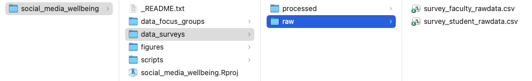

## Activity - Solving a Data Cleaning Problem

Your supervisor has asked you to look over a former research assistant’s script and data. The files are associated with another branch of the project, which is looking at university faculty’s perception of social media use and well being. 

You were given three files:

* [The survey](https://docs.google.com/forms/d/e/1FAIpQLScyWVIU8TBg1HcobtmwDTZ22YQJgALuHu0UwzLbP0f3m-g6ew/viewform?usp=header) that was shared with university faculty.
* <a href="data/survey.csv" download>
  The Data
</a>file generated by the faculty survey, called `survey.csv`. 

* <a href="files/script.R" download>
  The script
</a> used by the research assistant, called `script.R`:  When you open the file, you realize the script is not only uncommented, which means that you don’t know what has already been done to the data, but that it is also riddled with errors.

::: {.callout-note}
## Breakout Room

In breakout rooms, go through ‘script.R,’ and troubleshoot any errors that come up, adding comments to explain what each step does. Remember to rename the data file and script according to project naming conventions.

:::

## Answer Key

Do not read the drop-down content until you have tried to troubleshoot on your own.

::: {.callout-tip collapse=true}
## Answer

#### 1. Set-Up

Don’t forget to load in packages at the start of your script!

```{r}
#| eval: false

# A) load packages
library(tidyverse)

# B) read in faculty survey data
survey <- read_csv(“data/raw/survey_faculty-data.csv”)

``` 

#### 2. Rename Columns

Did you catch the missing comma after “What is your academic rank?”

```{r}
#| eval: false

# give columns names that are easier to work with!

survey_rename <- survey |> 


  rename(timestamp = “Timestamp”,

         name = “Name”,

         email = “Email”,

         age = “Age”,

         province = “Province”,

         gender = “Gender”,

         academic_rank = “What is your academic rank?”,

         department = “What is your primary department?”,

         personal_use = “On average, how many hours per day do you personally spend on social media?”,

         platforms = “Which social media platforms do you use?”,

         student_use = “On average, how many hours per day do you believe students spend on social media?”,

         student_performance = “To what extent do you believe social media affects student academic performance?”,

         student_connected = “Please indicate how much you agree or disagree with the following statements about social media and student mental health: [Social media helps students feel connected to others.]”,

         student_stressed = “Please indicate how much you agree or disagree with the following statements about social media and student mental health: [Social media makes students feel anxious or stressed.]”,

         student_distract = “Please indicate how much you agree or disagree with the following statements about social media and student mental health: [Social media distracts students from academic work.]”,

         student_lonely = “Please indicate how much you agree or disagree with the following statements about social media and student mental health: [Social media improves my mood when I feel lonely.]”,

         student_disengagement = “Have you observed social media use impacting student engagement in your classes?”)

``` 


#### 3. Remove Duplicate Entries

Make sure the opening and closing brackets match!

```{r}
#| eval: false

survey_unique <- survey_rename |> 
  distinct()

```

#### 4. Anonymize Data

When using `select()` to remove multiple columns, column names must be wrapped within the concatenate function, `c()`.

```{r}
#| eval: false

survey_anon <- survey_unique |> 

  # add column with ID number

  mutate(id = row_number()) |> 

 # move ID column to leftmost position

  relocate(id) |>

 # remove columns with personally-identifying information

  select(!(c(name,

           email)))

``` 

#### 5. Reorder Columns

Did you catch the typo when reading in `survey_anon`?

```{r}
#| eval: false

survey_reorder <- survey_anon |> 


  # move 'gender' after 'age'

  relocate(gender,

           .after = age) |> 


  # move 'timestamp' to leftmost position

  relocate(timestamp)

``` 

#### 6. Separate Out Values

That pesky extra quotation mark makes R think everything that follows should be in quotes\!

```{r}
#| eval: false

survey_sep <- survey_reorder |> 

  separate_wider_delim(cols = platforms, # separate values in 'platforms' column...

                       delim = “,”, # where commas appear...

                       names_sep = “_”, # into columns 'platforms_#'...

                       too_few = “align_start”) # and add NAs where platforms are not used

``` 

#### 7. Deal with NAs

Did you catch the typo in ‘province’?

```{r}
#| eval: false

survey_na <- survey_sep |> 


  # replace NAs in 'student_use' column with zeroes

  mutate(student_use = replace_na(student_use, 0)) |> 


  # remove entries where 'province' = NA

  drop_na(province)

``` 

#### 8. Replace Values

Check: do all cases of `case_when()` have a double equal sign, `==`?

```{r}
#| eval: false

# A) check responses for 'province' and 'department'

survey_na |> distinct(province) |> arrange(province) |> print(n = Inf)

survey_na |> distinct(department) |> arrange(department) |> print(n = Inf)

# B) rectify alternate spellings/representations

survey_replace <- survey_na  |> 


  mutate(province = case_when(province == “AB” ~ “Alberta”,

                              province == “B.C.” ~ “British Columbia”,

                              province == “BC” ~ “British Columbia”,

                              province == “MB” ~ “Manitoba”,

                              province == “NB” ~ “New Brunswick”,

                              province == “NS” ~ “Nova Scotia”,

                              province == “ON” ~ “Ontario”,

                              province == “QC” ~ “Quebec”,

                              province == “Québec” ~ “Quebec”,

                              province == “SK” ~ “Saskatchewan”,

                              TRUE ~ province), # this last bit is important - it means: if not on this list, leave as-is

         department = case_when(department == “Bio” ~ “Biology”,

                                department == “biology” ~ “Biology”,

                                department == “business” ~  “Business”,

                                department == “CS” ~ “Computer Science”,

                                department == “Comp Sci” ~ “Computer Science”,

                                department == “computer science” ~ “Computer Science”,

                                department == “Educ.” ~ “Education”,

                                department == “education” ~ “Education”,

                                department == “english” ~ “English”,

                                department == “Hist.” ~ “History”,

                                department == “history” ~ “History”,

                                department == “nursing” ~ “Nursing”,

                                department == “physics” ~ “Physics”,

                                department == “Psych” ~ “Psychology”,

                                department == “psychology” ~ “Psychology”,

                                department == “Soc” ~ “Sociology”,

                                department == “sociology” ~ “Sociology”,

                                TRUE ~ department)) # if not on this list, leave as-is

# C) check responses for 'province' and 'department' again

survey_replace |> distinct(province) |> arrange(province) |> print(n = Inf)

survey_replace |> distinct(department) |> arrange(department) |> print(n = Inf)

``` 

#### 9. Recode by Criteria

Did you notice the missing ‘or’ symbol, `|` beside ‘Psychology’? What about the missing bracket at the end of `relocate()`?

```{r}
#| eval: false

# group departments into their respective faculties, in new column 'faculty'

survey_recode <- survey_replace |> 


  mutate(faculty = case_when(department == “Biology” |

                               department == “Computer Science” |

                               department == “Physics” ~ “Science”,

                             department == “Commerce” |

                               department == “Business” ~   “Business”,

                             department == “Education” ~   “Education”,

                             department == “English” |

                               department == “History” ~  “Humanities”,

                             department == “Nursing” ~ “Health”,

                             department == “Psychology” |

                               department == “Sociology” ~ “Social Sciences”)) |>


  # put new 'faculty' column beside 'department'

  relocate(faculty,

           .after = department)

``` 

#### 10. Pivot Longer

Another case of a missing comma - this time, after listing out the columns to pivot longer.

```{r}
#| eval: false

survey_long <- survey_recode |> 


  # pivot only these columns longer

  pivot_longer(cols = c(student_performance,

                        student_connected,

                        student_stressed,

                        student_distract,

                        student_lonely,

                        student_disengagement),

               names_to = “social_media_affect”,

               values_to = “faculty_response”)

``` 

:::

### Data Management Considerations

Do not read the drop-down content until you have finished the activity.

::: {.callout-tip collapse=true}
## Data Management

In addition to the considerations of having to work with somebody else’s messy materials, you may have noticed that the directory structure we have set up for the project does not accommodate for the faculty survey or focus groups that were outlined in the project description. What a mess!

This is not at all uncommon in research projects, and we wanted to give you a taste of what a messy scenario might look like in real life. With that said, we have outlined a **possible** directory structure for the whole project, with the caveat that this could be set up in numerous ways depending on how you want to interact with the project files. The goal of this activity was to reinforce the idea that planning in advance can save you time and headaches, but to also give you a sense of what cleaning up a messy project might entail.



:::


