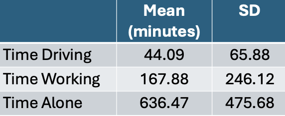
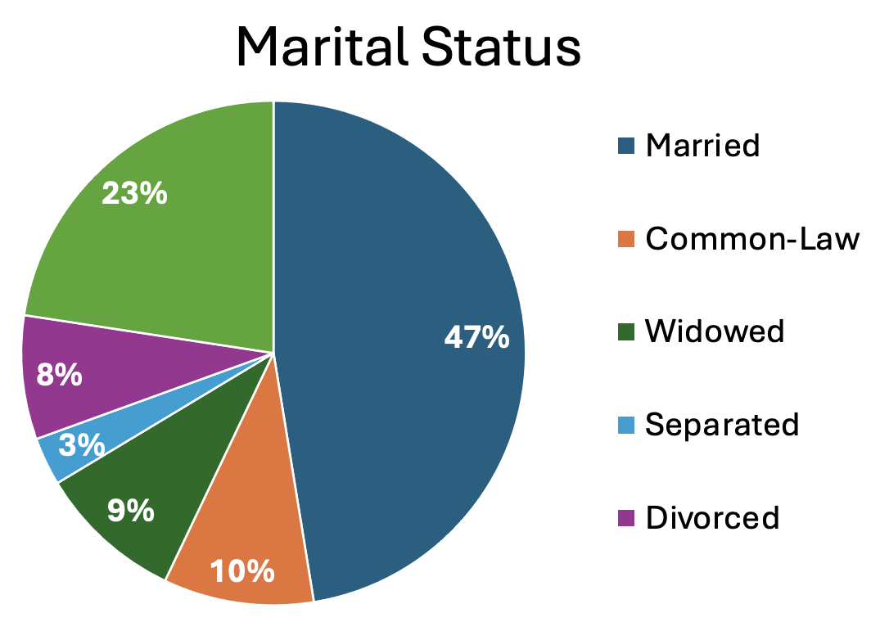
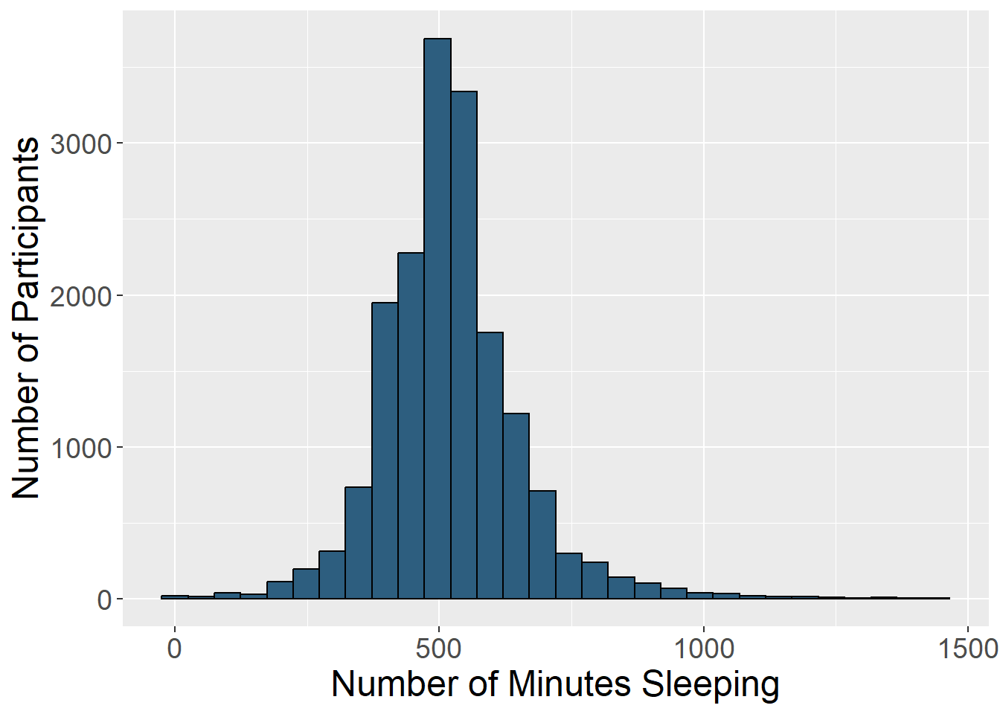
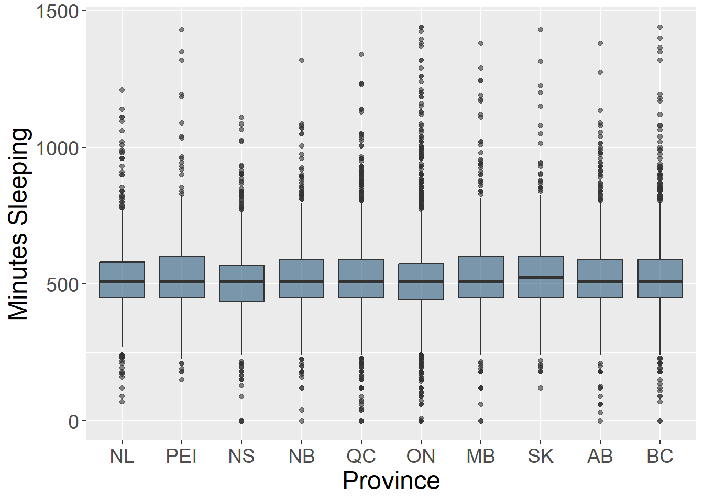
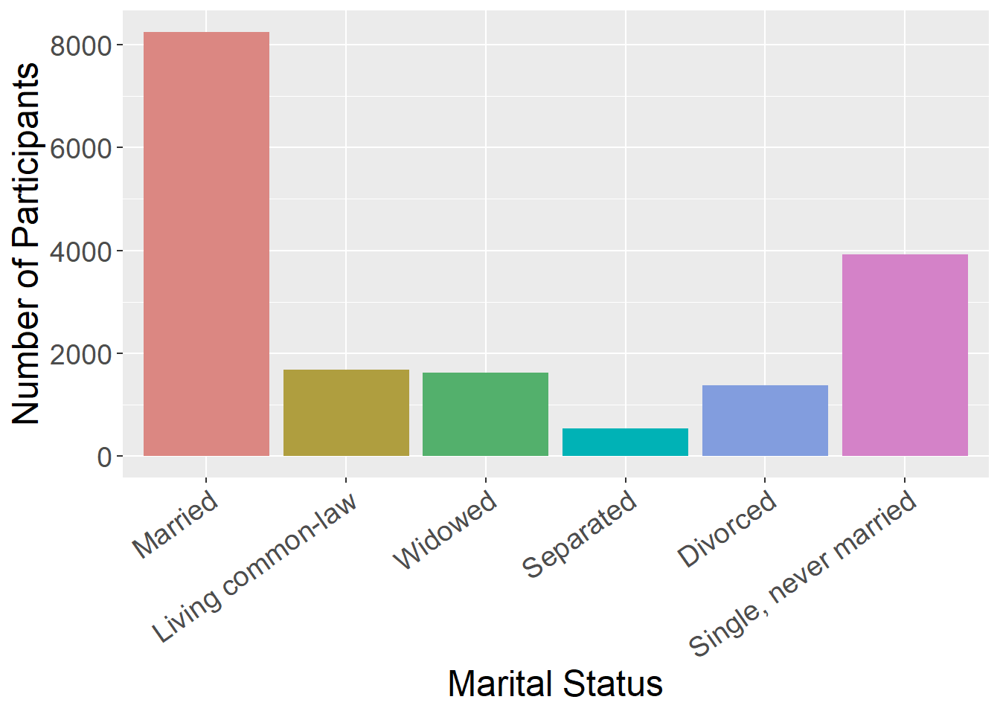
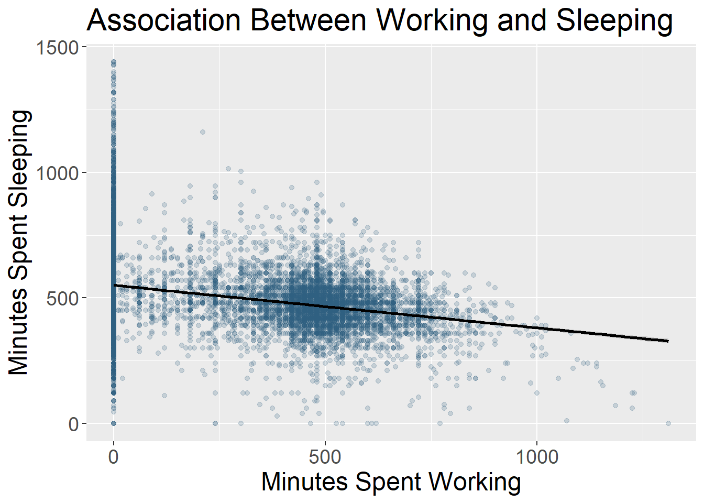
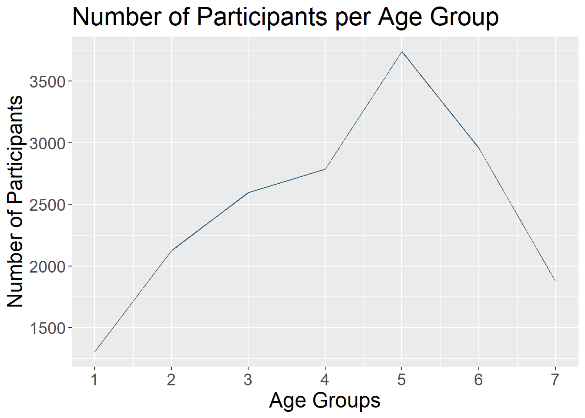

## Learning Objectives

By the end of this lesson, you’ll be able to:

- Locate data visualization within the data science workflow.
- Use the grammar of `ggpplot2` to create visualizations in R.
- Make four different plots using `ggpplot2`to visualize an example dataset.


## Lecture - Data Visualization in R

### Lecture

* [Download the PowerPoint](files/day6_L1_Data-Visualization.pptx)

<embed src="files/day6_L1_Data-Visualization.pdf" type="application/pdf" width="100%" height="600px" />


### Visualizing Data

Data visualization is an important part of exploring, understanding and sharing data. Looking at data in a graphical format is a critical part of the data science workflow.

There are numerous different ways to visualize data. Some examples are:

**Tables**: Tables to collect and organize data are one of the most common and basic data visualizations. But don’t discount them! They can be efficient ways to convey a large amount of information about your data all at once.


<br>
<br>

**Pie charts**: A classic pie chart is useful for representing parts that add up to a whole. This also allows for comparing group sizes. They are often used for demographic variables, with the whole representing the whole sample, or for representing money, with the whole representing a budget or total money spent/made. Be careful to use a pie chart only when it really adds to the story. For instance, if there are only two parts to the whole, a pie chart might not convey much more information. Conversely, if there are many groups, it can become difficult to really see all of them and compare them.


<br>
<br>

**Histograms**: Histograms display the distribution of one variable. The height of the bar represents how many times that value was represented in the data. This is typically what you view if you want to visually inspect if a variable is normally distributed.


<br>
<br>

**Box plots**: Box plots (also known as box and whisker plots) are good for understanding and comparing variance between groups. They typically depict the median and minimum/maximum of each group for a certain variable. The box portion represents the 1st and 3rd quartiles of the distribution. You can also show change over time with this type of plot.


<br>
<br>

**Bar charts**: Bar charts are good for representing data from groups or categories, with the bars representing different categories. The bar height usually represent a mean, a count, or a percentage, by category. These can be useful for comparing groups or showing change over time.


<br>
<br>

**Scatter plots**: Scatter plots include data points that are plotted along an x and y axis, showing the relationship between these two variables. Often researchers add a line to these plots to show the statistical relationship between the variables.


<br>
<br>

**Line charts**: Line charts use connected straight lines to display data. They are good for showing change over time on a continuous variable. They are often similar in purpose to bar charts, but visually simpler if there are many time points. An example of where we often see line charts used in the news is to visualize the stock market. (Plotting the various age groups here is not particularly meaningful since this data was only collected at one time point, but is used to illustrate this type of data visualization.)


<br>
<br>


### What makes a good visualization?

There is an art to picking the best data visualization that fits your data and the story you are telling. By nature, data visualizations are abstract representations of our data, with color, shape, and position representing the data points. This both hides the exact data itself, while also allowing us to highlight bigger picture ideas about the data, depending on what we choose to emphasize. When deciding on what type of data visualization to use, consider the following:

* What question are you exploring with your data and how will it inform future analyses?
* What is your data visualization adding to your science communication?
* What take-away message are you conveying with the image?
* What type of variables do you have? Continuous? Categorical? And what type of abstraction (e.g., color, shape) best suits that variable?
* Are you comparing groups?
* Are you showing change over time?
* Are you visualizing a relationship between variables?

It can be easy to get in the habit of using the same types of data visualization over and over again. Check out this website that gives many creative data visualization options (with R code!), categorized by goal: [R Graph Gallery](https://r-graph-gallery.com/)

<br>

### Data Visualization with ggplot2

While you can create data visualizations in base R, the go-to package for making charts and plots is ggplot2. ggplot2 is part of the tidyverse - every time you load in the tidyverse package, you have loaded ggplot2.

The ‘gg’ in ‘ggplot2’ stands for ‘grammar of graphics.’ Grammar of graphics is a way of building data visualizations step-by-step, in layers, instead of using prebuilt chart templates. This means that, using the same stepwise syntax, you can create an infinite number of data visualizations that are customized to your needs and preferences - which also makes plotting really fun!

#### Layers in ggplot2

The basic layers of a ggplot2 visualization are:

1. **Data**: information you want to plot.
2. **Aesthetics**: linking data to plot features.
3. **Geometry**: kind of plot or chart you want to make.

## Tutorial - Creating Plots Using ggplot2

### Making a Bar Plot

#### Set Up

Open `survey_student.RProj` and create a new R script: select File > New File > R Script. Let’s save it as `survey_student_visualization.R` in the project’s ‘scripts’ folder.

Add a comment to the top of the script describing what it does. It could be something like:

```{r}
# making visualizations for student survey data
``` 

Next, load in the `tidyverse` package.
```{r}
# load packages
library(tidyverse)
``` 

As mentioned earlier, the `tidyverse` package contains `ggplot2` - so when you load in the tidyverse, ggplot2 comes with it. If you want, you can just load ggplot2 without the tidyverse’s other packages.

```{r}
# load packages
library(ggplot2)
``` 

Next, we need data to plot. Read in the cleaned and anonymized student survey datasets:

```{r}
# read in cleaned + anonymized data
survey_long <- readRDS("data/survey_student_anonymized-long.rds")

survey_short <- readRDS("data/survey_student_anonymized-wide.rds")
``` 

::: {.callout-caution}

#### Note

Although we *could* read in the `.csv` files we saved at the end of the data cleaning script, we’re going to read in the `.rds` files instead.

`.rds` files preserve the R attributes of a dataset - like transformations to variable type (e.g., from character to factor). Reading in the `.rds` files means we don’t have to repeat the same transformations we carried out in the cleaning script in our new visualization script.
:::

Now we're ready to start plotting!

#### Layers in ggplot2

The basic syntax of ggplot2 is:

```{r}
#| eval: false

ggplot(data,
  aes(x = x_variable, y = y_variable)) +
  geom_whatever()
``` 

Let’s work through this syntax layer by layer.

Start by typing out and running the following code snippet:

```{r}
ggplot(survey_short)
``` 

You should get… an empty plot! This first `ggplot2` layer simply tells R: make a plot. But it doesn’t specify what should go on that plot, or how it should be arranged.

So, let’s tell `ggplot2` what variable we want to graph by putting it in the `aes()` - or aesthetic - function. Let’s plot the `age` variable on the x axis:

```{r}
ggplot(survey_short,
  aes(x = age))
``` 

Run this code snippet. It should still produce an empty plot, but with the different categories of the `age` variable on the x axis.

Now, we can specify the kind of plot we want to produce. Let’s create a bar plot by specifying `geom_bar()`.

```{r}
ggplot(survey_short,
  aes(x = age)) +
  geom_bar()
``` 

And look at that - you’ve just made your first ggplot2 graphic in R, a lovely bar plot!

Notice that we’ve only specified which variable to put on the x axis, while the y axis was automatically populated with count data (i.e., the number of times that variable showed up in the dataset).

To add another layer to the plot, we also used a plus sign `+` after the first `ggplot()` argument. All additional plot elements are added with a plus sign too.

::: {.callout-caution}

#### Note

**ggplot2 Geometries**

There are tons of different geometries built into ggplot2. Take a look at the <a href="files/ggplot-cheatsheet.pdf" download>ggplot2 cheatsheet</a> to get a sense of what other kinds of plots you can make.

:::


#### Adding Plot Elements

This plot looks fine, but it’s pretty basic. There are some things we can add and tweak to make it easier to read and interpret, and to make it look better. Let’s start by adding more descriptive axis labels to the plot.

Like all things `ggplot2`, adding axis labels is just a matter of adding another layer onto our existing plot code. We can specify labels using the argument `labs()`:

```{r}
ggplot(survey_short,
  aes(x = age)) +
  geom_bar() +
  labs(x = "Age",
      y = "Number of Participants")
``` 

Notice that our x and y axis labels have been renamed. That makes things a bit neater and easier to understand.

Another aspect of plots we can manipulate is their colour. What if we wanted to change the bars in the plot from grey to blue? We can do that by specifying `fill` and `color` within the `geom_bar()` function. Note that `fill` controls the colour *inside* of a shape, while `color` controls the *border* colour.

```{r}
ggplot(survey_short,
  aes(x = age)) +
  geom_bar(fill = "blue",
      color = "black") +
  labs(x = "Age",
      y = "Number of Participants")
``` 

This gives us a plot of blue bars outlined in black.

We may also want to modify the width of the bars in the plot - perhaps by making them wider. Again, we can specify `width` in the `geom_bar()` function, with possible values ranging from 0-1.

```{r}
ggplot(survey_short,
  aes(x = age)) +
  geom_bar(fill = "blue",
      color = "black",
      width = 1) +
  labs(x = "Age",
       y = "Number of Participants")
``` 

Something else we might want to change is the background of our plot. `ggplot2` automatically adds in the grey-coloured grid behind plots, but that might not be how you want to present your own data. Try the layer `theme_classic()` to the plot code and see what it looks like.

```{r}
ggplot(survey_short,
  aes(x = age)) +
  geom_bar(fill = "blue",
      color = "black",
      width = 1) +
  labs(x = "Age",
      y = "Number of Participants") +
  theme_classic()
``` 

Much cleaner!

You might have noticed that when you started typing out `theme_` in your R script, a drop-down menu of other theme types popped up. Try out one more theme of your choosing and see if you like it any better!

Before we move on, let’s change the theme back to `theme_classic()`.

The next thing we’ll change on this plot is the size of the text. We can do that by manually altering the `theme()` function, like this:

```{r}
ggplot(survey_short,
  aes(x = age)) +
  geom_bar(fill = "blue",
      color = "black",
      width = 1) +
  labs(x = "Age",
      y = "Number of Participants") +
  theme_classic() +
  theme(axis.title = element_text(size = 14))
``` 


The `theme()` function is where you can change things like axis and axis title text size, manually change grid and background features, alter positioning of a plot legend, etc. Take a look at the <a href="files/ggplot-theme-cheatsheet.pdf" download>ggplot theme cheatsheet</a> to see everything that you can change with the `theme()` function.

Next, you might have noticed spaces between the bar plot and the axis lines - ggplots often have these spaces between graph elements and axes. You can remove the space between the plot and the axes using the following lines:

```{r}
#| eval: false
  scale_y_continuous(expand = expansion(0))
``` 

Add these layers onto your plot and check if the spaces are gone. The complete code chunk to create this plot is:

```{r}
ggplot(survey_short,
  aes(x = age)) +
  geom_bar(fill = "blue",
      color = "black",
      width = 1) +
  labs(x = "Age",
      y = "Number of Participants") +
  theme_classic() +
  theme(axis.title.x = element_text(size = 14),
      axis.title.y = element_text(size = 14)) +
  scale_y_continuous(expand = expansion(0))
``` 

Congratulations! You’ve created and cleaned up a plot in R, using `ggplot2`!

### Making a Scatter Plot

Now, let’s make a scatter plot.

Start by coding the skeleton structure of a scatter plot with total hours spent on social media, ‘hours_total,’ on the x axis, and ‘hours_sleep’ on the y axis, with descriptive axis labels.

```{r}
ggplot(survey_short,
  aes(x = hours_total,
      y = hours_sleep))
``` 

We’ve got a plot with our axes labels, but no data graphed yet. Let’s specify that our geometry is `geom_point()` - a scatter plot:

```{r}
ggplot(survey_short,
  aes(x = hours_total,
      y = hours_sleep)) +
  geom_point()
``` 

Now we’ve got data on our plot.

Let’s say we’re interested in looking at how students of different genders are spending time on social media versus sleeping. We can code different groups into our plot inside the `aes()` function.

```{r}
ggplot(survey_short,
  aes(x = hours_total,
      y = hours_sleep,
           color = gender)) +
  geom_point()
``` 

This code snippet produces a plot where the points are different colours, based on the gender of the respondent.

Look closely at the plot. Do you see that there are points hidden behind other points? We can separate points out by specifying `position = "jitter"` within `geom_point()`:

```{r}
ggplot(survey_short,
  aes(x = hours_total,
      y = hours_sleep,
      color = gender)) +
  geom_point(position = "jitter")
``` 

Adding the `jitter` argument made this plot much easier to interpret.

We can also change the colour of our scatter plot points. Try changing the colour of the points to ‘blue,’ like we did for the bar plot.

```{r}
ggplot(survey_short,
  aes(x = hours_total,
      y = hours_sleep,
      color = gender)) +
  geom_point(position = "jitter",
      color = "blue")
``` 

Specifying `color = "blue"` within `geom_point()` works - but that command turns all points blue, and we can no longer distinguish data points by participants’ gender. Perhaps using the concatenate function, `c()`, nested within will work. Give it a try: since there are five gender categories (female, male, non-binary, prefer not to answer, NA), concatenate five different colours within the `color` argument.


```{r}
#| eval: false
ggplot(survey_short,
  aes(x = hours_total,
      y = hours_sleep,
      color = gender)) +
  geom_point(position = "jitter",
      color = c("blue", "red", "yellow", "green", "pink"))
``` 

Hmm - this code snippet throws an error argument.

That’s because, when specifying colours for data in different categories, we actually need to add another plot layer: `scale_color_manual()`. Within that argument, list the colours you want to use with `values` and the concatenate function `c()`.

```{r}
ggplot(survey_short,
  aes(x = hours_total,
      y = hours_sleep,
      color = gender)) +
  geom_point(position = "jitter") +
  scale_color_manual(values = c("blue", "red", "yellow", "green", "pink"))
``` 

Now, we have our different gender categories back, and they’re matched with the correct colours.

… Except for the NA category, which should be pink, but is grey.

That’s because we need to assign colours to NAs differently, using `na.value`, which is separate from `values`:

```{r}
ggplot(survey_short,
  aes(x = hours_total,
      y = hours_sleep,
      color = gender)) +
  geom_point(position = "jitter") +
  scale_color_manual(values = c("blue", "red", "yellow", "green"),
      na.value = "pink")
``` 

Now all of our colours are correct.

In addition to specifying colours by name, you can specify colours by hex code - which is a combination of numbers and letters that matches a hue. Let’s change the colour scheme of this plot to those in van Gogh’s painting [Vase with Twelve Sunflowers](https://emilhvitfeldt.github.io/r-color-palettes/discrete/vangogh/SunflowersMunich/).

```{r}
ggplot(survey_short,
  aes(x = hours_total,
      y = hours_sleep,
      color = gender)) +
  geom_point(position = "jitter") +
  scale_color_manual(values = c("#77A690FF", "#304020FF", "#BF7E06FF", "#401506FF"),
      na.value = "#A63D17FF")
``` 

We’ve already seen how we can manipulate the fill, colour, and width of chart elements; now, we’ll take a look at how to change point shape and size. Shape and size are also assigned within the geom_point() function. [Shapes in R are coded by number](https://blog.albertkuo.me/post/point-shape-options-in-ggplot/). Let’s specify `shape = 17` (triangle) and `size = 2`.

```{r}
ggplot(survey_short,
  aes(x = hours_total,
      y = hours_sleep,
      color = gender)) +
  geom_point(position = "jitter",
      size = 2,
      shape = 17) +
  scale_color_manual(values = c("#77A690FF", "#304020FF", "#BF7E06FF", "#401506FF"),
      na.value = "#A63D17FF")
``` 

To finish the plot, add x and y axis labels, change the theme to `theme_classic()`, and increase the axis title and text elements to `size = 14`.

```{r}
ggplot(survey_short,
  aes(x = hours_total,
      y = hours_sleep,
      color = gender)) +
  geom_point(position = "jitter",
      size = 2,
      shape = 17) +
  scale_color_manual(values = c("#77A690FF", "#304020FF", "#BF7E06FF", "#401506FF"),
      na.value = "#A63D17FF") +
  labs(x = "Hours Spent on Social Media",
       y = "Hours Spent Sleeping") +
  theme_classic() +
  theme(axis.title = element_text(size = 14),
        axis.text = element_text(size = 14))
``` 

One small, final change we can make is to capitalize the legend title. We do that within the `labs()` function as well.

```{r}
#| eval: false
color = "Participant Gender"
``` 

We will change the legend title using `color`, as earlier we specified that colour was based on gender category.

The entire code block to make the scatter plot is:

```{r}
ggplot(survey_short,
  aes(x = hours_total,
      y = hours_sleep,
      color = gender)) +
  geom_point(position = "jitter",
      size = 2,
      shape = 17) +
  scale_color_manual(values = c("#77A690FF", "#304020FF", "#BF7E06FF", "#401506FF"),
      na.value = "#A63D17FF") +
  labs(x = "Hours Spent on Social Media",
       y = "Hours Spent Sleeping", 
       color = "Participant Gender") +
  theme_classic() +
  theme(axis.title = element_text(size = 14),
        axis.text = element_text(size = 14))
```

### Saving Plots

To save a plot, we first need to assign it to an object using the syntax `name <- code`. Try assigning the scatter plot code to an object called `social_media_sleep`

```{r}
social_media_sleep <-
  ggplot(survey_short,
  aes(x = hours_total,
      y = hours_sleep,
      color = gender)) +
  geom_point(position = "jitter",
      size = 2,
      shape = 17) +
  scale_color_manual(values = c("#77A690FF", "#304020FF", "#BF7E06FF", "#401506FF"),
      na.value = "#A63D17FF") +
  labs(x = "Hours Spent on Social Media",
       y = "Hours Spent Sleeping", 
       color = "Participant Gender") +
  theme_classic() +
  theme(axis.title = element_text(size = 14),
        axis.text = element_text(size = 14))
```

Now that we’ve assigned the scatter plot a name, we can save it. The syntax for exporting an image is:

```{r}
#| eval: false
ggsave(“name.png”,
  R_object,
  width = 100,
  height = 100,
  units = “units”,
  path = “folder”)
``` 

Here, `name.png` is the name you want to give your image file, with includes the file extension you want to save it as (e.g., .tiff, .png. .jpeg, etc.); `R_object` is the name of the plot object in your Global Environment; the width, height, and units for width and height (e.g., mm, px) specify the size of the exported image; and the path is the place you want to save your image to. 

Try saving the scatter plot to your `figures` folder.

```{r}
#| eval: false
ggsave("survey_student_sleep.png",
  social_media_sleep,
  width = 100,
  height = 100,
  units = "mm",
  path = "figures")
``` 

<br>
<br>

## Activity

In breakout rooms, work together to build the following plots.

### Question 1: Bar Plot

::: {.callout-note}
## Create a Bar Plot


Create a **Bar plot** to show which social media platforms are used most by respondents.

Start by calculating the average number of hours spent on each platform, across respondents, from `survey_long`.

```{r}
# calculate average hours per platform from ‘survey_long’
platform_mean_hours <- survey_long |> 
  # for every category in ‘hours_type’...  
  group_by(hours_type) |> 
  # summarise dataset down to mean hours per category + standard deviation 
  summarise(mean = mean(hours_number),
        sd = sd(hours_number)) |> 
  # remove unneeded columns
  filter(hours_type != "hours_sleep",
        hours_type != "hours_total",
        hours_type != "hours_other")
``` 

View `platform_mean_hours` and take a look at how the data has been summarized.

Then, use `platform_mean_hours` to make the following plot:

```{r}
#| eval: true
#| echo: false
#| fig-asp: 1
platform_mean_hours_plot <- 
  # specify data + aesthetics
  ggplot(platform_mean_hours,
    aes(x = hours_type,
        y = mean)) +
  # specify geometry
  geom_col(fill = "darkseagreen4") + # change fill colour to dark sea-green
  # add error bars
  geom_errorbar(aes(ymin = pmax(mean - sd, 0), # keep error bar for Twitter above zero
        ymax = mean + sd), 
        width = 0.2, # make error bars less wide
        color = "grey10") + # change colour to dark grey
  # fix up axes labels
  labs(x = "Social Media Platform",
       y = "Average Hours per Day") +
   # fix up platform labels
  scale_x_discrete(labels = c("Facebook",
                              "Instagram",
                              "Snapchat",
                              "TikTok",
                              "Twitter/X")) +
  # remove gap between x axis + plot
  scale_y_continuous(expand = expansion(0)) +
  # set theme
  theme_classic() +
  # manually change theme elements
  theme(axis.title = element_text(size = 14),
        axis.text.x = element_text(size = 14,
                                   angle = 45, # tilt x axis text 45 degrees
                                   hjust = 1), # centre x axis text
        axis.text.y = element_text(size = 14),
        axis.ticks.x = element_blank()) # remove x axis ticks
platform_mean_hours_plot
```

<br>
<br>

Save the finished plot to your `figures` folder with the name `survey_student_meantime-platform.png`, with a width and height of 150 mm.

Some helpful hints:

* The colour of the bars is `darkseagreen4`
* Error bars represent standard deviation, and are added using `geom_errorbar()`
* You’ll need to rename the x axis text using `scale_x_discrete()`
* You can change or remove axis ticks using `theme()` and the arguments `element_text()` to edit text and `element_blank()` to remove the chart element
* Use the `ggplot2` cheat sheet and/or search Google for the changes you want to make to your plot if you get stuck.

:::

::: {.callout-tip collapse=true}

## Answer

```{r}
platform_mean_hours_plot <- 
  # specify data + aesthetics
  ggplot(platform_mean_hours,
    aes(x = hours_type,
        y = mean)) +
  # specify geometry
  geom_col(fill = "darkseagreen4") + # change fill colour to dark sea-green
  # add error bars
  geom_errorbar(aes(ymin = pmax(mean - sd, 0), # keep error bar for Twitter above zero
        ymax = mean + sd), 
        width = 0.2, # make error bars less wide
        color = "grey10") + # change colour to dark grey
  # fix up axes labels
  labs(x = "Social Media Platform",
       y = "Average Hours per Day") +
   # fix up platform labels
  scale_x_discrete(labels = c("Facebook",
                              "Instagram",
                              "Snapchat",
                              "TikTok",
                              "Twitter/X")) +
  # remove gap between x axis + plot
  scale_y_continuous(expand = expansion(0)) +
  # set theme
  theme_classic() +
  # manually change theme elements
  theme(axis.title = element_text(size = 14),
        axis.text.x = element_text(size = 14,
                                   angle = 45, # tilt x axis text 45 degrees
                                   hjust = 1), # centre x axis text
        axis.text.y = element_text(size = 14),
        axis.ticks.x = element_blank()) # remove x axis ticks

```

```{r}
#| eval: false
# save plot to "figures" folder
ggsave("survey_student_meantime-platform.png",
  platform_mean_hours_plot,
  width = 150,
  height = 150,
  units = "mm",
  path = "figures")
```

:::

### Question 2: Box Plot

::: {.callout-note}
## Create a Box Plot

Create a **box plot** to show how perceptions of stress associated with hours spent on social media.

Use `survey_short` data to make the following plot: 
```{r}
#| eval: true
#| echo: false
#| fig-asp: 1
stress_total_hours_plot <-
  # specify data + aesthetics
  ggplot(survey_short,
         aes(x = feel_stress,
             y = hours_total)) +
  # specify geometry
  geom_boxplot(fill = "grey") +
  # fix up axes labels
  labs(x = "Social Media Incurs Stress",
       y = "Total Daily Hours on Social Media") +
  # fix up agreement labels
  scale_x_discrete(labels = c("Strong Disagree",
                              "Disagree",
                              "Neutral",
                              "Agree",
                              "NA")) +
  # set theme
  theme_classic() +
  # manually change theme elements
  theme(axis.title = element_text(size = 14),
        axis.text.y = element_text(size = 12),
        axis.text.x = element_text(size = 12,
                                   angle = 45,
                                   hjust = 1))
stress_total_hours_plot

```

<br>
<br>

Save the finished plot to your `figures` folder with the name `survey_student_stress-hours.png`, with a width and height of 150 mm.

Some helpful hints:
  
  * You’ll need to rename the x axis text using `scale_x_discrete()`
* Use the ggplot2 cheat sheet and/or search Google for the changes you want to make to your plot if you get stuck.

:::
  
::: {.callout-tip collapse=true}

## Answer

```{r}
stress_total_hours_plot <-
  # specify data + aesthetics
  ggplot(survey_short,
         aes(x = feel_stress,
             y = hours_total)) +
  # specify geometry
  geom_boxplot(fill = "grey") +
  # fix up axes labels
  labs(x = "Social Media Incurs Stress",
       y = "Total Daily Hours on Social Media") +
  # fix up agreement labels
  scale_x_discrete(labels = c("Strong Disagree",
                              "Disagree",
                              "Neutral",
                              "Agree",
                              "NA")) +
  # set theme
  theme_classic() +
  # manually change theme elements
  theme(axis.title = element_text(size = 14),
        axis.text.y = element_text(size = 12),
        axis.text.x = element_text(size = 12,
                                   angle = 45,
                                   hjust = 1))

```


```{r, eval=FALSE}
#| eval: false
# save plot to "figures" folder
ggsave("survey_student_stress-hours.png",
       stress_total_hours_plot,
       width = 150,
       height = 150,
       units = "mm",
       path = "figures")
```

:::

### Question 3: Linear Regression

::: {.callout-note}
## Create a Linear Regression

Create a **linear regression** showing the relationship between respondent age and time spent on social media.

Start by calculating the average number of hours spent on social media by age, from `survey_short`.

```{r}
# calculate average hours on social media per age from ‘survey_short’
age_mean_hours <- survey_short |>
# for every age in ‘age’...
  group_by(age) |> 
  # summarise dataset down to mean hours per age + standard deviation
  summarise(mean = mean(hours_total),
            sd = sd(hours_total))
``` 

View `age_mean_hours` and take a look at how the data has been summarized.

Then, use `age_mean_hours` to make the following plot:
```{r}
#| eval: true
#| echo: false
#| fig-asp: 1
age_mean_hours_plot <-
  # specify data + aesthetics
  ggplot(age_mean_hours,
         aes(x = age,
             y = mean)) +
  # specify geometry
  geom_smooth(method = "lm",
              color = "black", # change colour of regression line
              fill = "slategray3") + # change colour of ribbon
  # fix up axes labels
  labs(x = "Participant Age",
       y = "Average Hours on Social Media Per Day") +
  # remove gaps between axes and plots
  scale_x_continuous(expand = expansion(0)) +
  scale_y_continuous(expand = expansion(0)) +
  # set theme
  theme_classic() +
  # manually change theme elements
  theme(axis.title.x = element_text(size = 14),
        axis.title.y = element_text(size = 14))
age_mean_hours_plot
```

<br>
<br>

Save the finished plot to your `figures` folder with the name `survey_student_meantime-age.png`, with a width and height of 150 mm.

Some helpful hints:

* The colour of ribbon is `slategray3`
* A linear regression is plotted using  geom_smooth() , specifying `method = ‘lm’`
* Use the ggplot2 cheat sheet and/or search Google for the changes you want to make to your plot if you get stuck.

:::

::: {.callout-tip collapse=true}

## Answer

```{r}
age_mean_hours_plot <-
  # specify data + aesthetics
  ggplot(age_mean_hours,
         aes(x = age,
             y = mean)) +
  # specify geometry
  geom_smooth(method = "lm",
              color = "black", # change colour of regression line
              fill = "slategray3") + # change colour of ribbon
  # fix up axes labels
  labs(x = "Participant Age",
       y = "Average Hours on Social Media Per Day") +
  # remove gaps between axes and plots
  scale_x_continuous(expand = expansion(0)) +
  scale_y_continuous(expand = expansion(0)) +
  # set theme
  theme_classic() +
  # manually change theme elements
  theme(axis.title.x = element_text(size = 14),
        axis.title.y = element_text(size = 14))
```

```{r}
#| eval: false
# save plot to "figures" folder
ggsave("survey_student_meantime-age.png",
       age_mean_hours_plot,
       width = 150,
       height = 150,
       units = "mm",
       path = "figures")
```

:::