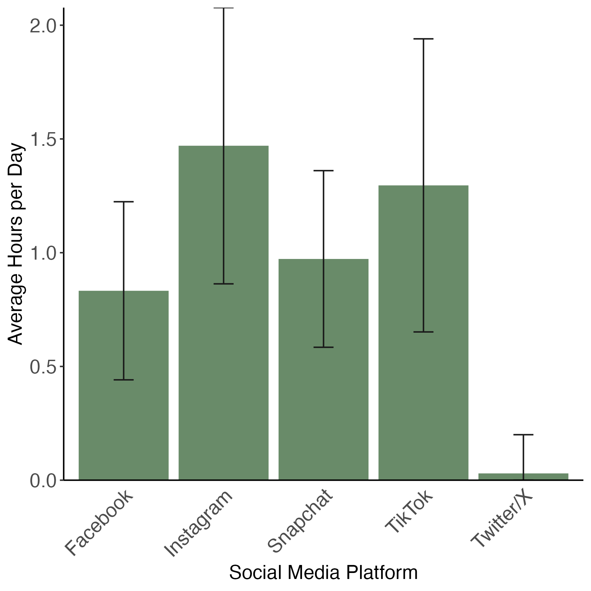
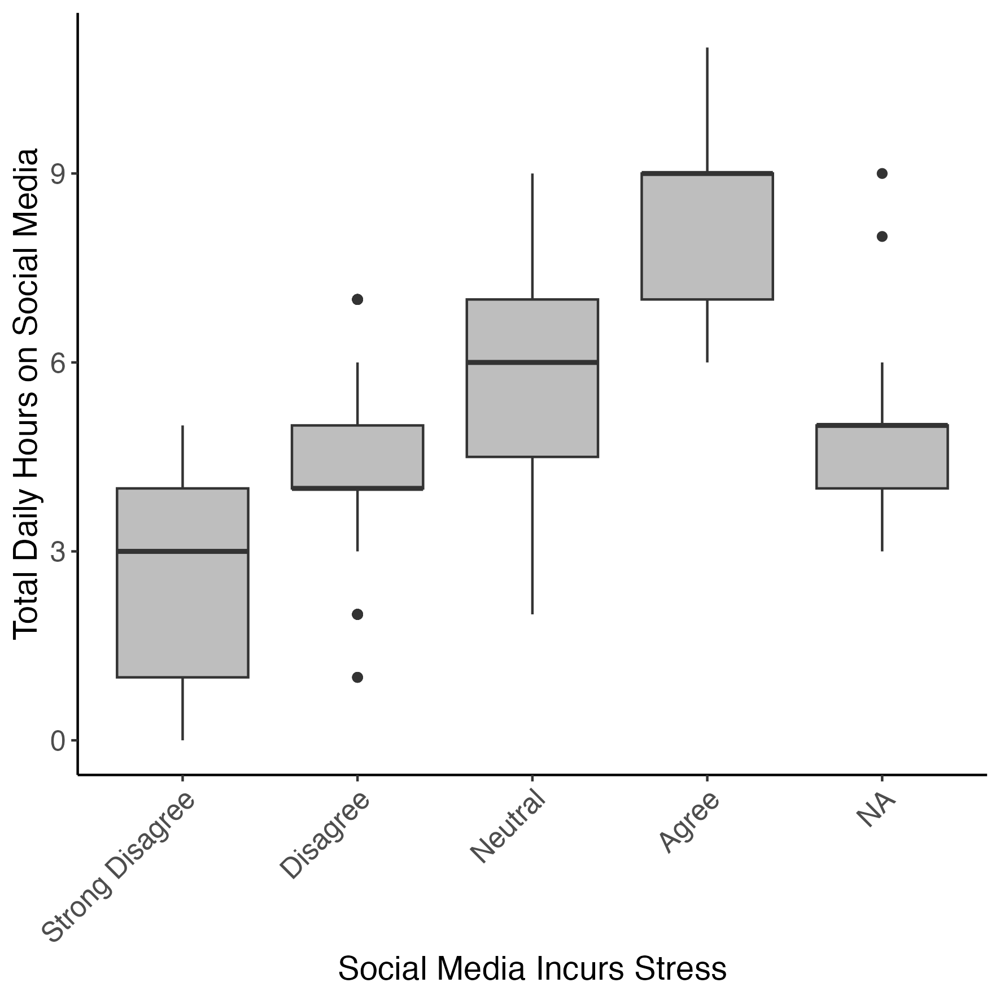
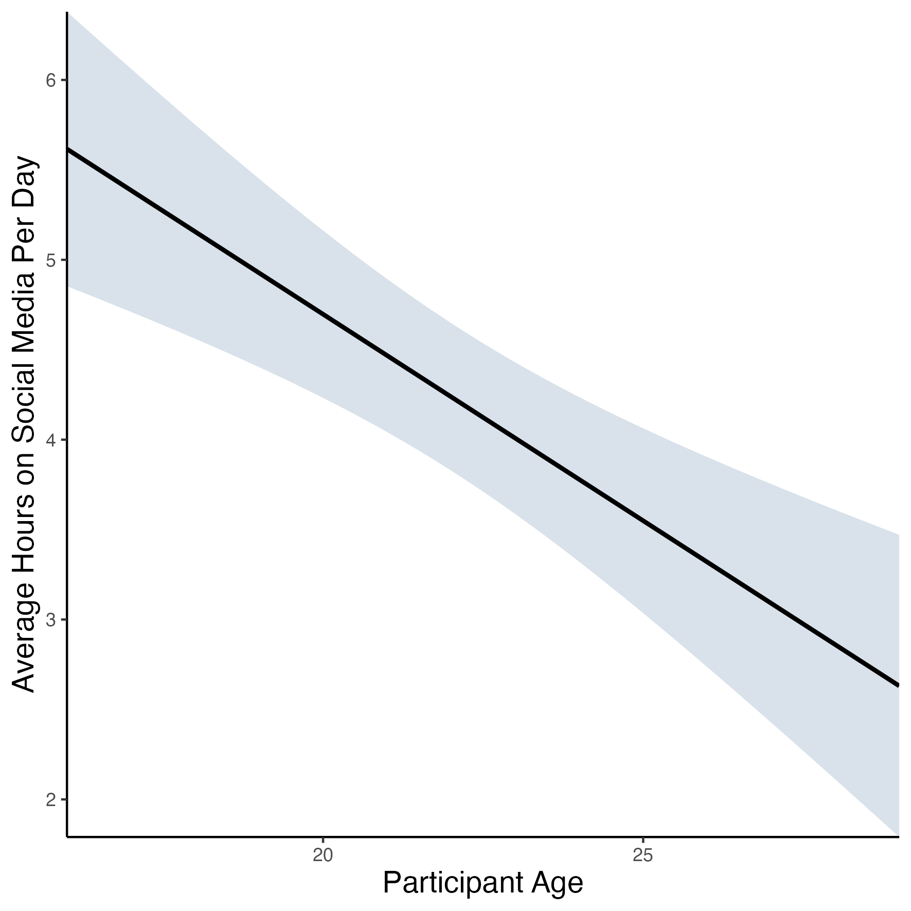

In breakout rooms, work together to build the following plots.

## Question 1: Bar Plot

::: {.callout-tip}
## Create a Bar Plot


Create a **Bar plot** to show which social media platforms are used most by respondents.

Start by calculating the average number of hours spent on each platform, across respondents, from `survey_long`.

```{r, eval=TRUE, echo=FALSE}
library(tidyverse)
```

```{r, eval=TRUE, echo=FALSE}
survey_long <- readRDS("data/survey_student_anonymized-long.rds")
```

```{r, eval=TRUE, echo=FALSE}
survey_short <- readRDS("data/survey_student_anonymized-wide.rds")
```


```{r}
# calculate average hours per platform from ‘survey_long’
platform_mean_hours <- survey_long |> 
  # for every category in ‘hours_type’...  
  group_by(hours_type) |> 
  # summarise dataset down to mean hours per category + standard deviation 
  summarise(mean = mean(hours_number),
        sd = sd(hours_number)) |> 
  # remove unneeded columns
  filter(hours_type != "hours_sleep",
        hours_type != "hours_total",
        hours_type != "hours_other")
``` 

View `platform_mean_hours` and take a look at how the data has been summarized.

Then, use `platform_mean_hours` to make the following plot:



<br>
<br>

Save the finished plot to your `figures` folder with the name `survey_student_meantime-platform.png`, with a width and height of 150 mm.

Some helpful hints:

* The colour of the bars is `darkseagreen4`
* Error bars represent standard deviation, and are added using `geom_errorbar()`
* You’ll need to rename the x axis text using `scale_x_discrete()`
* You can change or remove axis ticks using `theme()` and the arguments `element_text()` to edit text and `element_blank()` to remove the chart element
* Use the `ggplot2` cheat sheet and/or search Google for the changes you want to make to your plot if you get stuck.

:::

::: {.callout-tip collapse=true}

## Answer

```{r}
platform_mean_hours_plot <- 
  # specify data + aesthetics
  ggplot(platform_mean_hours,
    aes(x = hours_type,
        y = mean)) +
  # specify geometry
  geom_col(fill = "darkseagreen4") + # change fill colour to dark sea-green
  # add error bars
  geom_errorbar(aes(ymin = pmax(mean - sd, 0), # keep error bar for Twitter above zero
        ymax = mean + sd), 
        width = 0.2, # make error bars less wide
        color = "grey10") + # change colour to dark grey
  # fix up axes labels
  labs(x = "Social Media Platform",
       y = "Average Hours per Day") +
   # fix up platform labels
  scale_x_discrete(labels = c("Facebook",
                              "Instagram",
                              "Snapchat",
                              "TikTok",
                              "Twitter/X")) +
  # remove gap between x axis + plot
  scale_y_continuous(expand = expansion(0)) +
  # set theme
  theme_classic() +
  # manually change theme elements
  theme(axis.title = element_text(size = 14),
        axis.text.x = element_text(size = 14,
                                   angle = 45, # tilt x axis text 45 degrees
                                   hjust = 1), # centre x axis text
        axis.text.y = element_text(size = 14),
        axis.ticks.x = element_blank()) # remove x axis ticks

```

```{r, eval=FALSE}
# save plot to "figures" folder
ggsave("survey_student_meantime-platform.png",
  platform_mean_hours_plot,
  width = 150,
  height = 150,
  units = "mm",
  path = "figures")
```

:::

## Question 2: Box Plot

::: {.callout-tip}
## Create a Box Plot

Create a **box plot** to show how perceptions of stress associated with hours spent on social media.

Use `survey_short` data to make the following plot: 


<br>
<br>

Save the finished plot to your `figures` folder with the name `survey_student_stress-hours.png`, with a width and height of 150 mm.

Some helpful hints:
  
  * You’ll need to rename the x axis text using `scale_x_discrete()`
* Use the ggplot2 cheat sheet and/or search Google for the changes you want to make to your plot if you get stuck.

:::
  
::: {.callout-tip collapse=true}

## Answer

```{r}
stress_total_hours_plot <-
  # specify data + aesthetics
  ggplot(survey_short,
         aes(x = feel_stress,
             y = hours_total)) +
  # specify geometry
  geom_boxplot(fill = "grey") +
  # fix up axes labels
  labs(x = "Social Media Incurs Stress",
       y = "Total Daily Hours on Social Media") +
  # fix up agreement labels
  scale_x_discrete(labels = c("Strong Disagree",
                              "Disagree",
                              "Neutral",
                              "Agree",
                              "NA")) +
  # set theme
  theme_classic() +
  # manually change theme elements
  theme(axis.title = element_text(size = 14),
        axis.text.y = element_text(size = 12),
        axis.text.x = element_text(size = 12,
                                   angle = 45,
                                   hjust = 1))

```


```{r, eval=FALSE}
# save plot to "figures" folder
ggsave("survey_student_stress-hours.png",
       stress_total_hours_plot,
       width = 150,
       height = 150,
       units = "mm",
       path = "figures")
```

:::

## Question 3: Linear Regression

::: {.callout-tip}
## Create a Linear Regression

Create a **linear regression** showing the relationship between respondent age and time spent on social media.

Start by calculating the average number of hours spent on social media by age, from `survey_short`.

```{r}
# calculate average hours on social media per age from ‘survey_short’
age_mean_hours <- survey_short |>
# for every age in ‘age’...
  group_by(age) |> 
  # summarise dataset down to mean hours per age + standard deviation
  summarise(mean = mean(hours_total),
            sd = sd(hours_total))
``` 

View `age_mean_hours` and take a look at how the data has been summarized.

Then, use `age_mean_hours` to make the following plot:


<br>
<br>

Save the finished plot to your `figures` folder with the name `survey_student_meantime-age.png`, with a width and height of 150 mm.

Some helpful hints:

* The colour of ribbon is `slategray3`
* A linear regression is plotted using  geom_smooth() , specifying `method = ‘lm’`
* Use the ggplot2 cheat sheet and/or search Google for the changes you want to make to your plot if you get stuck.

:::

::: {.callout-tip collapse=true}

## Answer

```{r}
age_mean_hours_plot <-
  # specify data + aesthetics
  ggplot(age_mean_hours,
         aes(x = age,
             y = mean)) +
  # specify geometry
  geom_smooth(method = "lm",
              color = "black", # change colour of regression line
              fill = "slategray3") + # change colour of ribbon
  # fix up axes labels
  labs(x = "Participant Age",
       y = "Average Hours on Social Media Per Day") +
  # remove gaps between axes and plots
  scale_x_continuous(expand = expansion(0)) +
  scale_y_continuous(expand = expansion(0)) +
  # set theme
  theme_classic() +
  # manually change theme elements
  theme(axis.title.x = element_text(size = 14),
        axis.title.y = element_text(size = 14))
```

```{r, eval=FALSE}
# save plot to "figures" folder
ggsave("survey_student_meantime-age.png",
       age_mean_hours_plot,
       width = 150,
       height = 150,
       units = "mm",
       path = "figures")
```


