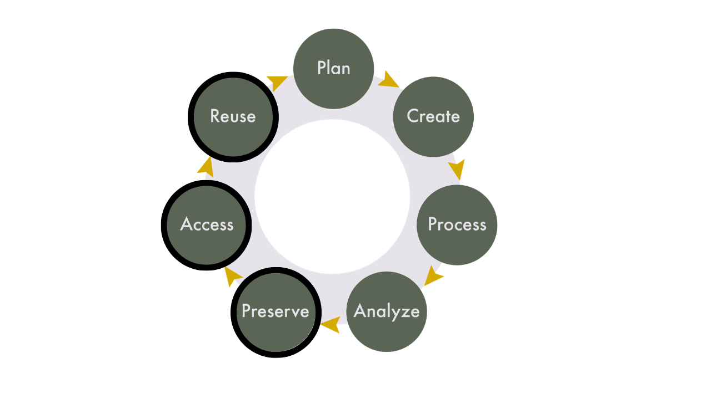
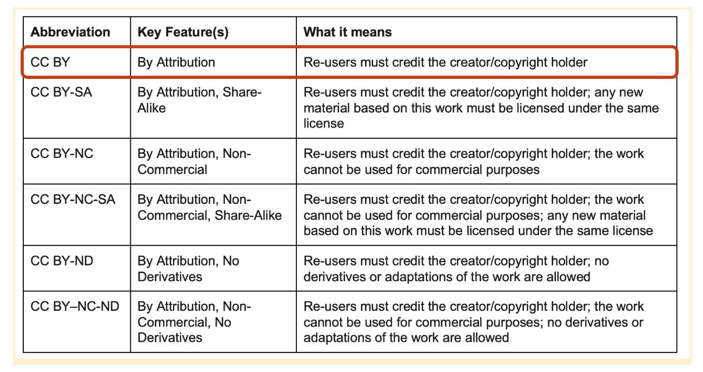

## Learning Objectives

By the end of this session, you’ll be able to:

 - Articulate reasons to share and preserve research data.  
 - Make decisions about what data and materials to share and keep after a project’s completion.  
 - Define data repositories and their purpose.  
 - Discuss qualities of good data repositories and how to choose one for your project.  
 - Describe data license types and the main considerations when choosing a license for your project.  
 - Deposit data into the Borealis data repository.
 
## Lecture - Data Sharing

We've spent a lot of time in this course talking about documentation and its importance for data sharing and reproducibility. In this session, we're going to learn how to preserve data so it can be accessed and reused, which is part of the research data life cycle that we looked at on day one.

### Why Would You Share Data?

As mentioned in the [Introduction to RDM](../Day01/Day01_Lesson1.html) session, research funders and publishers are progressively requiring that data be shared after a project’s completion. Because of this, one major reason that researchers share data is because they have an obligation to share. However, these requirements are driven by a larger philosophy that FAIR data is synonymous with good research. By allowing data to be made accessible to others, research can be vetted for errors and bias, which enables new studies to utilize existing data rather than recreating new data. 

### Why Wouldn’t You Share Data?

While funders and publishers announce data sharing requirements, they understand that there will be reasons that certain data can’t be shared. These can include:

* Sensitivities and ethics regarding personal information.  
* Sensitivities and ethics regarding community-based data.  
* Intellectual property and ownership considerations.  
* Too much data.

#### Data Sensitivity & Consent for Secondary Use

Before you share your data, consider the ethical implications of sharing it. As discussed in Day 1, sensitive data is determined through the inherent risk and potential harm that may come from inappropriate access or mishandling of it. As of May 2026, there is currently no existing research data infrastructure in Canada that can adequately provide protection (data security, access controls, etc.) for a dataset containing sensitive data.

Most research funders do not require sensitive data to be shared. Rather, they operate under the principle of “as open as possible, as closed as necessary.”

Some funders still require sensitive data to be discoverable. This means that the data files associated with the project are not deposited in a research data repository, but the metadata and documentation, when appropriate, are. The data is then self-hosted in a secure location, chosen by the researcher, where adequate protections can be guaranteed.

If you are working with sensitive data and are required to share its metadata and documentation, you should develop a data access plan, which details the procedures for providing access to the data. This should also be clearly articulated in your ethics application and consent form.

#### Data Size & Folder Structure 

Before you share your data, consider the size of your data. Repositories often have file and dataset size limits, though they may permit larger uploads by request, or through a specialized service. For most research data repositories, file size limits can range between 2 to 50 gigabytes, and total dataset size limits can range between 2-5 terabytes. 

Additionally, before you deposit, consider the folder structure of your files and how you would like to structure your files in the repository. 

::: {.callout-caution}
## Tip

If your deposit has many files and folders, compress the root directory as a .zip file. When you deposit your dataset, upload the zipped (compressed) file as is. This will maintain the folder structure of your dataset.

:::

### Deciding What to Share

When sharing data, you do not necessarily need to share every file generated in your project. Rather, what you share should be a purposeful selection of files that allow for the interpretation and reproducibility of your research. This can include:

**Data files:**

* Raw/original files  
* Processed data, which is a cleaned or manipulated version of the raw data files  
* Analyzed or summary data, which shows the analysis and results of the processed data

**Code files:**

* Cleaning  
* Analysis  
* Visualization

**Documentation:**

* README file(s)  
* Data dictionary  
* Codebook

The exact files you choose to share will be specific to your project, but at minimum should include:

* Processed data that has been cleaned of errors and/or anonymized to remove direct or indirect identifying information, and that is in a preservation friendly format, and  
* enough supporting documentation for other researchers to understand, reproduce, and/or reuse your data.

### What to Keep for Yourself

In addition to the data and files that you will share with others, you also want to consider which project files you should keep for yourself. Just because you’re not sharing something doesn’t mean you should get rid of it. It is common for institutions to have rules for how long you have to keep research records after a project is complete. Research ethics boards don’t require you to destroy data, but if participants are told that their data will be destroyed, it must be. While it is not possible to predict all the files you will generate prior to beginning a project, considering these elements at the project’s onset, and through a DMP, can help ensure that your research files will be in good shape at the end of your project to enable your desired workflows. 

Files you will want to consider saving for yourself include:

* Project management records: internal communications, decision making documents, admin records, ethics information, etc.  
* Data management plans, methodologies, standard operated procedures.  
* Unused analyses, visualizations, code chunks.  
* Intermediate files.

You will also want to make sure that everybody involved with the project agrees on what data/files will be shared (if any), and how/where this will happen. This can include:

* Your supervisor  
* Partners/collaborators/communities you’re working with  
* Research participants

### Data Repositories

There are different ways that data can be shared. Some researchers will keep their files on a local storage system, and through the addition of a data availability statement in their research papers, others can contact them and request access to the data. Another option is to host the data on a website that is maintained by those involved with the research project. While both of these methods for sharing data do work, they require ongoing work and maintenance, which can be a burden and result in unintended barriers to data access.

Data repositories are systems that facilitate the upload, long-term preservation, discovery, and access of research data and accompanying materials. The focus of data repositories is on housing data after a project’s completion - data that won’t be changed or updated on a regular basis. These systems remove the perpetual maintenance and work by researchers in keeping their data safe and organized, and are a best practice for sharing data.

Data repositories provide: 

- persistent identifiers (e.g. DOIs),   
- options for controlled vocabulary and custom metadata,   
- version control,  
- access permissions on both public and administrative sides of the interface. 

Persistent identifiers make datasets citable as research outputs. Metadata enables search and discovery. Versioning ensures research remains traceable over time. And, access permissions help research teams control who can edit or view the data. 

Data repositories **do not** always guarantee long-term storage and preservation, nor are they always appropriate for sensitive data. Your choice of repository will depend on the unique needs of your project, the structure and size of your data, and the ethical, legal, or cultural aspects of the data you want to deposit. 

Repositories generally fall into three categories:

- Disciplinary: these are focused on specific research communities, such as genomics, demography, or archaeology. For example, [GEO](https://www.ncbi.nlm.nih.gov/geo/#:~:text=GEO%20is%20a%20public%20functional%20genomics%20data,submissions.%20Array%2D%20and%20sequence%2Dbased%20data%20are%20accepted.), [ICPSR](https://www.icpsr.umich.edu/sites/icpsr/home), and the [Archaeology Data Service](https://archaeologydataservice.ac.uk).  
- Generalist: these accept data from multiple disciplines and support multiple file types. For example, [Zenodo](https://zenodo.org) and [Figshare](https://figshare.com). The [Federated Research Data Repository](https://www.frdr-dfdr.ca/repo/) is a Canadian generalist repository that specializes in big data deposits.   
- Institutional: these are hosted by universities or governments. For example, [Borealis](https://borealisdata.ca) is a Canadian institutional data repository.

#### Choosing a Repository

The following questions can be used to guide your decision in choosing a data repository:

 - Does it assign DOIs?  
 - Does it support metadata standards?  
 - Is there institutional support?  
 - What are file size limits?  
 - Does it allow restricted access?  
 - Is it sustainable long-term?  
 - Is it indexed by discovery services?
 
### Borealis

Borealis is a national data repository service coordinated by the [Digital Research Alliance of Canada](https://www.alliancecan.ca/en). It is built on [Dataverse](https://dataverse.org), an open-source repository infrastructure originally developed at Harvard. It is used by over 70 institutions in Canada, and will be the repository that we will be using for this program.

Benefits of Borealis include:

* Servers are hosted in Canada.  
* Has a robust preservation plan ([https://borealisdata.ca/preservationplan/](https://borealisdata.ca/preservationplan/)).  
* Provides a persistent digital object identifier (DOI) for all datasets.  
* Metadata are harvested by a number of aggregation services, e.g., Lunaris(https://www.lunaris.ca/en), Google Dataset Search([https://datasetsearch.research.google.com/](https://datasetsearch.research.google.com/).)  
* Metrics available for how often datasets/files have been downloaded.

If your institution uses Borealis, there will likely be local support available to you. This support is going to be different across institutions, with some institutions providing robust support for submissions, some providing a review of submitted datasets, and others allowing data to be directly deposited by researchers.

While Borealis is generally a good choice for most research projects, there are some drawbacks that can make it unsuitable for certain projects. While many institutions in Canada use Borealis, it requires a subscription and a certain level of staffing, and not all institutions are able to support it. There is also a maximum file size of 5GB, so larger datasets cannot be uploaded to the system. If your institution doesn’t support Borealis, or if you are working with larger data, FRDR (mentioned above) is a good choice as a generalist Canadian repository. 

For more details about Borealis, you can contact your institution, or follow the documentation on their website: [https://learn.scholarsportal.info/all-guides/borealis/](https://learn.scholarsportal.info/all-guides/borealis/) 

### Data Licenses 

When you share data, you should carefully consider the license and what it will allow people to do with it (or not do with it). As with all aspects of data sharing, these are considerations you will need to communicate with your research team and research participants, and ideally have outlined in your DMP.

#### Creative Commons licenses 

[Creative Commons licenses](https://creativecommons.org/) are a common way to licence data, as it provides a structured way for users to dictate and understand what they are able to do with the data. Borealis and some other data repositories have Creative Commons licenses built into the platform, which allows for the easy application of the license. You must be the copyright holder in order to apply a Creative Commons license, and once a license has been set you can’t revoke it, so pick wisely!  

Below are the types of Creative Commons licenses available, and if you have questions about how to choose a license, they have created a tool to help you work through the decision process: [https://creativecommons.org/chooser/](https://creativecommons.org/chooser/)

::: {.callout-caution}
## Note

In addition to the licenses listed above, there is also the option for a CCo license, which is a dedication of your work/data to the public domain. It allows anyone to use the work/data and do what they want with it without crediting you in any way, but unless you’re very generous, you probably want to use a different CC license type.

:::
